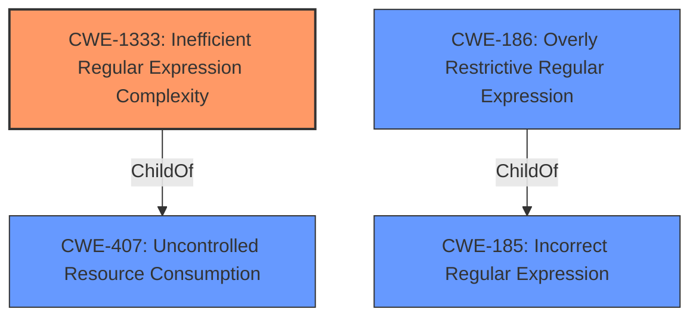

# Analysis Report for CVE-2021-40897

# Vulnerability Analysis Report: CVE-2021-40897

## Description


## Analysis (with Relationship Data)

# Summary
| CWE ID    | CWE Name                                                         | Confidence | CWE Abstraction Level | CWE Vulnerability Mapping Label | CWE-Vulnerability Mapping Notes |
| :-------- | :--------------------------------------------------------------- | :--------- | :-------------------- | :------------------------------ | :------------------------------ |
| CWE-1333 | Inefficient Regular Expression Complexity                          | 1.0        | Base                 | Primary                         | Allowed                       |

## Evidence and Confidence

*   **Confidence Score:** 1.0
*   **Evidence Strength:** HIGH

## Relationship Analysis
The primary relationship that impacted my decision was the direct match of the vulnerability description to CWE-1333, which is a Base level CWE. There is a hierarchical relationship between CWE-1333 and CWE-407 (Uncontrolled Resource Consumption), but CWE-1333 is more specific to the vulnerability involving regular expressions. Other CWEs like CWE-185 (Incorrect Regular Expression) and CWE-186 (Overly Restrictive Regular Expression) were considered but were not as direct a fit as the vulnerability involved inefficient regular expression complexity rather than correctness or restrictiveness.



## Vulnerability Chain
The vulnerability chain starts with the **inefficient regular expression** (CWE-1333), which leads to excessive resource consumption, ultimately resulting in a denial of service.

## Summary of Analysis
The analysis is based on the provided evidence, specifically the vulnerability description and the CVE Reference Links Content Summary. The vulnerability is described as a **"Regular Expression Denial of Service"** (ReDOS) vulnerability in `split-html-to-chars` v1.0.5 when splitting crafted invalid htmls. The CVE Reference Links Content Summary confirms that the root cause is the handling of crafted invalid HTML input, particularly a very long string of double quotes, which leads to excessive resource consumption and a denial-of-service (DoS).

The primary CWE selected is CWE-1333 (Inefficient Regular Expression Complexity), which directly matches the ReDOS vulnerability. The description of CWE-1333 states that the product uses a regular expression with an inefficient, possibly exponential worst-case computational complexity that consumes excessive CPU cycles. This aligns perfectly with the vulnerability where processing a very long string of double quotes leads to excessive resource consumption.

The graph relationships influenced the selection by highlighting the hierarchical structure and alternative classifications. However, CWE-1333 was chosen because it is the most specific and accurate representation of the vulnerability.

The selection of CWE-1333 is at the optimal level of specificity because it directly addresses the root cause of the vulnerability, which is the inefficient regular expression complexity. While other CWEs were considered, they were either too general or did not accurately reflect the nature of the vulnerability.


## CWE Relationship Analysis

Current CWEs represent these abstraction levels: .


### Vulnerability Chain Analysis

**Chain starting from CWE-1333:**
- 1333 (Inefficient Regular Expression Complexity) - ROOT


**Chain starting from CWE-185:**
- 185 (Incorrect Regular Expression) - ROOT


### CWE Relationship Diagram

```mermaid
graph TD
    classDef primary fill:#f96,stroke:#333,stroke-width:2px
    classDef secondary fill:#69f,stroke:#333
    classDef tertiary fill:#9e9,stroke:#333
```


*Report generated on 2025-03-30 12:30:07*
