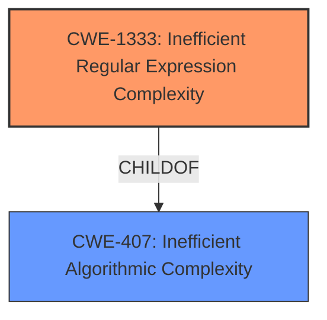

# Enhanced Analysis for CVE-2021-40899

# Summary
| CWE ID | CWE Name | Confidence | CWE Abstraction Level | CWE Vulnerability Mapping Label | CWE-Vulnerability Mapping Notes |
|---|---|---|---|---|---|
| CWE-1333 | Inefficient Regular Expression Complexity | 1.0 | Base | Allowed | Primary CWE |

## Evidence and Confidence

*   **Confidence Score:** 1.0
*   **Evidence Strength:** HIGH

## Relationship Analysis
The primary relationship that influenced the decision was the ChildOf relationship of CWE-1333 to CWE-407, indicating that inefficient regex complexity is a specific type of inefficient algorithmic complexity. However, since the vulnerability is specifically about a regular expression, CWE-1333 is more appropriate.



## Vulnerability Chain
The vulnerability chain consists of a regular expression with **inefficient algorithmic complexity** (CWE-1333), which leads to excessive CPU consumption and ultimately a denial of service.

## Summary of Analysis
The analysis is based on the provided evidence, specifically the **Vulnerability Description** and the **CVE Reference Links Content Summary**, which clearly state that the `repo-git-downloader` package is vulnerable to a **Regular Expression Denial of Service** (ReDoS). The **root cause** is the **inefficient regular expression complexity**, which can be triggered by crafted, invalid Git repositories.

The **Vulnerability Description Key Phrases** also pinpoint **Regular Expression Denial of Service** as the **weakness**.

The Retriever Results confirm that CWE-1333 is the top candidate, with a score of 1.0, and its description aligns perfectly with the vulnerability.

The decision to select CWE-1333 is based on the direct evidence of a **Regular Expression Denial of Service** vulnerability. The CWE is at the Base level of abstraction, which is the preferred level for mapping root causes.

Relevant CWE Information:

# Enhanced Context (25 CWEs)

## CWE-407: Inefficient Algorithmic Complexity
**Abstraction Level**: Class
**Similarity Score**: 0.78
**Source**: dense

**Description**:
An algorithm in a product has an inefficient worst-case computational complexity that may be detrimental to system performance and can be triggered by an attacker, typically using crafted manipulations that ensure that the worst case is being reached.

**Mapping Guidance**:
- Usage: Allowed-with-Review
- Rationale: This CWE entry is a Class and might have Base-level children that would be more appropriate

## CWE-1333: Inefficient Regular Expression Complexity
**Abstraction Level**: Base
**Similarity Score**: 1.00
**Source**: alternate_terms

**Description**:
The product uses a regular expression with an inefficient, possibly exponential worst-case computational complexity that consumes excessive CPU cycles.

**Mapping Guidance**:
- Usage: Allowed
- Rationale: This CWE entry is at the Base level of abstraction, which is a preferred level of abstraction for mapping to the root causes of vulnerabilities.

**CWE-1333 was selected because it exactly describes the root cause of this vulnerability.**

CWEs considered but not selected:

*   CWE-674 (Uncontrolled Recursion): While recursion can lead to resource exhaustion, the vulnerability is specifically related to regular expression complexity, not uncontrolled recursion.
*   CWE-617 (Reachable Assertion): This CWE is about assertions being triggered, which is not the case here.
*   CWE-626 (Null Byte Interaction Error (Poison Null Byte)): This CWE is irrelevant because the vulnerability has nothing to do with null byte handling.
*   CWE-88 (Improper Neutralization of Argument Delimiters in a Command ('Argument Injection')): This CWE is about command injection, which is not related to this vulnerability.
*   CWE-918 (Server-Side Request Forgery (SSRF)): This CWE is about SSRF, which is unrelated to this vulnerability.
*   CWE-182 (Collapse of Data into Unsafe Value): This CWE is about data collapsing, which is unrelated to this vulnerability.
*   CWE-185 (Incorrect Regular Expression): While related to regex, this CWE is about incorrect matching. CWE-1333 is more focused on performance.
*   CWE-427 (Uncontrolled Search Path Element): This CWE is about uncontrolled search paths, which is irrelevant to this vulnerability.
*   CWE-407 (Inefficient Algorithmic Complexity): While related, CWE-1333 is a more specific type of algorithmic complexity.


## CWE Relationship Analysis

Current CWEs represent these abstraction levels: .


### Vulnerability Chain Analysis

**Chain starting from CWE-918:**
- 918 (Server-Side Request Forgery (SSRF)) - ROOT


**Chain starting from CWE-626:**
- 626 (Null Byte Interaction Error (Poison Null Byte)) - ROOT


### CWE Relationship Diagram

```mermaid
graph TD
    classDef primary fill:#f96,stroke:#333,stroke-width:2px
    classDef secondary fill:#69f,stroke:#333
    classDef tertiary fill:#9e9,stroke:#333
```