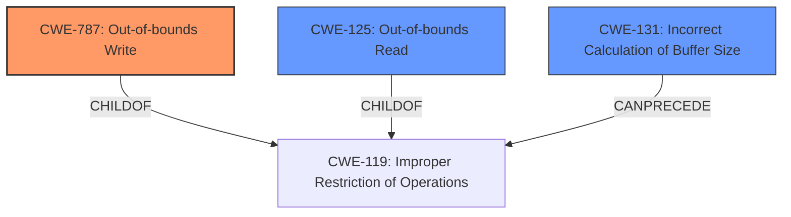

# Analysis Report for CVE-2021-4093

# Vulnerability Analysis Report: CVE-2021-4093

## Description


## Analysis (with Relationship Data)

# Summary
| CWE ID | CWE Name | Confidence | CWE Abstraction Level | CWE Vulnerability Mapping Label | CWE-Vulnerability Mapping Notes |
|---|---|---|---|---|---|
| CWE-787 | Out-of-bounds Write | 1.0 | Base | Primary | Allowed |
| CWE-125 | Out-of-bounds Read | 0.7 | Base | Secondary | Allowed |
| CWE-131 | Incorrect Calculation of Buffer Size | 0.6 | Base | Secondary | Allowed |

## Evidence and Confidence

*   **Confidence Score:** 0.9
*   **Evidence Strength:** HIGH

## Relationship Analysis
The primary CWE is CWE-787 (Out-of-bounds Write), which is a **Base** level CWE. It is related to CWE-119 (Improper Restriction of Operations within the Bounds of a Memory Buffer). CWE-125 (Out-of-bounds Read) is also related to CWE-119. CWE-131 (Incorrect Calculation of Buffer Size) can **CanPrecede** CWE-119, as an incorrect calculation can lead to out-of-bounds access.



## Vulnerability Chain
The chain of events is as follows:
1.  **Incorrect calculation of buffer size** (CWE-131) can lead to
2.  **Improper restriction of operations within the bounds of a memory buffer** (CWE-119) results in
3.  **Out-of-bounds Write** (CWE-787) and potentially **Out-of-bounds Read** (CWE-125).

The **root cause** is the **flaw in the KVMs AMD code**. The **impact** is a **crash of the entire system and potential guest-to-host escape**. The **vector** is a **malicious VMGEXIT for a string I/O instruction**.

## Summary of Analysis
The vulnerability involves an out-of-bounds write in the KVM's AMD code when handling string I/O operations for SEV-ES guests. A malicious guest can provide a length that, when used with the I/O access size, will cause a memory copy operation to exceed the allocated buffer in the hypervisor.

The primary weakness is **CWE-787 (Out-of-bounds Write)**, because the guest can provide a length that, when used with the I/O access size, will cause a memory copy operation to exceed the allocated buffer in the hypervisor. The "CVE Reference Links Content Summary" states, "The vulnerability stems from an out-of-bounds read/write in the `sev_es_string_io` function within the Linux kernel's KVM implementation when handling string I/O operations for SEV-ES guests." This clearly indicates an out-of-bounds write condition.

A secondary weakness is **CWE-125 (Out-of-bounds Read)**, because the vulnerability description and CVE summary also mention the possibility of out-of-bounds reads. The "CVE Reference Links Content Summary" states, "The vulnerability stems from an out-of-bounds read/write in the `sev_es_string_io` function within the Linux kernel's KVM implementation when handling string I/O operations for SEV-ES guests."

Another contributing factor is **CWE-131 (Incorrect Calculation of Buffer Size)**, because the `sev_es_string_io` function was incorrectly treating the REP count (from `SW_EXITINFO2`) as the size of the GHCB buffer, leading to the possibility of a buffer overflow.

I considered several other CWEs but did not select them because they did not accurately reflect the root cause of the vulnerability. For example, CWE-226 (Sensitive Information in Resource Not Removed Before Reuse), CWE-909 (Missing Initialization of Resource), CWE-362 (Concurrent Execution using Shared Resource with Improper Synchronization ('Race Condition')), and CWE-459 (Incomplete Cleanup) do not directly relate to the out-of-bounds access issue.

The selected CWEs are at the optimal level of specificity because they accurately describe the technical details of the vulnerability and its root cause.
Relevant CWE Information:

# Enhanced Context (25 CWEs)
The following CWEs were identified as potentially relevant to this vulnerability:

## CWE-226: Sensitive Information in Resource Not Removed Before Reuse
**Abstraction Level**: Base
**Similarity Score**: 0.80
**Source**: dense

**Description**:
The product releases a resource such as memory or a file so that it can be made available for reuse, but it does not clear or "zeroize" the information contained in the resource before the product performs a critical state transition or makes the resource available for reuse by other entities.

**Mapping Guidance**:
- Usage: Allowed
- Rationale: This CWE entry is at the Base level of abstraction, which is a preferred level of abstraction for mapping to the root causes of vulnerabilities.


## CWE-404: Improper Resource Shutdown or Release
**Abstraction Level**: Class
**Similarity Score**: 0.79
**Source**: dense

**Description**:
The product does not release or incorrectly releases a resource before it is made available for re-use.

**Mapping Guidance**:
- Usage: Allowed-with-Review
- Rationale: This CWE entry is a Class and might have Base-level children that would be more appropriate


## CWE-909: Missing Initialization of Resource
**Abstraction Level**: Class
**Similarity Score**: 0.79
**Source**: dense

**Description**:
The product does not initialize a critical resource.

**Mapping Guidance**:
- Usage: Allowed-with-Review
- Rationale: This CWE entry is a Class and might have Base-level children that would be more appropriate


## CWE-667: Improper Locking
**Abstraction Level**: Class
**Similarity Score**: 0.78
**Source**: dense

**Description**:
The product does not properly acquire or release a lock on a resource, leading to unexpected resource state changes and behaviors.

**Mapping Guidance**:
- Usage: Allowed-with-Review
- Rationale: This CWE entry is a Class and might have Base-level children that would be more appropriate


## CWE-908: Use of Uninitialized Resource
**Abstraction Level**: Base
**Similarity Score**: 0.78
**Source**: dense

**Description**:
The product uses or accesses a resource that has not been initialized.

**Mapping Guidance**:
- Usage: Allowed
- Rationale: This CWE entry is at the Base level of abstraction, which is a preferred level of abstraction for mapping to the root causes of vulnerabilities.


## CWE-131: Incorrect Calculation of Buffer Size
**Abstraction Level**: Base
**Similarity Score**: 0.77
**Source**: dense

**Description**:
The product does not correctly calculate the size to be used when allocating a buffer, which could lead to a buffer overflow.

**Mapping Guidance**:
- Usage: Allowed
- Rationale: This CWE entry is at the Base level of abstraction, which is a preferred level of abstraction for mapping to the root causes of vulnerabilities.


## CWE-362: Concurrent Execution using Shared Resource with Improper Synchronization ('Race Condition')
**Abstraction Level**: Class
**Similarity Score**: 0.77
**Source**: dense

**Description**:
The product contains a concurrent code sequence that requires temporary, exclusive access to a shared resource, but a timing window exists in which the shared resource can be modified by another code sequence operating concurrently.

**Mapping Guidance**:
- Usage: Allowed-with-Review
- Rationale: This CWE entry is a Class and might have Base-level children that would be more appropriate


## CWE-665: Improper Initialization
**Abstraction Level**: Class
**Similarity Score**: 0.77
**Source**: dense

**Description**:
The product does not initialize or incorrectly initializes a resource, which might leave the resource in an unexpected state when it is accessed or used.

**Mapping Guidance**:
- Usage: Discouraged
- Rationale: This CWE entry is a level-1 Class (i.e., a child of a Pillar). It might have lower-level children that would be more appropriate


## CWE-754: Improper Check for Unusual or Exceptional Conditions
**Abstraction Level**: Class
**Similarity Score**: 0.76
**Source**: dense


## CWE Relationship Analysis

Current CWEs represent these abstraction levels: .


### Vulnerability Chain Analysis

**Chain starting from CWE-131:**
- 131 (Incorrect Calculation of Buffer Size) - ROOT


**Chain starting from CWE-362:**
- 362 (Concurrent Execution using Shared Resource with Improper Synchronization ('Race Condition')) - ROOT


### CWE Relationship Diagram

```mermaid
graph TD
    classDef primary fill:#f96,stroke:#333,stroke-width:2px
    classDef secondary fill:#69f,stroke:#333
    classDef tertiary fill:#9e9,stroke:#333
```


*Report generated on 2025-03-31 11:44:23*
