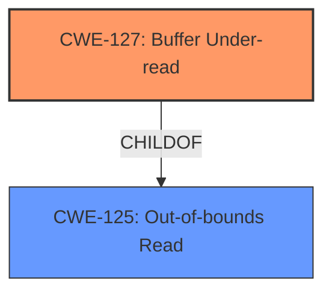

# Analysis Report for CVE-2021-40985

# Vulnerability Analysis Report: CVE-2021-40985

## Description


## Analysis (with Relationship Data)

# Summary
| CWE ID | CWE Name | Confidence | CWE Abstraction Level | CWE Vulnerability Mapping Label | CWE-Vulnerability Mapping Notes |
|---|---|---|---|---|---|
| CWE-127 | Buffer Under-read | 1.0 | Variant | Allowed | Primary CWE |
| CWE-125 | Out-of-bounds Read | 0.7 | Base | Allowed | Secondary Candidate |

## Evidence and Confidence

*   **Confidence Score:** 1.0
*   **Evidence Strength:** HIGH

## Relationship Analysis
The primary CWE selected was CWE-127 (Buffer Under-read), which is a variant of CWE-125 (Out-of-bounds Read). CWE-127 is more specific because the vulnerability involves reading from a memory location before the start of the buffer.


## Vulnerability Chain
The chain of events is as follows:
1.  A crafted BMP image is processed.
2.  A **stack-based buffer under-read** (CWE-127) occurs in the `image_load_bmp` function, due to missing input validation.
3.  This leads to a denial of service due to memory corruption.

The root cause is the **stack-based buffer under-read** (CWE-127) because the program attempts to read data from an invalid memory location.

## Summary of Analysis
The initial assessment focused on the **stack-based buffer under-read** vulnerability in htmldoc. The vulnerability occurs when processing a crafted BMP image in the `image_load_bmp` function. The primary indicator is the **buffer under-read**, which is explicitly mentioned in the vulnerability description.

The evidence supporting the selection of CWE-127 includes:
*   The vulnerability description explicitly states "**stack-based buffer under-read**".
*   The CVE Reference Links Content Summary confirms that the issue is in the `image_load_bmp` function, where color palette data is read without proper bounds checking.
*   The fix involves checking that the number of colors used in a BMP file is not greater than the allocated buffer, which confirms the under-read.

The relationship analysis shows that CWE-127 is a child of CWE-125. Since the vulnerability is specifically an under-read (reading before the buffer), CWE-127 is a more precise classification than its parent, CWE-125 (Out-of-bounds Read), which could include both under-reads and over-reads.

The retriever results list CWE-127 as the top combined result.

The final decision to use CWE-127 is based on the explicit mention of "**stack-based buffer under-read**" in the vulnerability description, the confirmation from the CVE Reference Links Content Summary about the lack of bounds checking when reading color palette data, and the hierarchical relationship between CWE-127 and CWE-125, with CWE-127 being a more specific variant.


## CWE Relationship Analysis

Current CWEs represent these abstraction levels: .


### Vulnerability Chain Analysis

**Chain starting from CWE-125:**
- 125 (Out-of-bounds Read) - ROOT


**Chain starting from CWE-127:**
- 127 (Buffer Under-read) - ROOT


### CWE Relationship Diagram

```mermaid
graph TD
    classDef primary fill:#f96,stroke:#333,stroke-width:2px
    classDef secondary fill:#69f,stroke:#333
    classDef tertiary fill:#9e9,stroke:#333
```


*Report generated on 2025-03-31 08:05:10*
