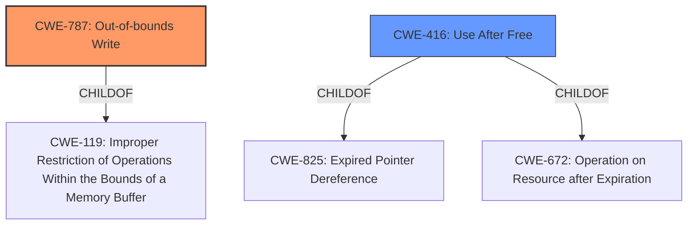

# Analysis Report for CVE-2021-4100

# Vulnerability Analysis Report: CVE-2021-4100

## Description


## Analysis (with Relationship Data)

# Summary
| CWE ID  | CWE Name                                                                 | Confidence | CWE Abstraction Level | CWE Vulnerability Mapping Label | CWE-Vulnerability Mapping Notes |
| :-------- | :----------------------------------------------------------------------- | :--------- | :---------------------- | :------------------------------ | :-------------------------------- |
| CWE-787 | Out-of-bounds Write                                                        | 0.85       | Base                    | Primary                          | Allowed                           |
| CWE-416 | Use After Free                                                           | 0.70       | Variant                 | Secondary                         | Allowed                           |

## Evidence and Confidence

*   **Confidence Score:** 0.80
*   **Evidence Strength:** HIGH

## Relationship Analysis
The primary CWE, CWE-787, is a base-level CWE that describes the condition where the product writes data past the end or before the beginning of the intended buffer. CWE-416, Use After Free, is a variant-level CWE describing the condition where a product reuses memory after it has been freed. CWE-416 is a child of CWE-825 (Expired Pointer Dereference) and CWE-672 (Operation on Resource after Expiration). The relationship between CWE-787 and CWE-416 is not direct, but a Use After Free can lead to an out-of-bounds write.



## Vulnerability Chain
The vulnerability chain starts with an **object lifecycle issue**, which then leads to **heap corruption**. This corruption could lead to an out-of-bounds write (CWE-787) or a use-after-free condition (CWE-416).

## Summary of Analysis
The vulnerability is caused by an **object lifecycle issue** that leads to **heap corruption** in ANGLE, a graphics engine used in Google Chrome. The primary weakness is classified as CWE-787 (Out-of-bounds Write), with CWE-416 (Use After Free) considered as a potential secondary weakness.

The **Vulnerability Description Key Phrases** identifies the root cause as an "**Object lifecycle issue**" and the impact as "**heap corruption**". The "**CVE Reference Links Content Summary**" reinforces this by stating, "Root cause of vulnerability: Object lifecycle issue" and "Weaknesses/vulnerabilities present: Object lifecycle issue", confirming that the **object lifecycle issue** is indeed the root cause.

The primary CWE match suggested by the automated analysis is CWE-787 (Out-of-bounds Write), which aligns with the **heap corruption** impact mentioned in the vulnerability description.

The retriever results also suggest several other CWEs such as CWE-416 (Use After Free), CWE-122 (Heap-based Buffer Overflow), and CWE-843 (Access of Resource Using Incompatible Type ('Type Confusion')).

Given the evidence, CWE-787 is the most appropriate primary CWE because the **heap corruption** indicates a memory safety issue that allows writing outside the intended buffer. CWE-416 is a possible secondary CWE because an object lifecycle issue could lead to a use-after-free condition, which in turn could contribute to **heap corruption**.

CWE-122 (Heap-based Buffer Overflow) was considered but not chosen as primary because the description does not explicitly mention a buffer overflow. Similarly, CWE-843 (Access of Resource Using Incompatible Type ('Type Confusion')) was considered but not chosen as primary because there isn't enough information to confirm type confusion.

The selection of CWE-787 as the primary CWE is at the base level of abstraction, providing sufficient specificity for the vulnerability. The choice of CWE-416 is a suitable secondary CWE as it describes a common mechanism by which memory corruption can occur due to object lifecycle issues.

# Relevant CWE Information:

# Enhanced Context (25 CWEs)

## CWE-191: Integer Underflow (Wrap or Wraparound)
**Abstraction Level**: Base
**Similarity Score**: 0.79
**Source**: dense

**Description**:
The product subtracts one value from another, such that the result is less than the minimum allowable integer value, which produces a value that is not equal to the correct result.

**Mapping Guidance**:
- Usage: Allowed
- Rationale: This CWE entry is at the Base level of abstraction, which is a preferred level of abstraction for mapping to the root causes of vulnerabilities.

## CWE-197: Numeric Truncation Error
**Abstraction Level**: Base
**Similarity Score**: 0.76
**Source**: dense

**Description**:
Truncation errors occur when a primitive is cast to a primitive of a smaller size and data is lost in the conversion.

**Mapping Guidance**:
- Usage: Allowed
- Rationale: This CWE entry is at the Base level of abstraction, which is a preferred level of abstraction for mapping to the root causes of vulnerabilities.

## CWE-125: Out-of-bounds Read
**Abstraction Level**: Base
**Similarity Score**: 0.76
**Source**: dense

**Description**:
The product reads data past the end, or before the beginning, of the intended buffer.

**Mapping Guidance**:
- Usage: Allowed
- Rationale: This CWE entry is at the Base level of abstraction, which is a preferred level of abstraction for mapping to the root causes of vulnerabilities.

## CWE-131: Incorrect Calculation of Buffer Size
**Abstraction Level**: Base
**Similarity Score**: 0.76
**Source**: dense

**Description**:
The product does not correctly calculate the size to be used when allocating a buffer, which could lead to a buffer overflow.

**Mapping Guidance**:
- Usage: Allowed
- Rationale: This CWE entry is at the Base level of abstraction, which is a preferred level of abstraction for mapping to the root causes of vulnerabilities.

## CWE-805: Buffer Access with Incorrect Length Value
**Abstraction Level**: Base
**Similarity Score**: 0.76
**Source**: dense

**Description**:
The product uses a sequential operation to read or write a buffer, but it uses an incorrect length value that causes it to access memory that is outside of the bounds of the buffer.

**Mapping Guidance**:
- Usage: Allowed
- Rationale: This CWE entry is at the Base level of abstraction, which is a preferred level of abstraction for mapping to the root causes of vulnerabilities.

## CWE-124: Buffer Underwrite ('Buffer Underflow')
**Abstraction Level**: Base
**Similarity Score**: 0.76
**Source**: dense

**Description**:
The product writes to a buffer using an index or pointer that references a memory location prior to the beginning of the buffer.

**Mapping Guidance**:
- Usage: Allowed
- Rationale: This CWE entry is at the Base level of abstraction, which is a preferred level of abstraction for mapping to the root causes of vulnerabilities.

## CWE-823: Use of Out-of-range Pointer Offset
**Abstraction Level**: Base
**Similarity Score**: 0.75
**Source**: dense

**Description**:
The product performs pointer arithmetic on a valid pointer, but it uses an offset that can point outside of the intended range of valid memory locations for the resulting pointer.

**Mapping Guidance**:
- Usage: Allowed
- Rationale: This CWE entry is at the Base level of abstraction, which is a preferred level of abstraction for mapping to the root causes of vulnerabilities.

## CWE-127: Buffer Under-read
**Abstraction Level**: Variant
**Similarity Score**: 0.75
**Source**: dense

**Description**:
The product reads from a buffer using buffer access mechanisms such as indexes or pointers that reference memory locations prior to the targeted buffer.

**Mapping Guidance**:
- Usage: Allowed
- Rationale: This CWE entry is at the Variant level of abstraction, which is a preferred level of abstraction for mapping to the root causes of vulnerabilities.

## CWE-126: Buffer Over-read
**Abstraction Level**: Variant
**Similarity Score**: 0.75
**Source**: dense

**Description**:
The product reads from a buffer using buffer access mechanisms such as indexes or pointers that reference memory locations after the targeted buffer.

**Mapping Guidance**:
- Usage: Allowed
- Rationale: This CWE entry is at the Variant level of abstraction, which is a preferred level of abstraction for mapping to the root


## CWE Relationship Analysis

Current CWEs represent these abstraction levels: .


### Vulnerability Chain Analysis

**Chain starting from CWE-131:**
- 131 (Incorrect Calculation of Buffer Size) - ROOT


**Chain starting from CWE-825:**
- 825 (Expired Pointer Dereference) - ROOT


### CWE Relationship Diagram

```mermaid
graph TD
    classDef primary fill:#f96,stroke:#333,stroke-width:2px
    classDef secondary fill:#69f,stroke:#333
    classDef tertiary fill:#9e9,stroke:#333
```


*Report generated on 2025-03-30 16:32:05*
