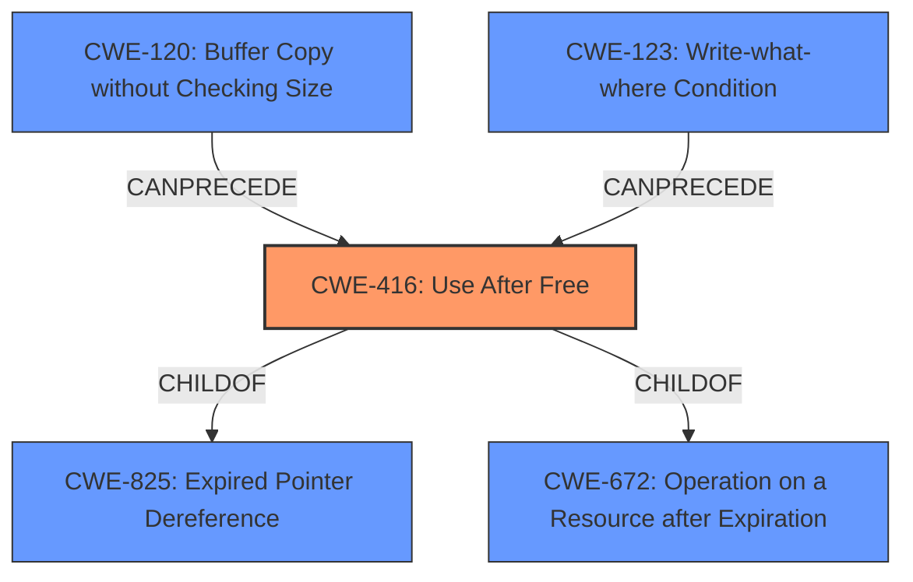

# Enhanced Analysis for CVE-2021-4102

# Summary
| CWE ID | CWE Name | Confidence | CWE Abstraction Level | CWE Vulnerability Mapping Label | CWE-Vulnerability Mapping Notes |
|---|---|---|---|---|---|
| CWE-416 | Use After Free | 1.0 | Variant | Allowed | Primary CWE |

## Evidence and Confidence

*   **Confidence Score:** 1.0
*   **Evidence Strength:** HIGH

## Relationship Analysis
The primary CWE is CWE-416, which is a Variant level weakness. It has parent-child relationships with CWE-825 and CWE-672. It also has chain relationships: it can be preceded by CWE-120 and CWE-123. The Variant level is appropriate because the vulnerability is a specific instance of a use-after-free condition.



## Vulnerability Chain
The vulnerability chain starts with a **use after free** condition in the V8 JavaScript engine, leading to **heap corruption**.

## Summary of Analysis
The vulnerability description clearly states a "**use after free**" condition in the V8 component of Google Chrome, leading to potential "**heap corruption**". The "CVE Reference Links Content Summary" also confirms the root cause is a "**Use-after-free** in V8."

The primary CWE match from similar CVE descriptions is CWE-416, which aligns perfectly with the "**use after free**" root cause. The retriever results also list CWE-416 as the top candidate.

CWE-416 (Use After Free) is a Variant level CWE, which is a preferred level of abstraction. The mapping guidance for CWE-416 allows its usage and notes that it is at the Variant level of abstraction, which is preferred.

I considered CWE-787 (Out-of-bounds Write) because it was the second highest CWE from similar CVE Descriptions and CWE-122 (Heap-based Buffer Overflow) because the weakness was listed as heap corruption but the rootcause for this CVE is clearly **Use-after-free** and not an out-of-bounds write.

Therefore, the best and most accurate mapping is CWE-416 (Use After Free).


## CWE Relationship Analysis

Current CWEs represent these abstraction levels: .


### Vulnerability Chain Analysis

**Chain starting from CWE-825:**
- 825 (Expired Pointer Dereference) - ROOT


**Chain starting from CWE-672:**
- 672 (Operation on a Resource after Expiration or Release) - ROOT


### CWE Relationship Diagram

```mermaid
graph TD
    classDef primary fill:#f96,stroke:#333,stroke-width:2px
    classDef secondary fill:#69f,stroke:#333
    classDef tertiary fill:#9e9,stroke:#333
```