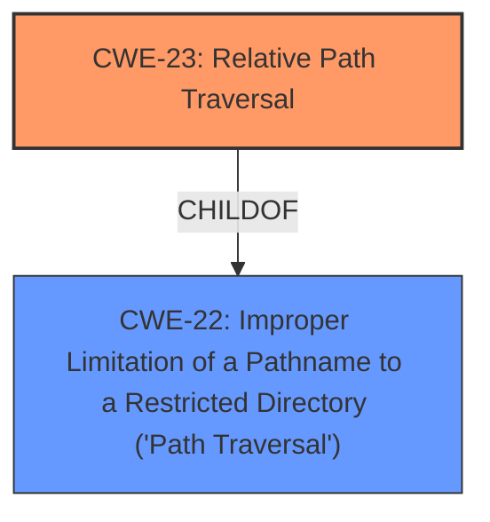

# Analysis for CVE-2021-41031

# Summary
| CWE ID | CWE Name | Confidence | CWE Abstraction Level | CWE Vulnerability Mapping Label | CWE-Vulnerability Mapping Notes |
|---|---|---|---|---|---|
| CWE-23 | Relative Path Traversal | 1.0 | Base | Allowed | Primary CWE |
| CWE-22 | Improper Limitation of a Pathname to a Restricted Directory ('Path Traversal') | 0.7 | Base | Allowed | Secondary Candidate |

## Evidence and Confidence

*   **Confidence Score:** 1.0
*   **Evidence Strength:** HIGH

## Relationship Analysis
The primary CWE, CWE-23, is a child of CWE-22. This indicates a hierarchical relationship where CWE-23 is a more specific case of CWE-22. Since the vulnerability description explicitly mentions a "relative path traversal" vulnerability, CWE-23 is the most appropriate choice.

## Vulnerability Chain
The vulnerability chain is straightforward:

1.  **Root Cause:** **Relative Path Traversal** (**CWE-23**)
2.  **Impact:** Privilege Escalation to SYSTEM

## Summary of Analysis
The initial analysis and final conclusion are based on strong evidence from the vulnerability description and supporting information. The description explicitly states a "**relative path traversal** vulnerability." The "CVE Reference Links Content Summary" confirms this, stating "A **relative path traversal** vulnerability exists in FortiClient for Windows" and "Weaknesses/vulnerabilities present: Relative path traversal (CWE-23)."

The hierarchical relationship between CWE-23 and CWE-22 supports choosing the more specific CWE-23, as the vulnerability is explicitly described as a "relative" path traversal.

The selection of CWE-23 is at the optimal level of specificity, as it directly reflects the **root cause** described in the vulnerability.

Relevant CWE Information:

# Enhanced Context (25 CWEs)

## CWE-23: Relative Path Traversal
**Abstraction Level**: Base
**Similarity Score**: 0.78
**Source**: dense

**Description**:
The product uses external input to construct a pathname that should be within a restricted directory, but it does not properly neutralize sequences such as ".." that can resolve to a location that is outside of that directory.

**Mapping Guidance**:
- Usage: Allowed
- Rationale: This CWE entry is at the Base level of abstraction, which is a preferred level of abstraction for mapping to the root causes of vulnerabilities.

## CWE-22: Improper Limitation of a Pathname to a Restricted Directory ('Path Traversal')
**Abstraction Level**: Base
**Similarity Score**: 7078.20
**Source**: sparse

**Description**:
The product uses external input to construct a pathname that is intended to identify a file or directory that is located underneath a restricted parent directory, but the product does not properly neutralize special elements within the pathname that can cause the pathname to resolve to a location that is outside of the restricted directory.

**Mapping Guidance**:
- Usage: Allowed
- Rationale: This CWE entry is at the Base level of abstraction, which is a preferred level of abstraction for mapping to the root causes of vulnerabilities.

CWE-23 and CWE-22 are the most relevant based on the description.

**CWE-59: Improper Link Resolution Before File Access ('Link Following')** was considered but not chosen because the vulnerability description does not mention anything about symbolic links or link following. It is related to file access issues, but not the specific type of vulnerability described.

**CWE-732: Incorrect Permission Assignment for Critical Resource** was considered but not chosen because the description focuses on path traversal, not incorrect permissions on resources.

**CWE-73: External Control of File Name or Path** was considered but not chosen because, while external control is often a factor in path traversal, the core weakness is the improper limitation of the pathname, making CWE-23 a more precise fit.

**CWE-25: Path Traversal: '/../filedir'** was considered but not chosen because the specific variant "/../" is not mentioned.

**CWE-434: Unrestricted Upload of File with Dangerous Type** was considered but not chosen as it is unrelated to path traversal.

**CWE-250: Execution with Unnecessary Privileges** was considered but not chosen as it does not describe the **root cause** of the vulnerability.

**CWE-98: Improper Control of Filename for Include/Require Statement in PHP Program ('PHP Remote File Inclusion')** was considered but not chosen as it is PHP specific and unrelated to path traversal.

**CWE-269: Improper Privilege Management** was considered but not chosen because it is too general and does not describe the **root cause**. The description of CWE-269 explicitly states that it is often misused for privilege escalation, which is a technical impact, not the root cause.