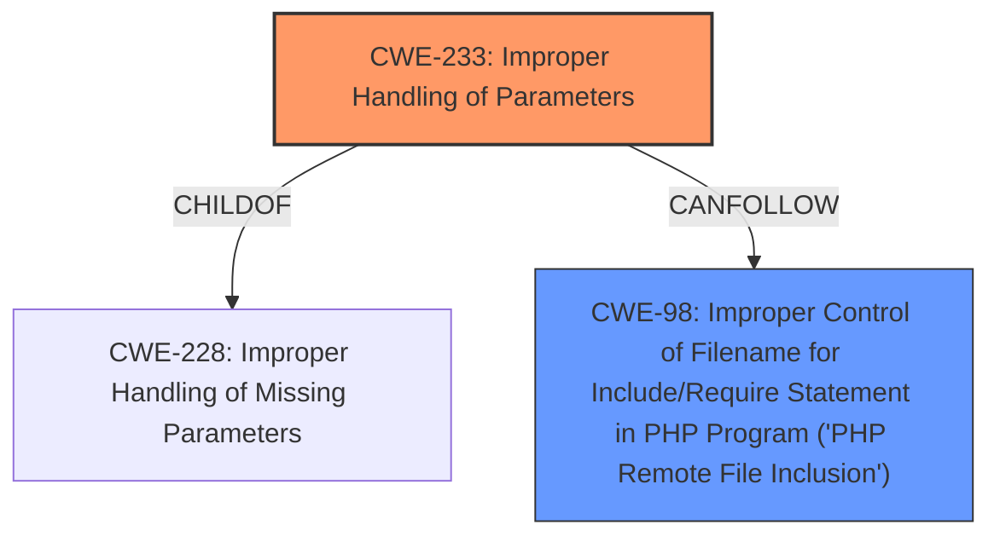

# Analysis Report for CVE-2021-4105

# Vulnerability Analysis Report: CVE-2021-4105

## Description


## Analysis (with Relationship Data)

# Summary
| CWE ID | CWE Name | Confidence | CWE Abstraction Level | CWE Vulnerability Mapping Label | CWE-Vulnerability Mapping Notes |
|---|---|---|---|---|---|
| CWE-233 | Improper Handling of Parameters | 0.9 | Base | Allowed | Primary CWE |
| CWE-98 | Improper Control of Filename for Include/Require Statement in PHP Program ('PHP Remote File Inclusion') | 0.7 | Variant | Allowed | Secondary Candidate |

## Evidence and Confidence

*   **Confidence Score:** 0.8
*   **Evidence Strength:** MEDIUM

## Relationship Analysis
The primary relationship influencing my decision is the hierarchical link between CWE-228 (Improper Handling of Missing Parameters) and its child CWE-233 (Improper Handling of Parameters). While CWE-228 is more general, the vulnerability description clearly points to a parameter handling issue, making CWE-233 the more specific and appropriate choice. CWE-98 can follow from CWE-233 if the improper handling of parameters results in a file inclusion vulnerability, which is the stated impact.



## Vulnerability Chain
The vulnerability chain begins with **Improper Handling of Parameters** (CWE-233), which leads to Remote Code Inclusion (CWE-98).

## Summary of Analysis
My analysis indicates that the primary weakness is **Improper Handling of Parameters** (CWE-233). The vulnerability description explicitly states this as the root cause: "**Improper Handling of Parameters** vulnerability". This aligns directly with CWE-233's description: "The product does not properly handle when the expected number of parameters, fields, or arguments is not provided in input, or if those parameters are undefined."

The impact, Remote Code Inclusion, suggests a potential secondary weakness, CWE-98. CWE-98 is "Improper Control of Filename for Include/Require Statement in PHP Program ('PHP Remote File Inclusion')". The evidence is indirect, as the description only mentions "Remote Code Inclusion" and doesn't specify PHP or file inclusion. However, given the prevalence of PHP in web applications and the nature of remote code inclusion, CWE-98 is a plausible secondary weakness.

I am overriding the retriever suggestions to make CWE-233 as the primary weakness due to the explicit mention of "**Improper Handling of Parameters**" in the vulnerability description. While CWE-78 (OS Command Injection) and CWE-22 (Path Traversal) are often related to injection vulnerabilities, they are not directly supported by the provided evidence. The **Improper Handling of Parameters** leads to the **Remote Code Inclusion** impact.

Relevant CWE Information:

# Enhanced Context (25 CWEs)

## CWE-233: Improper Handling of Parameters
**Abstraction:** Base
**Status:** Incomplete

### Description
The product does not properly handle when the expected number of parameters, fields, or arguments is not provided in input, or if those parameters are undefined.

### Extended Description
Not provided

### Alternative Terms
None

### Relationships
ChildOf -> CWE-228

### Mapping Guidance
**Usage:** Allowed
**Rationale:** This CWE entry is at the Base level of abstraction, which is a preferred level of abstraction for mapping to the root causes of vulnerabilities.
**Comments:** Carefully read both the name and description to ensure that this mapping is an appropriate fit. Do not try to 'force' a mapping to a lower-level Base/Variant simply to comply with this preferred level of abstraction.
**Reasons:**
- Acceptable-Use

## CWE-98: Improper Control of Filename for Include/Require Statement in PHP Program ('PHP Remote File Inclusion')
**Abstraction Level**: variant
**Similarity Score**: 4.53
**Source**: graph

**Description**:
CWE-98: Improper Control of Filename for Include/Require Statement in PHP Program ('PHP Remote File Inclusion')

**Mapping Guidance**:
- Usage: Allowed
- Rationale: This CWE entry is at the Variant level of abstraction, which is a preferred level of abstraction for mapping to the root causes of vulnerabilities.

**Relationships**:
- CANFOLLOW -> CWE-73
- CANFOLLOW -> CWE-473
- CANFOLLOW -> CWE-456
- CANFOLLOW -> CWE-425
- CANFOLLOW -> CWE-184


## CWE Relationship Analysis

Current CWEs represent these abstraction levels: .


### Vulnerability Chain Analysis

**Chain starting from CWE-456:**
- 456 (Missing Initialization of a Variable) - ROOT


**Chain starting from CWE-425:**
- 425 (Direct Request ('Forced Browsing')) - ROOT


### CWE Relationship Diagram

```mermaid
graph TD
    classDef primary fill:#f96,stroke:#333,stroke-width:2px
    classDef secondary fill:#69f,stroke:#333
    classDef tertiary fill:#9e9,stroke:#333
```


*Report generated on 2025-03-30 22:35:20*
