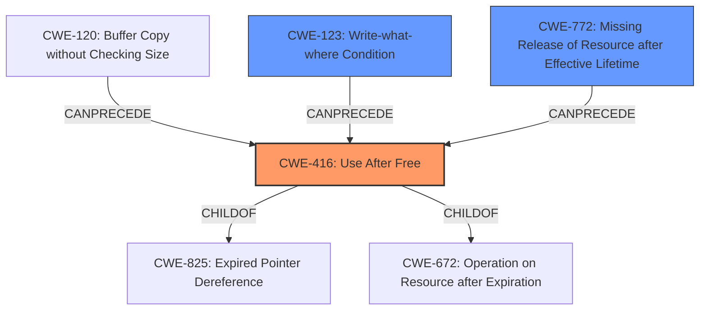

# Analysis Report for CVE-2021-41073

# Vulnerability Analysis Report: CVE-2021-41073

## Description


## Analysis (with Relationship Data)

# Summary
| CWE ID  | CWE Name                             | Confidence | CWE Abstraction Level | CWE Vulnerability Mapping Label | CWE-Vulnerability Mapping Notes |
| ------- | ------------------------------------ | ---------- | --------------------- | ------------------------------- | ------------------------------- |
| CWE-416 | Use After Free                       | 0.9        | Variant               | Primary                         | Allowed                       |
| CWE-123 | Write-what-where Condition          | 0.6        | Base                  | Secondary                       | Allowed                       |
| CWE-772 | Missing Release of Resource after Effective Lifetime | 0.4       | Base                 | Secondary                       | Allowed                       |

## Evidence and Confidence

*   **Confidence Score:** 0.8
*   **Evidence Strength:** HIGH

## Relationship Analysis
The primary weakness identified is CWE-416 Use After Free, which is a Variant of CWE-825 Expired Pointer Dereference and CWE-672 Operation on Resource after Expiration. CWE-416 can be preceded by CWE-120 Buffer Copy without Checking Size of Input and CWE-123 Write-what-where Condition. The relationship analysis helped confirm the selection of CWE-416 as the most specific and relevant weakness, and helped choose secondary weaknesses.



## Vulnerability Chain
The vulnerability chain starts with the **improper handling of `req->rw.addr`** , leading to a **type confusion**. This results in a **controllable kernel buffer free**, which is the **use-after-free** condition. The impact of this is potential **local privilege escalation**.
  - Root Cause: **Improper Handling of `req->rw.addr`**
  - Weakness: **Type Confusion**
  - Weakness: **Controllable Kernel Buffer Free**
  - Vulnerability: **Use-After-Free (CWE-416)**
  - Impact: **Local Privilege Escalation**

## Summary of Analysis
The initial analysis correctly identified **use-after-free** as the primary weakness, supported by the vulnerability description key phrases and the CVE reference links content summary: "**rootcause:** **use-after-free**".

The Retriever Results also strongly suggested CWE-416, with a score of 1.000.

The analysis was refined by considering the relationships between CWEs and the technical details of the vulnerability.

The final selection of CWE-416 is based on the evidence that the kernel buffer is freed and then subsequently used, leading to the vulnerability. The supporting evidence is: "trigger a free of a kernel buffer" and "the code does not correctly differentiate how to advance the `iter` pointer and the `addr/len` depending on the type... This leads to a controlled kernel buffer free due to the increment logic".

The secondary weaknesses, CWE-123 and CWE-772, were considered based on the possibility of memory corruption and resource management issues, respectively, but they are not as directly supported by the evidence as CWE-416.

Relevant CWE Information:

# Enhanced Context (25 CWEs)
The following CWEs were identified as potentially relevant to this vulnerability:

## CWE-131: Incorrect Calculation of Buffer Size
**Abstraction Level**: Base
**Similarity Score**: 0.78

## CWE-667: Improper Locking
**Abstraction Level**: Class
**Similarity Score**: 0.77

## CWE-191: Integer Underflow (Wrap or Wraparound)
**Abstraction Level**: Base
**Similarity Score**: 0.76

## CWE-415: Double Free
**Abstraction Level**: Variant
**Similarity Score**: 0.76

## CWE-404: Improper Resource Shutdown or Release
**Abstraction Level**: Class
**Similarity Score**: 0.76

## CWE-362: Concurrent Execution using Shared Resource with Improper Synchronization ('Race Condition')
**Abstraction Level**: Class
**Similarity Score**: 0.76

## CWE-366: Race Condition within a Thread
**Abstraction Level**: Base
**Similarity Score**: 0.75

## CWE-226: Sensitive Information in Resource Not Removed Before Reuse
**Abstraction Level**: Base
**Similarity Score**: 0.75

## CWE-911: Improper Update of Reference Count
**Abstraction Level**: Base
**Similarity Score**: 0.75

## CWE-805: Buffer Access with Incorrect Length Value
**Abstraction Level**: Base
**Similarity Score**: 0.75

## CWE-364: Signal Handler Race Condition
**Abstraction Level**: Base
**Similarity Score**: 8283.57

## CWE-362: Concurrent Execution using Shared Resource with Improper Synchronization ('Race Condition')
**Abstraction Level**: Class
**Similarity Score**: 7562.24

## CWE-667: Improper Locking
**Abstraction Level**: Class
**Similarity Score**: 7398.98

## CWE-367: Time-of-check Time-of-use (TOCTOU) Race Condition
**Abstraction Level**: Base
**Similarity Score**: 7390.68

## CWE-415: Double Free
**Abstraction Level**: Variant
**Similarity Score**: 7259.13

## CWE-123: Write-what-where Condition
**Abstraction Level**: base
**Similarity Score**: 5.03

## CWE-120: Buffer Copy without Checking Size of Input ('Classic Buffer Overflow')
**Abstraction Level**: base
**Similarity Score**: 4.82

## CWE-416: Use After Free
**Abstraction Level**: variant
**Similarity Score**: 4.53

## CWE-364: Signal Handler Race Condition
**Abstraction Level**: base
**Similarity Score**: 4.33

## CWE-825: Expired Pointer Dereference
**Abstraction Level**: base
**Similarity Score**: 4.33

## CWE-476: NULL Pointer Dereference
**Abstraction Level**: base
**Similarity Score**: 4.33

## CWE-787: Out-of-bounds Write
**Abstraction Level**: base
**Similarity Score**: 4.33

## CWE-1341: Multiple Releases of Same Resource or Handle
**Abstraction Level**: base
**Similarity Score**: 4.33

## CWE-190: Integer Overflow or Wraparound
**Abstraction Level**: base
**Similarity Score**: 4.33

## CWE-772: Missing Release of Resource after Effective Lifetime
**Abstraction Level**: base
**Similarity Score**: 4.33

### CWE Detail Analysis and Selection Rationale

*   **CWE-416 Use After Free:** This is the primary weakness. The vulnerability description states a **use-after-free** condition is triggered. The CVE reference summary details a controllable kernel buffer free, which directly aligns with the CWE-416 description: "The product reuses or references memory after it has been freed." Confidence: 0.9

*   **CWE-123 Write-what-where Condition:** This is a possible secondary weakness. The vulnerability description mentions memory corruption scenarios as a potential impact. A controlled buffer free can potentially allow an attacker to write arbitrary data to an arbitrary location in memory. The CWE-123 description aligns with this: "The product allows an attacker to write to an arbitrary memory location." Confidence: 0.6

*   **CWE-772 Missing Release of Resource after Effective Lifetime:** This is another possible secondary weakness. If the resource is not properly released, it can contribute to the vulnerability. The CWE-772 description aligns with this: "The product does not release a system resource after its effective lifetime has ended." Confidence: 0.4

*   **CWE-131 Incorrect Calculation of Buffer Size:** This was considered because the vulnerability involves pointer arithmetic and size calculations. However, there is no direct evidence that the buffer size calculation is incorrect. The


## CWE Relationship Analysis

Current CWEs represent these abstraction levels: .


### Vulnerability Chain Analysis

**Chain starting from CWE-366:**
- 366 (Race Condition within a Thread) - ROOT


**Chain starting from CWE-123:**
- 123 (Write-what-where Condition) - ROOT


### CWE Relationship Diagram

```mermaid
graph TD
    classDef primary fill:#f96,stroke:#333,stroke-width:2px
    classDef secondary fill:#69f,stroke:#333
    classDef tertiary fill:#9e9,stroke:#333
```


*Report generated on 2025-03-31 03:53:40*
