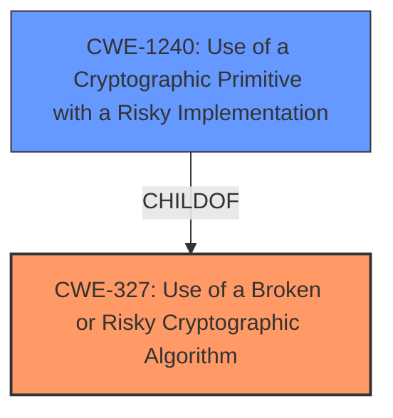

# Analysis Report for CVE-2021-41096

# Vulnerability Analysis Report: CVE-2021-41096

## Description


## Analysis (with Relationship Data)

# Summary
| CWE ID  | CWE Name | Confidence | CWE Abstraction Level | CWE Vulnerability Mapping Label | CWE-Vulnerability Mapping Notes |
|--------------|--------------------------------------------------------------------|----------------|-------------------------|------------------------------------|--------------------------------------|
| CWE-327 | Use of a Broken or Risky Cryptographic Algorithm | 1.0 | Class | Allowed-with-Review | Primary CWE  |
| CWE-1240 | Use of a Cryptographic Primitive with a Risky Implementation | 0.75 | Base | Allowed | Secondary Candidate |

## Evidence and Confidence

*   **Confidence Score:** 0.9
*   **Evidence Strength:** HIGH

## Relationship Analysis
The primary relationship considered was the parent-child relationship between CWE-327 (Class) and CWE-1240 (Base). Since the description specifies the use of a weak algorithm, RSA/ECB/PKCS1Padding, CWE-327 is the best fit as a general classification. CWE-1240 provides a more specific reason for *why* the cryptographic primitive is considered weak, but it is not as direct a classification as CWE-327 in this context.



## Vulnerability Chain
The vulnerability chain starts with the **use of a weak cryptographic algorithm** (RSA/ECB/PKCS1Padding), which leads to potential data exposure, data modification, and vulnerability to attacks like Bleichenbacher.

## Summary of Analysis
The initial analysis identified **use of a weak cryptographic algorithm** as the root cause. The retriever results suggested CWE-327 (Use of a Broken or Risky Cryptographic Algorithm) and CWE-1240 (Use of a Cryptographic Primitive with a Risky Implementation) as potential matches.

Based on the vulnerability description: "Versions 2.2 and earlier for release builds and versions 425 and earlier for nightly builds suffer from **use of a weak cryptographic algorithm** (RSA/ECB/PKCS1Padding)." and "The vulnerability stems from the **use of a weak cryptographic algorithm**, specifically "RSA/ECB/PKCS1Padding"."

CWE-327 is selected as the primary CWE because it directly addresses the **use of a weak cryptographic algorithm**. It is a Class-level CWE, but the specific algorithm is mentioned (RSA/ECB/PKCS1Padding) which would be a risky implementation.
CWE-1240 is a Base-level CWE and a child of CWE-327, providing more information on why a cryptographic primitive is risky. It is a secondary candidate because it further clarifies the weakness but is not the primary issue.

The selected CWEs are at an appropriate level of specificity, with CWE-327 capturing the general problem and CWE-1240 elaborating on the implementation aspect.

Relevant CWE Information:

# Enhanced Context (25 CWEs)

## CWE-1240: Use of a Cryptographic Primitive with a Risky Implementation
**Abstraction Level**: Base
**Similarity Score**: 0.81
**Source**: dense

**Description**:
To fulfill the need for a cryptographic primitive, the product implements a cryptographic algorithm using a non-standard, unproven, or disallowed/non-compliant cryptographic implementation.

**Mapping Guidance**:
- Usage: Allowed
- Rationale: This CWE entry is at the Base level of abstraction, which is a preferred level of abstraction for mapping to the root causes of vulnerabilities.

## CWE-327: Use of a Broken or Risky Cryptographic Algorithm
**Abstraction Level**: Class
**Similarity Score**: 2.98
**Source**: graph

**Description**:
CWE-327: Use of a Broken or Risky Cryptographic Algorithm

**Mapping Guidance**:
- Usage: Allowed-with-Review
- Rationale: This CWE entry is a Class and might have Base-level children that would be more appropriate

## CWE-328: Use of Weak Hash
**Abstraction Level**: Base
**Similarity Score**: 0.75
**Source**: dense

**Description**:
The product uses an algorithm that produces a digest (output value) that does not meet security expectations for a hash function that allows an adversary to reasonably determine the original input (preimage attack), find another input that can produce the same hash (2nd preimage attack), or find multiple inputs that evaluate to the same hash (birthday attack).

**Mapping Guidance**:
- Usage: Allowed
- Rationale: This CWE entry is at the Base level of abstraction, which is a preferred level of abstraction for mapping to the root causes of vulnerabilities.


## CWE Relationship Analysis

Current CWEs represent these abstraction levels: .


### Vulnerability Chain Analysis

**Chain starting from CWE-327:**
- 327 (Use of a Broken or Risky Cryptographic Algorithm) - ROOT


**Chain starting from CWE-1240:**
- 1240 (Use of a Cryptographic Primitive with a Risky Implementation) - ROOT


### CWE Relationship Diagram

```mermaid
graph TD
    classDef primary fill:#f96,stroke:#333,stroke-width:2px
    classDef secondary fill:#69f,stroke:#333
    classDef tertiary fill:#9e9,stroke:#333
```


*Report generated on 2025-03-30 20:05:40*
