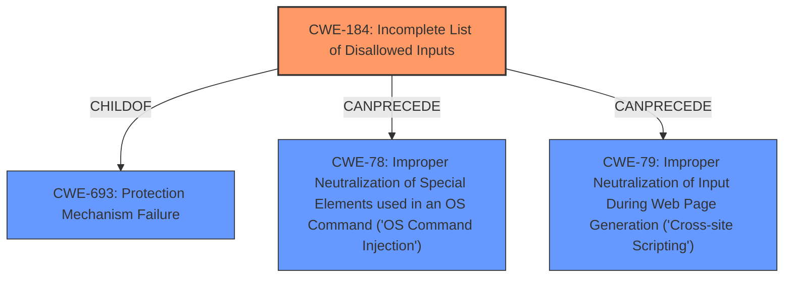

# Analysis for CVE-2021-41133

# Summary
| CWE ID | CWE Name | Confidence | CWE Abstraction Level | CWE Vulnerability Mapping Label | CWE-Vulnerability Mapping Notes |
|---|---|---|---|---|---|
| CWE-184 | Incomplete List of Disallowed Inputs | 0.9 | Base | Primary | Allowed |
| CWE-668 | Exposure of Resource to Wrong Sphere | 0.6 | Class | Secondary | Discouraged |
| CWE-863 | Incorrect Authorization | 0.5 | Class | Secondary | Allowed-with-Review |

## Evidence and Confidence

*   **Confidence Score:** 0.8
*   **Evidence Strength:** HIGH

## Relationship Analysis
The primary relationship that influenced the CWE selection was the ChildOf relationship between CWE-184 and its parents, especially CWE-693, highlighting a protection mechanism failure. The CANPRECEDE relationships of CWE-184 to other injection-related CWEs (like CWE-78 and CWE-79) help contextualize the impact.

## Vulnerability Chain
The vulnerability chain starts with the **incomplete filtering** of syscalls (CWE-184), leading to VFS manipulation. This allows an attacker to bypass sandbox restrictions, resulting in **privilege escalation**.

## Summary of Analysis
The initial assessment focused on identifying the **root cause** of the vulnerability, which is the **incomplete filtering** of syscalls in Flatpak. The evidence supports the selection of CWE-184 because Flatpak's seccomp filter did not block recently added syscalls related to mount operations. This allowed attackers to manipulate the VFS, leading to a sandbox escape and **privilege escalation**.

The selection of CWE-184 is based on the following evidence from the vulnerability description and CVE Reference Links Content Summary:

*   Vulnerability Description Key Phrases: "**weakness:** **privilege escalation**", "**vector:** manipulating VFS".
*   CVE Reference Links Content Summary: "**Insufficient Syscall Filtering:** Flatpak used a denylist approach that did not account for new syscalls related to mounting and VFS manipulation."

The retriever results also support the selection of CWE-184 as the top combined result.

Based on this evidence, CWE-184 is the most appropriate and specific CWE for this vulnerability.

The other CWEs from the retriever results were considered but not used as the primary CWE:
*   CWE-668: Exposure of Resource to Wrong Sphere - While technically applicable, it is too high-level and doesn't capture the specific **root cause**. The mapping guidance discourages its use when lower-level CWEs are applicable.
*   CWE-863: Incorrect Authorization - This is relevant as the **privilege escalation** represents an authorization bypass, but it is a consequence of the **incomplete input validation**, not the primary cause.
*   CWE-427: Uncontrolled Search Path Element - This doesn't directly fit the scenario, as the issue isn't about an untrusted search path but rather the ability to manipulate the VFS due to **incomplete syscall filtering**.
*   CWE-287: Improper Authentication - Authentication isn't the core issue; it's the **privilege escalation** due to bypassing sandbox restrictions.

Relevant CWE Information:

# Enhanced Context (25 CWEs)
The following CWEs were identified as potentially relevant to this vulnerability:

## CWE-668: Exposure of Resource to Wrong Sphere
**Abstraction Level**: Class
**Similarity Score**: 0.78
**Source**: dense

**Description**:
The product exposes a resource to the wrong control sphere, providing unintended actors with inappropriate access to the resource.

**Mapping Guidance**:
- Usage: Discouraged
- Rationale: CWE-668 is high-level and is often misused as a catch-all when lower-level CWE IDs might be applicable. It is sometimes used for low-information vulnerability reports [REF-1287]. It is a level-1 Class (i.e., a child of a Pillar). It is not useful for trend analysis.

## CWE-184: Incomplete List of Disallowed Inputs
**Abstraction Level**: Base
**Similarity Score**: 7513.19
**Source**: sparse

**Description**:
The product implements a protection mechanism that relies on a list of inputs (or properties of inputs) that are not allowed by policy or otherwise require other action to neutralize before additional processing takes place, but the list is incomplete.

**Mapping Guidance**:
- Usage: Allowed
- Rationale: This CWE entry is at the Base level of abstraction, which is a preferred level of abstraction for mapping to the root causes of vulnerabilities.

## CWE-863: Incorrect Authorization
**Abstraction Level**: Class
**Similarity Score**: 6701.54
**Source**: sparse

**Description**:
The product performs an authorization check when an actor attempts to access a resource or perform an action, but it does not correctly perform the check.

**Mapping Guidance**:
- Usage: Allowed-with-Review
- Rationale: This CWE entry is a Class and might have Base-level children that would be more appropriate