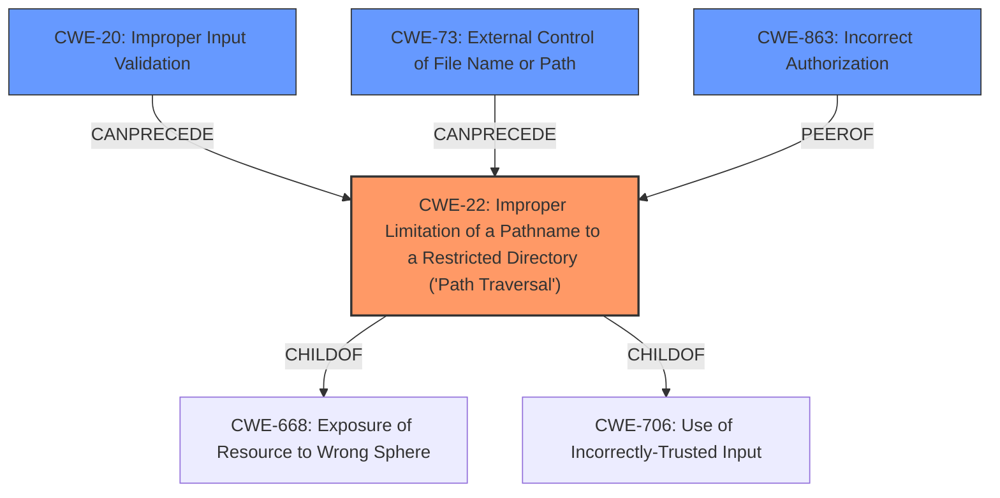

# Raw Analyzer Response for CVE-2021-41143

# Summary
| CWE ID  | CWE Name                                                                                               | Confidence | CWE Abstraction Level | CWE Vulnerability Mapping Label | CWE-Vulnerability Mapping Notes |
| :-------- | :------------------------------------------------------------------------------------------------------- | :---------- | :---------------------- | :------------------------------ | :------------------------------ |
| CWE-22    | Improper Limitation of a Pathname to a Restricted Directory ('Path Traversal')                       | 1          | Base                     | Primary                         | Allowed                         |
| CWE-20    | Improper Input Validation                                                                              | 0.8         | Class                     | Secondary                        | Discouraged                     |
| CWE-73    | External Control of File Name or Path                                                                   | 0.8         | Base                     | Secondary                        | Allowed                         |
| CWE-863   | Incorrect Authorization                                                                                | 0.7         | Class                     | Secondary                        | Allowed-with-Review             |

## Evidence and Confidence

*   **Confidence Score:** 0.85
*   **Evidence Strength:** HIGH

## Relationship Analysis
The primary weakness is CWE-22, which stems from the application's failure to properly restrict pathnames, allowing attackers to access files outside the intended directory. CWE-22 is a child of CWE-668 (Exposure of Resource to Wrong Sphere) and CWE-706 (Use of Incorrectly-Trusted Input). CWE-20 (Improper Input Validation) can lead to CWE-22 because the lack of validation allows malicious pathnames to be used. CWE-73 (External Control of File Name or Path) is related because the vulnerability involves user-controlled paths. CWE-863 (Incorrect Authorization) applies since an authenticated user with admin privileges is able to perform actions outside the scope of what should be allowed.

## Vulnerability Chain
The vulnerability chain begins with **insufficient path sanitization** (Implicit CWE due to missing process) in the `deleteDirectory` method, leading to **path traversal** (CWE-22), which enables **arbitrary file deletion**, and ultimately can result in **remote code execution (RCE)**.

## Summary of Analysis
The analysis indicates that the primary weakness is CWE-22. This conclusion is supported by the CVE Reference Links Content Summary, which states: "The vulnerability stems from **insufficient path sanitization** within the `Mage_Cms_Model_Wysiwyg_Images_Storage` class, specifically in the `deleteDirectory` method. The code **does not properly validate user-supplied paths** when deleting directories within customer media storage." This aligns directly with the definition of CWE-22, where the product **does not properly neutralize special elements within the pathname** that can cause the pathname to resolve to a location that is outside of the restricted directory."

CWE-20 (Improper Input Validation) is a contributing factor because the **lack of validation** on user-supplied paths allows the path traversal to occur. CWE-73 (External Control of File Name or Path) also contributes, as the vulnerability involves user-controlled paths that are not properly sanitized. CWE-863 applies since an authenticated user with admin privileges should not be able to delete arbitrary files.

The selected CWEs are at the optimal level of specificity, with CWE-22 being the base weakness and CWE-20, CWE-73, and CWE-863 providing additional context.

Relevant CWE Information:

# Enhanced Context (25 CWEs)

## CWE-807: Reliance on Untrusted Inputs in a Security Decision
**Abstraction Level**: Base
**Similarity Score**: 0.76
**Source**: dense

**Description**:
The product uses a protection mechanism that relies on the existence or values of an input, but the input can be modified by an untrusted actor in a way that bypasses the protection mechanism.

**Mapping Decision**: Not Selected. The vulnerability is due to insufficient validation of input, rather than reliance on untrusted input in a security decision.

## CWE-274: Improper Handling of Insufficient Privileges
**Abstraction Level**: Base
**Similarity Score**: 0.76
**Source**: dense

**Description**:
The product does not handle or incorrectly handles when it has insufficient privileges to perform an operation, leading to resultant weaknesses.

**Mapping Decision**: Not Selected. The vulnerability is not directly related to handling insufficient privileges.

## CWE-280: Improper Handling of Insufficient Permissions or Privileges
**Abstraction Level**: Base
**Similarity Score**: 0.75
**Source**: dense

**Description**:
The product does not handle or incorrectly handles when it has insufficient privileges to access resources or functionality as specified by their permissions. This may cause it to follow unexpected code paths that may leave the product in an invalid state.

**Mapping Decision**: Not Selected. Similar to CWE-274, the vulnerability isn't about handling insufficient privileges, but rather mishandling path sanitization.

## CWE-639: Authorization Bypass Through User-Controlled Key
**Abstraction Level**: Base
**Similarity Score**: 0.75
**Source**: dense

**Description**:
The system's authorization functionality does not prevent one user from gaining access to another user's data or record by modifying the key value identifying the data.

**Mapping Decision**: Not Selected. The vulnerability is not about bypassing authorization through user-controlled keys.

## CWE-653: Improper Isolation or Compartmentalization
**Abstraction Level**: Class
**Similarity Score**: 0.75
**Source**: dense

**Description**:
The product does not properly compartmentalize or isolate functionality, processes, or resources that require different privilege levels, rights, or permissions.

**Mapping Decision**: Not Selected. The vulnerability is not primarily related to improper isolation or compartmentalization.

## CWE-1289: Improper Validation of Unsafe Equivalence in Input
**Abstraction Level**: Base
**Similarity Score**: 0.75
**Source**: dense

**Description**:
The product receives an input value that is used as a resource identifier or other type of reference, but it does not validate or incorrectly validates that the input is equivalent to a potentially-unsafe value.

**Mapping Decision**: Not Selected. The vulnerability is more directly related to path traversal than unsafe equivalence.

## CWE-1220: Insufficient Granularity of Access Control
**Abstraction Level**: Base
**Similarity Score**: 0.75
**Source**: dense

**Description**:
The product implements access controls via a policy or other feature with the intention to disable or restrict accesses (reads and/or writes) to assets in a system from untrusted agents. However, implemented access controls lack required granularity, which renders the control policy too broad because it allows accesses from unauthorized agents to the security-sensitive assets.

**Mapping Decision**: Not Selected. The vulnerability is not about access control granularity.

## CWE-693: Protection Mechanism Failure
**Abstraction Level**: Pillar
**Similarity Score**: 0.75
**Source**: dense

**Description**:
The product does not use or incorrectly uses a protection mechanism that provides sufficient defense against directed attacks against the product.

**Mapping Decision**: Not Selected. This is a high-level category and less specific than CWE-22.

## CWE-668: Exposure of Resource to Wrong Sphere
**Abstraction Level**: Class
**Similarity Score**: 0.74
**Source**: dense

**Description**:
The product exposes a resource to the wrong control sphere, providing unintended actors with inappropriate access to the resource.

**Mapping Decision**: Not Selected. While related, CWE-22 is a more specific description of the vulnerability.

## CWE-552: Files or Directories Accessible to External Parties
**Abstraction Level**: Base
**Similarity Score**: 0.74
**Source**: dense

**Description**:
The product makes files or directories accessible to unauthorized actors, even though they should not be.

**Mapping Decision**: Not Selected. The vulnerability is more about path traversal than general accessibility.

## CWE-23: Relative Path Traversal
**Abstraction Level**: Base
**Similarity Score**: 8495.65
**Source**: sparse

**Description**:
The product uses external input to construct a pathname that