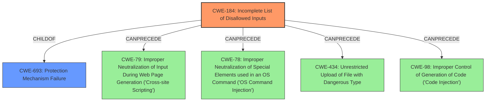

# Enhanced Analysis for CVE-2021-41144

# Summary
| CWE ID | CWE Name | Confidence | CWE Abstraction Level | CWE Vulnerability Mapping Label | CWE-Vulnerability Mapping Notes |
|---|---|---|---|---|---|
| CWE-184 | Incomplete List of Disallowed Inputs | 0.9 | Base | Allowed | Primary CWE |
| CWE-94 | Improper Control of Generation of Code ('Code Injection') | 0.7 | Base | Allowed-with-Review | Secondary Candidate |

## Evidence and Confidence

*   **Confidence Score:** 0.8
*   **Evidence Strength:** HIGH

## Relationship Analysis
The primary relationship influencing the choice of CWE-184 is its role as a base-level weakness describing an **incomplete** security mechanism. CWE-184 is a child of CWE-693 (Protection Mechanism Failure) which is too abstract. CWE-184 can precede CWE-78, CWE-79, CWE-98 and CWE-434, showing that an incomplete list of disallowed inputs can lead to other vulnerabilities like command injection, XSS or code execution.



## Vulnerability Chain
The vulnerability chain starts with an **incomplete** method blacklist (CWE-184), leading to a bypass of security measures, ultimately resulting in remote code execution.

## Summary of Analysis
The initial assessment focused on identifying the root cause of the remote code execution vulnerability in OpenMage LTS. The analysis of the vulnerability description and CVE reference summary pointed towards a bypass of the block blacklist. The key phrase "bypass the block blacklist to execute remote code" strongly suggests that the blacklist was **incomplete**, allowing malicious code to be executed.

The retriever results also highlighted CWE-184 (Incomplete List of Disallowed Inputs) as the top candidate. The CVE Reference Links Content Summary also mentions that "The `Security.php` had a method blacklist, which was circumvented and has now been fixed." This reinforces the idea that the vulnerability stems from an **incomplete** or inadequate list of disallowed methods.

CWE-184's description states: "The product implements a protection mechanism that relies on a list of inputs (or properties of inputs) that are not allowed by policy or otherwise require other action to neutralize before additional processing takes place, but the list is **incomplete**." This accurately reflects the vulnerability where the blacklist **failed** to prevent the execution of malicious code.

The choice of CWE-184 is at the optimal level of specificity because it directly addresses the root cause, which is the **incomplete** blacklist. While the ultimate impact is remote code execution, focusing on CWE-184 provides a more accurate and actionable classification of the weakness.

The reasoning for selecting CWE-184 is primarily based on the evidence within the CVE Reference Links Content Summary stating "The `Security.php` had a method blacklist, which was circumvented and has now been fixed." This explicitly points to an **incomplete** security measure, aligning perfectly with CWE-184.

Relevant CWE Information:

# Enhanced Context (25 CWEs)
## CWE-184: Incomplete List of Disallowed Inputs
**Abstraction Level**: Base
**Similarity Score**: 0.104
**Source**: sparse

**Description**:
The product implements a protection mechanism that relies on a list of inputs (or properties of inputs) that are not allowed by policy or otherwise require other action to neutralize before additional processing takes place, but the list is **incomplete**.

**Mapping Guidance**:
- Usage: Allowed
- Rationale: This CWE entry is at the Base level of abstraction, which is a preferred level of abstraction for mapping to the root causes of vulnerabilities.

### Additional Considered CWEs

*   **CWE-20: Improper Input Validation** - While input validation is related, CWE-20 is too general. The problem isn't a general lack of validation, but rather a specific **failure** in the blacklist mechanism.
*   **CWE-1336: Improper Neutralization of Special Elements Used in a Template Engine** - This CWE relates to template injection, which is a possibility given the context of layout blocks, but the primary issue is the **incomplete** blacklist, not necessarily the improper handling of template elements.
*   **CWE-94: Improper Control of Generation of Code ('Code Injection')** - This is a potential consequence of the blacklist bypass, but the root cause is the **incomplete** list of disallowed inputs that leads to code injection. The vulnerability description key phrases says "bypass the block blacklist to execute remote code" showing the impact is remote code execution but the rootcause is the "bypass the block blacklist".


## CWE Relationship Analysis

Current CWEs represent these abstraction levels: .


### Vulnerability Chain Analysis

**Chain starting from CWE-693:**
- 693 (Protection Mechanism Failure) - ROOT


**Chain starting from CWE-98:**
- 98 (Improper Control of Filename for Include/Require Statement in PHP Program ('PHP Remote File Inclusion')) - ROOT


### CWE Relationship Diagram

```mermaid
graph TD
    classDef primary fill:#f96,stroke:#333,stroke-width:2px
    classDef secondary fill:#69f,stroke:#333
    classDef tertiary fill:#9e9,stroke:#333
```