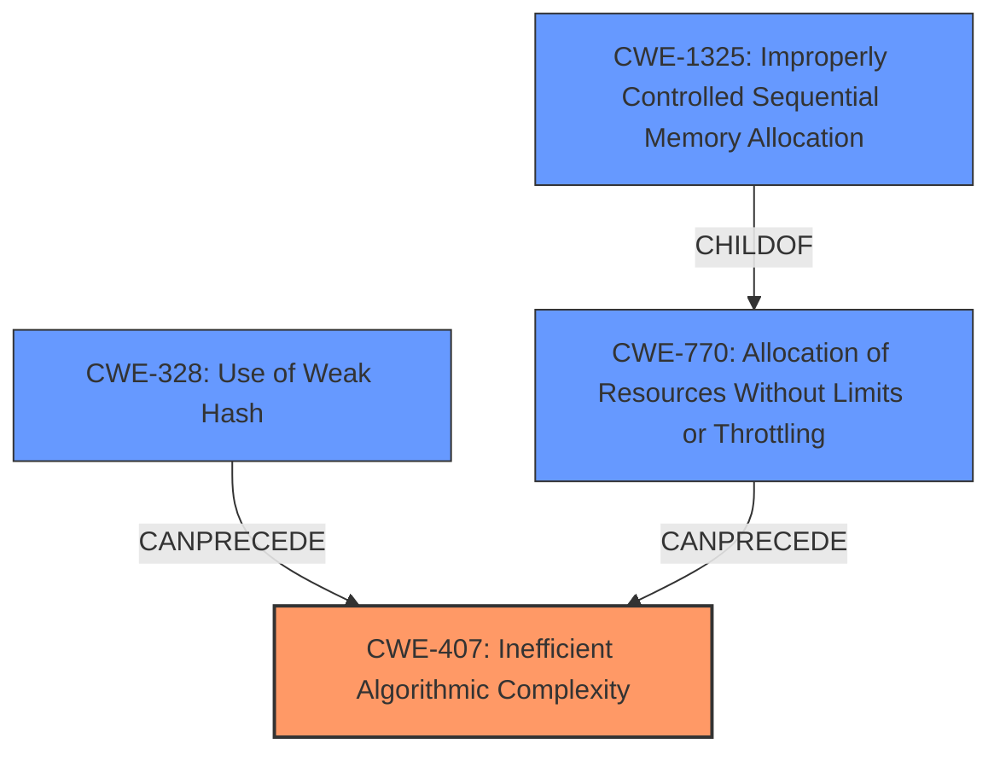

# Analysis Report for CVE-2021-41168

# Vulnerability Analysis Report: CVE-2021-41168

## Description


## Analysis (with Relationship Data)

# Summary

| CWE ID | CWE Name | Confidence | CWE Abstraction Level | CWE Vulnerability Mapping Label | CWE-Vulnerability Mapping Notes |
|---|---|---|---|---|---|
| CWE-407 | Inefficient Algorithmic Complexity | 0.9 | Class | Allowed-with-Review | Primary CWE |
| CWE-328 | Use of Weak Hash | 0.8 | Base | Allowed | Secondary Candidate |
| CWE-770 | Allocation of Resources Without Limits or Throttling | 0.7 | Base | Allowed | Secondary Candidate |
| CWE-1325 | Improperly Controlled Sequential Memory Allocation | 0.6 | Base | Allowed | Secondary Candidate |

## Evidence and Confidence

*   **Confidence Score:** 0.8
*   **Evidence Strength:** HIGH

## Relationship Analysis

The primary weakness identified is CWE-407 **Inefficient Algorithmic Complexity**, which is a Class-level CWE. The vulnerability stems from a **weak hash function** (CWE-328) that leads to hash collisions, causing the algorithm to perform inefficiently. CWE-407 is a parent of CWE-1333 **Inefficient Regular Expression Complexity**, which is not applicable in this case, since there is no regular expression. CWE-328 is a child of CWE-326 **Inadequate Encryption Strength**, which is also not applicable. CWE-770 **Allocation of Resources Without Limits or Throttling** is a parent of CWE-789 **Memory Allocation with Excessive Size Value**. CWE-1325 **Improperly Controlled Sequential Memory Allocation** is a child of CWE-770.



## Vulnerability Chain

The vulnerability chain starts with the **weak hash function** (CWE-328) which leads to hash collisions. This causes the algorithm's complexity to increase, resulting in denial of service (CWE-407). The hash table implementation allows duplicate keys, which enables an attacker to create long linked lists with duplicate entries (CWE-770 and CWE-1325), further exacerbating the DoS.

## Summary of Analysis

The initial assessment identified the **weak hash function** as a critical element. The vulnerability description explicitly mentions the **weak hash function** and its impact on the algorithm's performance, leading to a denial-of-service (DoS) attack. "References written in markdown ` [reference_name] https//www.example.com` are inserted into a hash table which was found to have a **weak hash function**, meaning that an attacker can reliably generate a large number of collisions for it. This makes the hash table vulnerable to a hash-collision DoS attack, a type of algorithmic complexity attack."

The primary CWE is CWE-407 **Inefficient Algorithmic Complexity**, as the vulnerability manifests as an algorithmic complexity issue due to hash collisions. While CWE-328 **Use of Weak Hash** is also relevant, it's more of a contributing factor than the core weakness. CWE-770 **Allocation of Resources Without Limits or Throttling** and CWE-1325 **Improperly Controlled Sequential Memory Allocation** are also contributing factors, as the hash table allows duplicate entries, leading to increased memory consumption and retrieval times.

The selected CWEs are at an appropriate level of specificity, with CWE-407 being a Class, and CWE-328, CWE-770, and CWE-1325 being Base-level CWEs. This provides a comprehensive view of the vulnerability, capturing both the high-level algorithmic issue and the underlying technical causes.

CWE-1333 **Inefficient Regular Expression Complexity** was considered but excluded because the vulnerability does not involve regular expressions. Similarly, CWE-476 **NULL Pointer Dereference** was considered but deemed not applicable as the vulnerability does not involve dereferencing NULL pointers. CWE-459 **Incomplete Cleanup** was also considered but excluded as there is no incomplete cleanup in the described vulnerability.


## CWE Relationship Analysis

Current CWEs represent these abstraction levels: .


### Vulnerability Chain Analysis

**Chain starting from CWE-1325:**
- 1325 (Improperly Controlled Sequential Memory Allocation) - ROOT


**Chain starting from CWE-476:**
- 476 (NULL Pointer Dereference) - ROOT


### CWE Relationship Diagram

```mermaid
graph TD
    classDef primary fill:#f96,stroke:#333,stroke-width:2px
    classDef secondary fill:#69f,stroke:#333
    classDef tertiary fill:#9e9,stroke:#333
```


*Report generated on 2025-03-31 10:11:16*
