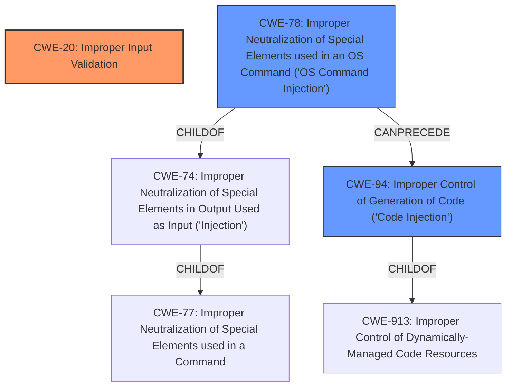

# Raw Analyzer Response for CVE-2021-4120

# Summary
| CWE ID | CWE Name | Confidence | CWE Abstraction Level | CWE Vulnerability Mapping Label | CWE-Vulnerability Mapping Notes |
|---|---|---|---|---|---|
| CWE-20 | Improper Input Validation | 0.9 | Class | Primary | Discouraged - but applicable as root cause is **fails to perform sufficient validation** |
| CWE-78 | Improper Neutralization of Special Elements used in an OS Command ('OS Command Injection') | 0.7 | Base | Secondary | Allowed - AppArmor policy rules injection |
| CWE-94 | Improper Control of Generation of Code ('Code Injection') | 0.6 | Base | Secondary | Allowed-with-Review - arbitrary AppArmor policy rules injection |

## Evidence and Confidence

*   **Confidence Score:** 0.8
*   **Evidence Strength:** HIGH

## Relationship Analysis
The primary weakness is CWE-20, which represents the **failure to perform sufficient validation**. CWE-78 and CWE-94 are secondary because they describe the specific impact of the **improper input validation**, leading to the ability to inject arbitrary code (AppArmor policy rules). CWE-78 is a child of CWE-77 (Improper Neutralization of Special Elements used in a Command) and CWE-74 (Improper Neutralization of Special Elements in Output Used as Input 'Injection'). CWE-94 is a child of CWE-913 (Improper Control of Dynamically-Managed Code Resources). The relationship highlights the progression from **insufficient validation** to code injection.

## Vulnerability Chain
The vulnerability chain starts with **CWE-20 (Improper Input Validation)**, which leads to the ability to inject arbitrary AppArmor policy rules. This results in **CWE-78 (Improper Neutralization of Special Elements used in an OS Command)** and/or **CWE-94 (Improper Control of Generation of Code)**, ultimately allowing an attacker to escape strict snap confinement and potentially escalate privileges.

## Summary of Analysis
The initial assessment identified **insufficient validation** as the primary issue, supported by the description: "snapd 2.54.2 **fails to perform sufficient validation of snap content interface and layout paths**". This directly maps to **CWE-20 (Improper Input Validation)**. The **CVE Reference Links Content Summary** reinforces this, stating "**Lack of Input Sanitization:** `snapd` failed to properly sanitize or validate the strings provided for content interface `read` settings and layout paths."

The ability to inject arbitrary AppArmor policy rules translates to **CWE-78 (Improper Neutralization of Special Elements used in an OS Command)** because the injected rules are effectively OS commands that modify the system's security policy. It also relates to **CWE-94 (Improper Control of Generation of Code)** as the AppArmor policy is code that controls system behavior.

While **CWE-20** is discouraged by MITRE, it is appropriate here as the root cause. The **Complete CWE Specifications** for **CWE-20** state: "The product receives input or data, but it does not validate or incorrectly validates that the input has the properties that are required to process the data safely and correctly."

The **Retriever Results** listed several other CWEs, including Path Traversal variants (**CWE-22, CWE-23, CWE-24, CWE-25, CWE-26, CWE-27, CWE-29, CWE-35, CWE-36, CWE-37**) and **CWE-113 (Improper Neutralization of CRLF Sequences in HTTP Headers)**, **CWE-1336 (Improper Neutralization of Special Elements Used in a Template Engine)**, **CWE-138 (Improper Neutralization of Special Elements)**, and **CWE-1284 (Improper Validation of Specified Quantity in Input)**, but these are less relevant as they don't directly address the core issue of **insufficient validation** of the snap content interface and layout paths. These are potential impacts resulting from the **improper validation**, but the core weakness is the **lack of validation** itself. Path Traversal is not applicable as the intended behavior is not a file system access.

**CWE-78** is selected because the **CVE Reference Links Content Summary** states: "Due to the lack of validation, it was possible to inject arbitrary AppArmor policy rules by embedding them within these paths." This implies the ability to execute commands, which aligns with **CWE-78**. **CWE-94** is considered because the injected AppArmor policies can be seen as generated code, which is not properly controlled.

The selection of **CWE-20**, **CWE-78**, and **CWE-94** provides the optimal level of specificity, capturing both the root cause (insufficient validation) and the immediate consequences (code injection, OS command injection).