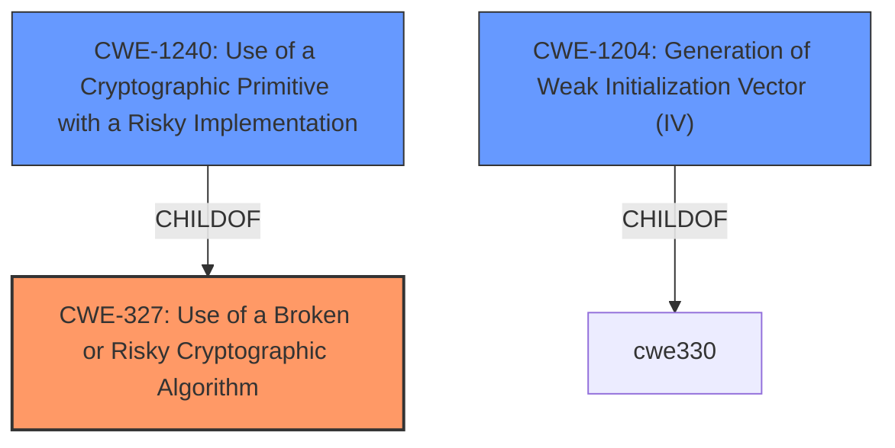

# Analysis Report for CVE-2021-41278

# Vulnerability Analysis Report: CVE-2021-41278

## Description


## Analysis (with Relationship Data)

# Summary
| CWE ID | CWE Name | Confidence | CWE Abstraction Level | CWE Vulnerability Mapping Label | CWE-Vulnerability Mapping Notes |
|---|---|---|---|---|---|
| CWE-327 | Use of a Broken or Risky Cryptographic Algorithm | 1.0 | Class | Allowed-with-Review | Primary CWE |
| CWE-1240 | Use of a Cryptographic Primitive with a Risky Implementation | 0.9 | Base | Allowed | Secondary Candidate |
| CWE-1204 | Generation of Weak Initialization Vector (IV) | 0.7 | Base | Allowed | Secondary Candidate |

## Evidence and Confidence

*   **Confidence Score:** 0.9
*   **Evidence Strength:** HIGH

## Relationship Analysis
The primary CWE selected is CWE-327 (Use of a Broken or Risky Cryptographic Algorithm), which is a Class-level CWE. It is related to CWE-1240 (Use of a Cryptographic Primitive with a Risky Implementation) and CWE-1204 (Generation of Weak Initialization Vector (IV)) through hierarchical relationships. CWE-1240 is a child of CWE-327, indicating it's a more specific instance of using flawed cryptography. CWE-1204 is related to IV generation, which is often a component in an algorithm implementation. The choice of CWE-327 is preferred initially as the top level Class CWE, with child CWEs provided as secondary candidates.



## Vulnerability Chain
The vulnerability chain starts with the **broken encryption** within the `app-functions-sdk AES transform`. This **broken encryption** leads to the ability for attackers to **decrypt messages**. Thus:
1.  **Root Cause:** **Broken encryption in app-functions-sdk AES transform**
2.  **Weakness:** Use of a **broken** or risky cryptographic algorithm
3.  **Impact:** Attackers can decrypt messages.

## Summary of Analysis
The initial assessment identified the **broken encryption** as the root cause, with the impact being the ability to decrypt messages. The retriever results and complete CWE specifications were then analyzed.

The primary CWE, CWE-327 (Use of a Broken or Risky Cryptographic Algorithm), aligns well with the description of the vulnerability. The vulnerability description key phrases mention "**broken encryption in app-functions-sdk AES transform**", which directly corresponds to using a risky cryptographic algorithm. The "CVE Reference Links Content Summary" section supports this by stating, "The core issue is a flawed implementation of AES encryption. This **broken** implementation leads to weak encryption." The evidence strongly points towards a cryptographic flaw, making CWE-327 a relevant choice. The mapping guidance allows this choice with review, suggesting examination of child CWEs.

CWE-1240 (Use of a Cryptographic Primitive with a Risky Implementation) is a child of CWE-327 and is also highly relevant, as the vulnerability stems from a specific implementation flaw within the AES transform. The CWE description states: "To fulfill the need for a cryptographic primitive, the product implements a cryptographic algorithm using a non-standard, unproven, or disallowed/non-compliant cryptographic implementation." The "CVE Reference Links Content Summary" also mentions this aspect.

CWE-1204 (Generation of Weak Initialization Vector (IV)) is another possible choice, as weaknesses in IV generation can compromise encryption strength. However, the available information does not explicitly confirm that the **broken encryption** is caused by weak IV generation. Thus, it is a secondary candidate only.

CWE-259 (Use of Hard-coded Password) and CWE-321 (Use of Hard-coded Cryptographic Key) were considered but deemed less relevant because the vulnerability does not seem to be related to hard-coded credentials, but to a **broken implementation** of a cryptographic algorithm.

The chosen CWEs are at the optimal level of specificity because they accurately reflect the underlying cause of the vulnerability: the use of a **broken** cryptographic algorithm.

Relevant CWE Information:

# Enhanced Context (25 CWEs)
The following CWEs were identified as potentially relevant to this vulnerability:

## CWE-203: Observable Discrepancy
**Abstraction Level**: Base
**Similarity Score**: 0.77
**Source**: dense

**Description**:
The product behaves differently or sends different responses under different circumstances in a way that is observable to an unauthorized actor, which exposes security-relevant information about the state of the product, such as whether a particular operation was successful or not.

**Mapping Guidance**:
- Usage: Allowed
- Rationale: This CWE entry is at the Base level of abstraction, which is a preferred level of abstraction for mapping to the root causes of vulnerabilities.

## CWE-1240: Use of a Cryptographic Primitive with a Risky Implementation
**Abstraction Level**: Base
**Similarity Score**: 0.76
**Source**: dense

**Description**:
To fulfill the need for a cryptographic primitive, the product implements a cryptographic algorithm using a non-standard, unproven, or disallowed/non-compliant cryptographic implementation.

**Mapping Guidance**:
- Usage: Allowed
- Rationale: This CWE entry is at the Base level of abstraction, which is a preferred level of abstraction for mapping to the root causes of vulnerabilities.

## CWE-208: Observable Timing Discrepancy
**Abstraction Level**: Base
**Similarity Score**: 0.76
**Source**: dense

**Description**:
Two separate operations in a product require different amounts of time to complete, in a way that is observable to an actor and reveals security-relevant information about the state of the product, such as whether a particular operation was successful or not.

**Mapping Guidance**:
- Usage: Allowed
- Rationale: This CWE entry is at the Base level of abstraction, which is a preferred level of abstraction for mapping to the root causes of vulnerabilities.

## CWE-345: Insufficient Verification of Data Authenticity
**Abstraction Level**: Class
**Similarity Score**: 0.76
**Source**: dense

**Description**:
The product does not sufficiently verify the origin or authenticity of data, in a way that causes it to accept invalid data.

**Mapping Guidance**:
- Usage: Discouraged
- Rationale: This CWE entry is a level-1 Class (i.e., a child of a Pillar). It might have lower-level children that would be more appropriate

## CWE-204: Observable Response Discrepancy
**Abstraction Level**: Base
**Similarity Score**: 0.75
**Source**: dense

**Description**:
The product provides different responses to incoming requests in a way that reveals internal state information to an unauthorized actor outside of the intended control sphere.

**Mapping Guidance**:
- Usage: Allowed
- Rationale: This CWE entry is at the Base level of abstraction, which is a preferred level of abstraction for mapping to the root causes of vulnerabilities.

## CWE-1391: Use of Weak Credentials
**Abstraction Level**: Class
**Similarity Score**: 0.74
**Source**: dense

**Description**:
The product uses weak credentials (such as a default key or hard-coded password) that can be calculated, derived, reused, or guessed by an attacker.

**Mapping Guidance**:
- Usage: Allowed-with-Review
- Rationale: This CWE entry is a Class and might have Base-level children that would be more appropriate

## CWE-668: Exposure of Resource to Wrong Sphere
**Abstraction Level**: Class
**Similarity Score**: 0.74
**Source**: dense

**Description**:
The product exposes a resource to the wrong control sphere, providing unintended actors with inappropriate access to the resource.

**Mapping Guidance**:
- Usage: Discouraged
- Rationale: CWE-668 is high-level and is often misused as a catch-all when lower-level CWE IDs might be applicable. It is sometimes used for low-information vulnerability reports [REF-1287]. It is a level-1 Class (i.e., a child of a Pillar). It is not useful for trend analysis.

## CWE-330: Use of Insufficiently Random Values
**Abstraction Level**: Class
**Similarity Score**: 0.74
**Source**: dense

**Description**:
The product uses insufficiently random numbers or values in a security context that depends on unpredictable numbers.

**Mapping Guidance**:
- Usage: Discouraged
- Rationale: This CWE entry is a level-1 Class (i.e., a child of a Pillar). It might have lower-level children that would be more appropriate

## CWE-327: Use of a Broken or Risky


## CWE Relationship Analysis

Current CWEs represent these abstraction levels: .


### Vulnerability Chain Analysis

**Chain starting from CWE-208:**
- 208 (Observable Timing Discrepancy) - ROOT


**Chain starting from CWE-203:**
- 203 (Observable Discrepancy) - ROOT


### CWE Relationship Diagram

```mermaid
graph TD
    classDef primary fill:#f96,stroke:#333,stroke-width:2px
    classDef secondary fill:#69f,stroke:#333
    classDef tertiary fill:#9e9,stroke:#333
```


*Report generated on 2025-03-31 12:11:13*
