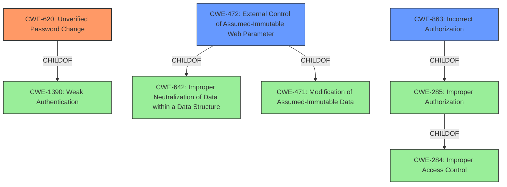

# Raw Analyzer Response for CVE-2021-41322

# Summary
| CWE ID | CWE Name | Confidence | CWE Abstraction Level | CWE Vulnerability Mapping Label | CWE-Vulnerability Mapping Notes |
|---|---|---|---|---|---|
| CWE-620 | Unverified Password Change | 0.9 | Base | Allowed | Primary CWE |
| CWE-472 | External Control of Assumed-Immutable Web Parameter | 0.6 | Base | Allowed | Secondary Candidate |
| CWE-863 | Incorrect Authorization | 0.5 | Class | Allowed-with-Review | Secondary Candidate |

## Evidence and Confidence

*   **Confidence Score:** 0.9
*   **Evidence Strength:** HIGH

## Relationship Analysis
The primary CWE, CWE-620, is a child of CWE-1390 (Weak Authentication), indicating a lack of proper authentication mechanisms during password changes. CWE-472 (External Control of Assumed-Immutable Web Parameter) is related to CWE-642 (Improper Neutralization of Data within a Data Structure) and CWE-471 (Modification of Assumed-Immutable Data). CWE-863 (Incorrect Authorization) is a child of CWE-285 (Improper Authorization) and CWE-284 (Improper Access Control). The vulnerability can be seen as a combination of missing authentication steps and improper authorization checks.

## Vulnerability Chain
The vulnerability chain starts with the **improper access control**, leading to a low-privileged user's ability to modify a POST parameter. This results in the ability to change the Admin password.
- **Root Cause:** **Improper Access Control** (inferred) and **Unverified Password Change** (CWE-620)
- **Weakness:** External Control of Assumed-Immutable Web Parameter (CWE-472) or Incorrect Authorization (CWE-863)
- **Impact:** Change Admin password

## Summary of Analysis
The primary weakness is that the Poly VVX 400/410 allows low-privileged users to change the Admin password by modifying a POST parameter during the password reset process, indicating a **missing verification step for password changes**. This directly corresponds to **CWE-620: Unverified Password Change**, where the product doesn't require knowledge of the original password or another form of authentication.

Supporting evidence from the vulnerability description:
- "**improper access control**"
- "**impact:** change Admin password"
- "**vector:** modifying a POST parameter"
- "**attacker:** low-privileged users"

The retriever results also suggest **CWE-472: External Control of Assumed-Immutable Web Parameter**, which could be a contributing factor, as the POST parameter is being externally controlled. The description of CWE-472 states: "The web application does not sufficiently verify inputs that are assumed to be immutable but are actually externally controllable, such as hidden form fields." This is possible since the password reset process should verify the user's identity before allowing a password change.

Another considered CWE is **CWE-863: Incorrect Authorization**, as the low-privileged user is able to perform an action (changing the Admin password) that should require higher privileges.

The decision to prioritize CWE-620 is based on the fact that the core issue revolves around the absence of verification during the password change process. While CWE-472 and CWE-863 highlight related aspects of the vulnerability, CWE-620 directly addresses the root cause.

CWEs considered but not used:
- CWE-285: Improper Authorization - Discouraged due to being a high-level class.
- CWE-287: Improper Authentication - Discouraged due to being a high-level class.
- CWE-732: Incorrect Permission Assignment for Critical Resource - This is about incorrect permission assignment and not directly about missing verification during password change.
- CWE-1393: Use of Default Password - This vulnerability is about changing the Admin password by modifying a POST parameter and not about default credentials.
- CWE-321: Use of Hard-coded Cryptographic Key - Not relevant to this vulnerability description.
- CWE-306: Missing Authentication for Critical Function - Although there is a **missing** authentication step, it is only specific to the password change function. Therefore, CWE-620 is more relevant.
- CWE-352: Cross-Site Request Forgery (CSRF) - The vulnerability description lacks information relating to CSRF, so it is not relevant.
- CWE-288: Authentication Bypass Using an Alternate Path or Channel - Not relevant to this vulnerability description.