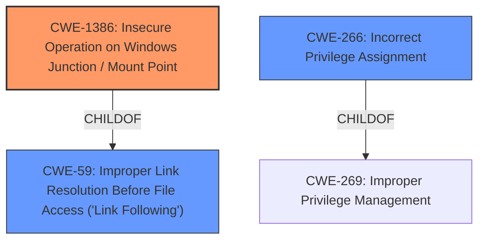

# Analysis for CVE-2021-41379

# Summary
| CWE ID | CWE Name | Confidence | CWE Abstraction Level | CWE Vulnerability Mapping Label | CWE-Vulnerability Mapping Notes |
|---|---|---|---|---|---|
| CWE-1386 | Insecure Operation on Windows Junction / Mount Point | 0.9 | Base | Allowed | Primary CWE |
| CWE-59 | Improper Link Resolution Before File Access ('Link Following') | 0.7 | Base | Allowed | Secondary Candidate |
| CWE-266 | Incorrect Privilege Assignment | 0.6 | Base | Allowed | Secondary Candidate |

## Evidence and Confidence

*   **Confidence Score:** 0.8
*   **Evidence Strength:** HIGH

## Relationship Analysis
The primary CWE is CWE-1386, which is a child of CWE-59. CWE-59 represents a more general case of improper link resolution. The vulnerability description clearly indicates the abuse of Windows junctions, thus justifying the selection of the more specific CWE-1386. CWE-266 is a broader category about incorrect privilege assignment that is a child of CWE-269.

## Vulnerability Chain
The vulnerability chain starts with the **improper access control** of the Windows Installer service, leading to the ability to create junctions and ultimately escalate privileges.

## Summary of Analysis
The initial assessment identified several candidate CWEs, including CWE-59, CWE-266, and CWE-1386. The final decision was heavily influenced by the provided evidence, particularly the "CVE Reference Links Content Summary" which states: "The vulnerability exists within the Windows Installer service due to **improper handling of junctions**" and "The Windows Installer service can be abused by creating a junction to delete a file or directory." This, coupled with the vulnerability description's mention of **improper access control** and privilege escalation, strongly supports the selection of CWE-1386 as the primary weakness because it most accurately describes the **root cause** of the vulnerability.

The selection of CWE-1386 is at the optimal level of specificity because it directly addresses the insecure operation on Windows junctions/mount points. While CWE-59 is a parent, it is less specific.

Relevant CWE Information:

# Enhanced Context (25 CWEs)

## CWE-73: External Control of File Name or Path
This CWE was considered but not selected because the vulnerability is not primarily about external control of file names or paths, but rather about the **improper handling** of junctions within the Windows Installer service. While an attacker can create junctions, the core issue is the service's **failure** to properly handle them, not necessarily the external control aspect.

## CWE-59: Improper Link Resolution Before File Access ('Link Following')
This CWE was considered and selected as a secondary candidate because CWE-1386 is a child of CWE-59 and the vulnerability involves improper handling of links (junctions).

## CWE-427: Uncontrolled Search Path Element
This CWE was considered but not selected because the vulnerability doesn't involve an uncontrolled search path. The issue is with the Windows Installer service's handling of junctions, not the paths it searches.

## CWE-41: Improper Resolution of Path Equivalence
This CWE was considered but not selected because the vulnerability doesn't hinge on path equivalence issues, but rather on the **improper handling** of junctions.

## CWE-552: Files or Directories Accessible to External Parties
This CWE was considered but not selected because the vulnerability isn't primarily about making files or directories accessible to external parties. The core issue is the ability to escalate privileges through junction manipulation.

## CWE-23: Relative Path Traversal
This CWE was considered but not selected because the vulnerability does not involve path traversal. The issue is the **improper handling** of junctions.

## CWE-668: Exposure of Resource to Wrong Sphere
This CWE was considered but not selected because it is too high-level. The vulnerability is more specifically related to the **improper handling** of junctions by the Windows Installer service (CWE-1386).

## CWE-276: Incorrect Default Permissions
This CWE was considered but not selected because the vulnerability is not about incorrect default permissions but about the **improper handling** of junctions that leads to privilege escalation.

## CWE-426: Untrusted Search Path
This CWE was considered but not selected because the vulnerability doesn't involve an untrusted search path. The core issue is the **improper handling** of junctions.

## CWE-497: Exposure of Sensitive System Information to an Unauthorized Control Sphere
This CWE was considered but not selected because the vulnerability is not directly related to the exposure of sensitive system information. The primary issue is the **improper handling** of junctions.

## CWE-266: Incorrect Privilege Assignment
This CWE was considered and selected as a secondary candidate because the vulnerability ultimately leads to privilege escalation, which is related to **incorrect privilege assignment**.

## CWE-1386: Insecure Operation on Windows Junction / Mount Point
**CWE-1386: Insecure Operation on Windows Junction / Mount Point** is the primary CWE because it directly addresses the **root cause**: the **improper handling** of junctions by the Windows Installer service, which leads to privilege escalation. The vulnerability description and the CVE reference summary both highlight the abuse of junctions as the core mechanism.

*   **How the vulnerability's details match the CWE's characteristics:** The vulnerability specifically involves the Windows Installer service's **failure** to properly handle junctions, allowing attackers to manipulate them and escalate privileges.
*   **The security implications and potential impact:** This allows an attacker to escalate privileges and execute arbitrary code in the context of SYSTEM.
*   **Any parent-child relationships or chain patterns that influenced your mapping:** CWE-1386 is a child of CWE-59, reflecting the link-following aspect of the vulnerability.
*   **Whether the weakness is primary or secondary in the vulnerability:** Primary.
*   **How the official MITRE mapping guidance influenced your decision:** The mapping guidance for CWE-1386 supports its selection as the Base level of abstraction and its appropriateness for mapping to the root cause.