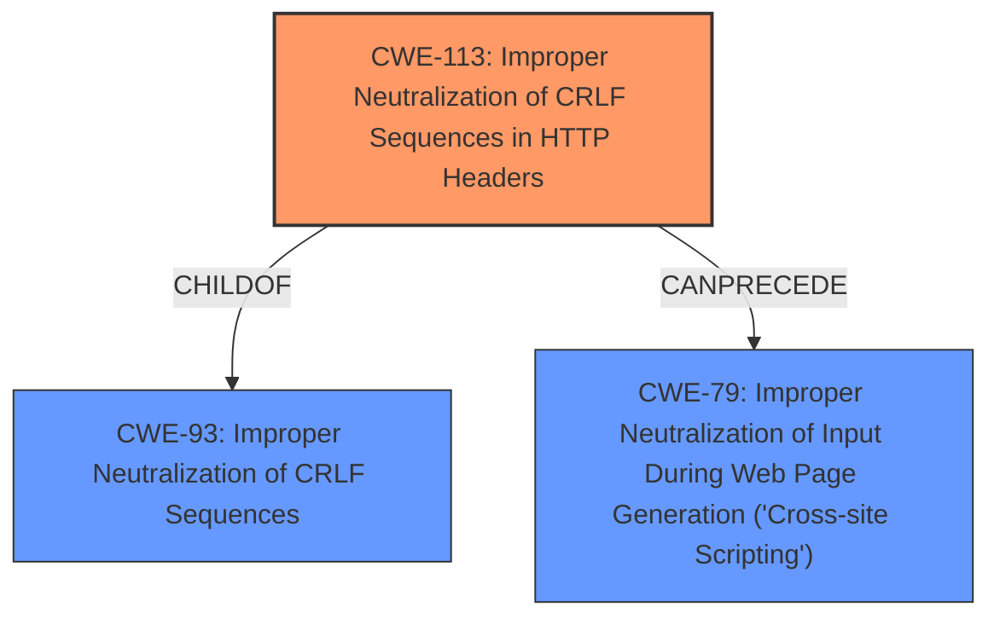

# Raw Analyzer Response for CVE-2021-41437

# Summary
| CWE ID  | CWE Name                                                                                               | Confidence | CWE Abstraction Level | CWE Vulnerability Mapping Label | CWE-Vulnerability Mapping Notes |
| :-------- | :------------------------------------------------------------------------------------------------------- | :---------- | :---------------------- | :-------------------------------- | :-------------------------------- |
| CWE-113   | Improper Neutralization of CRLF Sequences in HTTP Headers ('HTTP Request/Response Splitting')          | 1          | Variant                | Primary                             | Allowed                           |
| CWE-79   | Improper Neutralization of Input During Web Page Generation ('Cross-site Scripting')          | 0.5          | Base                | Secondary                             | Allowed                           |

## Evidence and Confidence

*   **Confidence Score:** 0.8
*   **Evidence Strength:** HIGH

## Relationship Analysis
The primary relationship influencing the decision is the direct match of the vulnerability description to the CWE-113 description. CWE-113 is a variant of CWE-93 (Improper Neutralization of CRLF Sequences), indicating a more specific instance of the broader CRLF injection issue. CWE-113 can precede CWE-79 (Cross-site Scripting), suggesting a potential chain of exploitation.

## Vulnerability Chain
The vulnerability chain starts with **HTTP response splitting** (**CWE-113**) due to the web application's failure to properly neutralize CRLF sequences in HTTP headers. This allows an attacker to inject arbitrary HTTP headers, potentially leading to redirection and ultimately granting the attacker access to the victim's cloud storage. The chain could potentially involve XSS (**CWE-79**) if the injected headers introduce malicious scripts.

## Summary of Analysis
The primary assessment is based on the explicit mention of "**HTTP response splitting**" in the vulnerability description, which directly corresponds to **CWE-113 (Improper Neutralization of CRLF Sequences in HTTP Headers)**. The "CVE Reference Links Content Summary" further supports this by stating that the "AiCloud component of the web application is vulnerable to an HTTP response splitting attack" and lists "HTTP Response Splitting" as one of the weaknesses. This strong evidence and the high retriever score of 1.0 for CWE-113 justifies its selection as the primary CWE.

The possibility of XSS (**CWE-79**) is considered as a secondary factor because the injected headers could potentially introduce malicious scripts. However, the primary impact described is unauthorized access to cloud storage, making **CWE-113** the more direct and relevant classification.

The selected CWEs are at the optimal level of specificity. **CWE-113** is a Variant, which is preferred for mapping to root causes. While **CWE-93** (Improper Neutralization of CRLF Sequences) is a parent of **CWE-113**, **CWE-113** provides a more precise characterization of the vulnerability within the context of HTTP headers.

Relevant CWE Information:

# Enhanced Context (25 CWEs)
The following CWEs were identified as potentially relevant to this vulnerability:

## CWE-113: Improper Neutralization of CRLF Sequences in HTTP Headers ('HTTP Request/Response Splitting')
**Abstraction Level**: Variant
**Similarity Score**: 0.81
**Source**: dense

**Description**:
The product receives data from an HTTP agent/component (e.g., web server, proxy, browser, etc.), but it does not neutralize or incorrectly neutralizes CR and LF characters before the data is included in outgoing HTTP headers.

**Mapping Guidance**:
- Usage: Allowed
- Rationale: This CWE entry is at the Variant level of abstraction, which is a preferred level of abstraction for mapping to the root causes of vulnerabilities.

## CWE-113: Improper Neutralization of CRLF Sequences in HTTP Headers ('HTTP Request/Response Splitting')
**Abstraction Level**: Variant
**Similarity Score**: 8151.90
**Source**: sparse

**Description**:
The product receives data from an HTTP agent/component (e.g., web server, proxy, browser, etc.), but it does not neutralize or incorrectly neutralizes CR and LF characters before the data is included in outgoing HTTP headers.

**Mapping Guidance**:
- Usage: Allowed
- Rationale: This CWE entry is at the Variant level of abstraction, which is a preferred level of abstraction for mapping to the root causes of vulnerabilities.

## CWE-79: Improper Neutralization of Input During Web Page Generation ('Cross-site Scripting')
**Abstraction Level**: base
**Similarity Score**: 5.03
**Source**: graph

**Description**:
CWE-79: Improper Neutralization of Input During Web Page Generation ('Cross-site Scripting')

**Mapping Guidance**:
- Usage: Allowed
- Rationale: This CWE entry is at the Base level of abstraction, which is a preferred level of abstraction for mapping to the root causes of vulnerabilities.

### Alternatives Considered and Rejected:
- **CWE-444 (Inconsistent Interpretation of HTTP Requests ('HTTP Request/Response Smuggling'))**: While related to HTTP, this CWE focuses on inconsistencies in how intermediaries interpret requests, which is not the primary issue in this case. The vulnerability is about injecting CRLF sequences, not about differing interpretations of requests.
- **CWE-93 (Improper Neutralization of CRLF Sequences ('CRLF Injection'))**: This is a parent of CWE-113. Since the vulnerability specifically exploits CRLF injection in HTTP headers, CWE-113 is a more precise match.
- **CWE-201 (Insertion of Sensitive Information Into Sent Data)**: This CWE is less relevant because the core issue is not the insertion of sensitive information, but the injection of CRLF sequences that lead to HTTP response splitting.
- **CWE-644 (Improper Neutralization of HTTP Headers for Scripting Syntax)**: This is not a direct fit because the focus is on scripting syntax in HTTP headers, whereas the described vulnerability involves CRLF injection for HTTP response splitting.
- **CWE-78 (Improper Neutralization of Special Elements used in an OS Command ('OS Command Injection'))**: This CWE is not applicable as the vulnerability does not involve OS command injection.
- **CWE-117 (Improper Output Neutralization for Logs)**: This CWE is not relevant because the issue is not related to log injection.
- **CWE-918 (Server-Side Request Forgery (SSRF))**: While HTTP response splitting could potentially lead to SSRF, the primary weakness is the CRLF injection itself.
- **CWE-295 (Improper Certificate Validation)**: Not relevant to the described vulnerability.