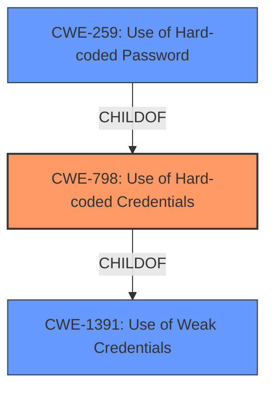

# Raw Analyzer Response for CVE-2021-41506

# Summary
| CWE ID | CWE Name | Confidence | CWE Abstraction Level | CWE Vulnerability Mapping Label | CWE-Vulnerability Mapping Notes |
|---|---|---|---|---|---|
| CWE-798 | Use of Hard-coded Credentials | 1.0 | Base | Primary | Allowed |
| CWE-259 | Use of Hard-coded Password | 0.8 | Variant | Secondary | Allowed |
| CWE-1391 | Use of Weak Credentials | 0.7 | Class | Secondary | Allowed-with-Review |

## Evidence and Confidence

*   **Confidence Score:** 0.9
*   **Evidence Strength:** HIGH

## Relationship Analysis
The primary CWE is CWE-798 (Use of Hard-coded Credentials), a Base level CWE. CWE-259 (Use of Hard-coded Password) is a Variant of CWE-798, providing more specific details about the type of credential being hardcoded. CWE-1391 (Use of Weak Credentials) is a Class that encompasses CWE-798, but is less specific.

## Vulnerability Chain
The vulnerability chain is:
1.  **ROOT CAUSE:** **Static root account credentials** (CWE-798 Use of Hard-coded Credentials)
2.  Impact: Backdoor allows root shell access and full device control.

## Summary of Analysis
The initial analysis focused on the **static root account credentials** as the root cause of the vulnerability. The vulnerability description clearly states that the issue is due to **static root account credentials** in the system. The CVE Reference Links Content Summary further details this by stating, "Once telnet is enabled, the devices use static login credentials (e.g., root/xmhdipc), which can be easily recovered from the firmware."

The Retriever Results suggested CWE-1391 (Use of Weak Credentials), CWE-321 (Use of Hard-coded Cryptographic Key), and CWE-259 (Use of Hard-coded Password) as potential matches.

CWE-798 (Use of Hard-coded Credentials) was chosen as the primary CWE because it directly addresses the **root cause** described in the vulnerability: the presence of hard-coded credentials. The vulnerability description key phrases highlights the **rootcause** as **static root account credentials**. This aligns precisely with the definition of CWE-798.

CWE-259 (Use of Hard-coded Password) was considered as a secondary CWE because the specific credential mentioned is a password. This is a more specific variant of CWE-798.

CWE-1391 (Use of Weak Credentials) was also considered as a secondary CWE because hard-coded credentials are a type of weak credential. However, it is a more general classification than CWE-798 or CWE-259.

The evidence strongly supports the selection of CWE-798 as the primary CWE, with CWE-259 and CWE-1391 as secondary CWEs. The selected CWEs are at the optimal level of specificity, accurately representing the **root cause** of the vulnerability.

Relevant CWE Information:

# Enhanced Context (25 CWEs)
The following CWEs were identified as potentially relevant to this vulnerability:

## CWE-74: Improper Neutralization of Special Elements in Output Used by a Downstream Component ('Injection')
**Abstraction Level**: Class
**Similarity Score**: 0.78
**Source**: dense

**Description**:
The product constructs all or part of a command, data structure, or record using externally-influenced input from an upstream component, but it does not neutralize or incorrectly neutralizes special elements that could modify how it is parsed or interpreted when it is sent to a downstream component.

**Mapping Guidance**:
- Usage: Discouraged
- Rationale: CWE-74 is high-level and often misused when lower-level weaknesses are more appropriate.

*This CWE was not selected because it is related to injection vulnerabilities and not directly related to the use of hard-coded credentials.*

## CWE-184: Incomplete List of Disallowed Inputs
**Abstraction Level**: Base
**Similarity Score**: 0.76
**Source**: dense

**Description**:
The product implements a protection mechanism that relies on a list of inputs (or properties of inputs) that are not allowed by policy or otherwise require other action to neutralize before additional processing takes place, but the list is incomplete.

**Mapping Guidance**:
- Usage: Allowed
- Rationale: This CWE entry is at the Base level of abstraction, which is a preferred level of abstraction for mapping to the root causes of vulnerabilities.

*This CWE was not selected because it is related to incomplete lists of disallowed inputs and not directly related to the use of hard-coded credentials.*

## CWE-1391: Use of Weak Credentials
**Abstraction Level**: Class
**Similarity Score**: 0.75
**Source**: dense

**Description**:
The product uses weak credentials (such as a default key or hard-coded password) that can be calculated, derived, reused, or guessed by an attacker.

**Mapping Guidance**:
- Usage: Allowed-with-Review
- Rationale: This CWE entry is a Class and might have Base-level children that would be more appropriate

*This CWE was selected as a secondary CWE since this is a broader category that covers this vulnerability.*

## CWE-138: Improper Neutralization of Special Elements
**Abstraction Level**: Class
**Similarity Score**: 0.75
**Source**: dense

**Description**:
The product receives input from an upstream component, but it does not neutralize or incorrectly neutralizes special elements that could be interpreted as control elements or syntactic markers when they are sent to a downstream component.

**Mapping Guidance**:
- Usage: Discouraged
- Rationale: This CWE entry is a level-1 Class (i.e., a child of a Pillar). It might have lower-level children that would be more appropriate

*This CWE was not selected because it is related to improper neutralization and not directly related to the use of hard-coded credentials.*

## CWE-41: Improper Resolution of Path Equivalence
**Abstraction Level**: Base
**Similarity Score**: 0.75
**Source**: dense

**Description**:
The product is vulnerable to file system contents disclosure through path equivalence. Path equivalence involves the use of special characters in file and directory names. The associated manipulations are intended to generate multiple names for the same object.

**Mapping Guidance**:
- Usage: Allowed
- Rationale: This CWE entry is at the Base level of abstraction, which is a preferred level of abstraction for mapping to the root causes of vulnerabilities.

*This CWE was not selected because it is related to file system path equivalence and not directly related to the use of hard-coded credentials.*

## CWE-807: Reliance on Untrusted Inputs in a Security Decision
**Abstraction Level**: Base
**Similarity Score**: 0.74
**Source**: dense

**Description**:
The product uses a protection mechanism that relies on the existence or values of an input, but the input can be modified by an untrusted actor in a way that bypasses the protection mechanism.

**Mapping Guidance**:
- Usage: Allowed
- Rationale: This CWE entry is at the Base level of abstraction, which is a preferred level of abstraction for mapping to the root causes of vulnerabilities.

*This CWE was not selected because it is related to reliance on untrusted inputs and not directly related to the use of hard-coded credentials.*

## CWE-73: External Control of File Name or Path
**Abstraction Level**: Base
**Similarity Score**: 0.74
**Source**: dense

**Description**:
The product allows user input to control or influence paths or file names that are used in filesystem operations.

**Mapping Guidance**:
- Usage: Allowed
- Rationale: This CWE entry is at the Base level of abstraction, which is a preferred level of abstraction for mapping to the root causes of vulnerabilities.

*This CWE was not selected because it is related to external control of file names and not directly related to the use of hard-coded credentials.*

## CWE-80: Improper Neutralization of Script-Related HTML Tags in a Web Page (Basic XSS)
**Abstraction Level**: Variant
**Similarity Score**: 0.74
**Source**: dense

**Description**:
The product receives input from an upstream component, but it does not neutralize or incorrectly neutralizes special characters such as "<", ">", and "&" that could be interpreted as web-scripting elements when they are sent to a downstream component that processes web pages.

**Mapping Guidance**:
- Usage: Allowed
- R