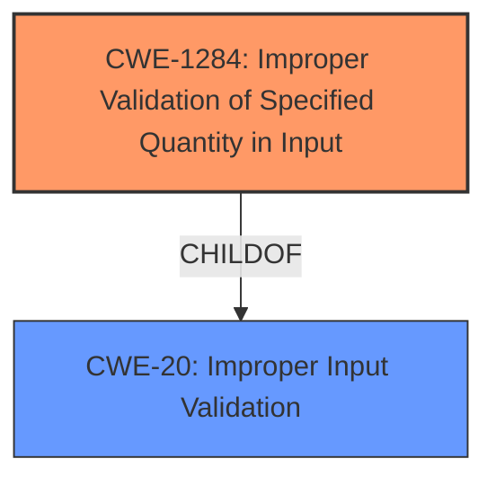

# Raw Analyzer Response for CVE-2021-41531

# Summary
| CWE ID | CWE Name | Confidence | CWE Abstraction Level | CWE Vulnerability Mapping Label | CWE-Vulnerability Mapping Notes |
|---|---|---|---|---|---|
| CWE-1284 | Improper Validation of Specified Quantity in Input | 0.9 | Base | Allowed | Primary CWE |

## Evidence and Confidence

*   **Confidence Score:** 0.9
*   **Evidence Strength:** HIGH

## Relationship Analysis
The primary CWE selected is CWE-1284, which focuses on the **improper validation of a specified quantity in input**. The vulnerability description highlights the **lack of validation of the max-length parameter** in ROA objects, which falls under the category of a specified quantity.

CWE-1284 has parent relationships (ChildOf) with CWE-20 (Improper Input Validation), which indicates that it is a more specific case of general input validation issues. The description and examples for CWE-1284 align closely with the vulnerability details, making it a strong match.

## Vulnerability Chain
The vulnerability chain starts with the **improper validation of the max-length parameter** (CWE-1284), leading to **invalid RTR payload** which ultimately causes RTR clients to **reject the RPKI data set**, effectively **disabling Route Origin Validation**.

## Summary of Analysis
The initial analysis and criticism focused on identifying the **root cause of the vulnerability**, which is the **lack of validation of the max-length value** in ROA objects. The provided evidence from the CVE Reference Links Content Summary explicitly states this, "Root cause of vulnerability: Lack of validation of the max-length value in ROA objects. Routinator passes through the provided value without checking if it exceeds the maximum prefix length of the address family."

The graph relationships show that CWE-1284 is a specific type of input validation issue (ChildOf CWE-20). The selection of CWE-1284 is based on its direct relevance to the **improper validation of a quantity (max-length)**. This choice is further supported by the retriever results, which lists CWE-1284 as a candidate.

The selected CWE is at the optimal level of specificity because it accurately captures the weakness related to the **validation of specified quantities**. Broader CWEs like CWE-20 would be less precise.

Relevant CWE Information:

# Enhanced Context (25 CWEs)

## CWE-191: Integer Underflow (Wrap or Wraparound)
**Abstraction Level**: Base
**Similarity Score**: 0.80

## CWE-197: Numeric Truncation Error
**Abstraction Level**: Base
**Similarity Score**: 0.77

## CWE-681: Incorrect Conversion between Numeric Types
**Abstraction Level**: Base
**Similarity Score**: 0.76

## CWE-130: Improper Handling of Length Parameter Inconsistency
**Abstraction Level**: Base
**Similarity Score**: 0.76

## CWE-190: Integer Overflow or Wraparound
**Abstraction Level**: Base
**Similarity Score**: 0.75

## CWE-131: Incorrect Calculation of Buffer Size
**Abstraction Level**: Base
**Similarity Score**: 0.75

## CWE-606: Unchecked Input for Loop Condition
**Abstraction Level**: Base
**Similarity Score**: 0.74

## CWE-805: Buffer Access with Incorrect Length Value
**Abstraction Level**: Base
**Similarity Score**: 0.74

## CWE-1389: Incorrect Parsing of Numbers with Different Radices
**Abstraction Level**: Base
**Similarity Score**: 0.74

## CWE-680: Integer Overflow to Buffer Overflow
**Abstraction Level**: Compound
**Similarity Score**: 0.74

## CWE-190: Integer Overflow or Wraparound
**Abstraction Level**: Base
**Similarity Score**: 5542.82

## CWE-125: Out-of-bounds Read
**Abstraction Level**: Base
**Similarity Score**: 5412.95

## CWE-1284: Improper Validation of Specified Quantity in Input
**Abstraction Level**: Base
**Similarity Score**: 5362.30

## CWE-295: Improper Certificate Validation
**Abstraction Level**: Base
**Similarity Score**: 5288.77

## CWE-835: Loop with Unreachable Exit Condition ('Infinite Loop')
**Abstraction Level**: Base
**Similarity Score**: 5209.45

## CWE-1284: Improper Validation of Specified Quantity in Input
**Abstraction Level**: base
**Similarity Score**: 4.33

## CWE-835: Loop with Unreachable Exit Condition ('Infinite Loop')
**Abstraction Level**: base
**Similarity Score**: 4.33

## CWE-1322: Use of Blocking Code in Single-threaded, Non-blocking Context
**Abstraction Level**: base
**Similarity Score**: 4.33

## CWE-295: Improper Certificate Validation
**Abstraction Level**: base
**Similarity Score**: 3.64

## CWE-322: Key Exchange without Entity Authentication
**Abstraction Level**: base
**Similarity Score**: 3.64

## CWE-128: Wrap-around Error
**Abstraction Level**: base
**Similarity Score**: 3.57

## CWE-123: Write-what-where Condition
**Abstraction Level**: base
**Similarity Score**: 3.49

## CWE-126: Buffer Over-read
**Abstraction Level**: variant
**Similarity Score**: 3.47

## CWE-120: Buffer Copy without Checking Size of Input ('Classic Buffer Overflow')
**Abstraction Level**: base
**Similarity Score**: 3.36

## CWE-195: Signed to Unsigned Conversion Error
**Abstraction Level**: variant
**Similarity Score**: 3.33

CWEs considered but not used:

*   CWE-1288 (Improper Validation of Consistency within Input): While there is an element of consistency required for the max-length parameter, the primary issue is the **lack of validation of the value itself**, not its consistency with other inputs. Therefore, this CWE is less relevant.
*   CWE-573 (Improper Following of Specification by Caller): This CWE is too high-level and doesn't directly address the **lack of input validation**.
*   CWE-835 (Loop with Unreachable Exit Condition ('Infinite Loop')): This CWE is unrelated to the vulnerability.
*   CWE-295 (Improper Certificate Validation): This CWE is specific to certificate validation, which is not relevant in this case.
*   CWE-1389 (Incorrect Parsing of Numbers with Different Radices): This CWE is related to parsing numbers with different radices, but it's not the core issue here. The problem is the **lack of validation of the max-length value**, not how it's parsed.
*   CWE-130 (Improper Handling of Length Parameter Inconsistency): While a length parameter is involved, the core issue isn't about handling inconsistencies, but about the **lack of a basic size check**.
*   CWE-190 (Integer Overflow or Wraparound): This could become a secondary issue, but there isn't enough evidence to show that this is happening. The **lack of size validation** is a more direct cause of the problem.