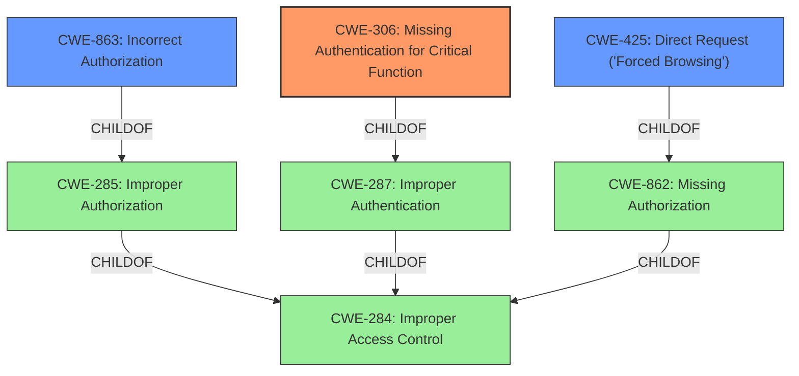

# Analysis Report for CVE-2021-41564

# Vulnerability Analysis Report: CVE-2021-41564

## Description


## Analysis (with Relationship Data)

# Summary
| CWE ID  | CWE Name                                         | Confidence | CWE Abstraction Level | CWE Vulnerability Mapping Label | CWE-Vulnerability Mapping Notes |
| :------- | :----------------------------------------------- | :--------- | :---------------------- | :------------------------------ | :------------------------------ |
| CWE-306  | Missing Authentication for Critical Function     | 1.0        | Base                    | Allowed                         | Primary CWE                     |
| CWE-425  | Direct Request ('Forced Browsing')             | 0.7        | Base                    | Allowed                         | Secondary Candidate             |
| CWE-863  | Incorrect Authorization                          | 0.6        | Class                   | Allowed-with-Review           | Secondary Candidate             |

## Evidence and Confidence

*   **Confidence Score:** 0.9
*   **Evidence Strength:** HIGH

## Relationship Analysis
The primary relationship influencing the decision is that CWE-306 (Missing Authentication for Critical Function) is a specific type of authentication failure, which falls under the broader category of access control issues. CWE-425 (Direct Request ('Forced Browsing')) is related as it represents a scenario where authorization checks are bypassed due to direct access to resources. CWE-863 (Incorrect Authorization) is a Class level CWE that can describe this vulnerability, but is less specific than CWE-306 and CWE-425. Therefore, CWE-306 is chosen as the primary CWE due to its precise description of the vulnerability.



## Vulnerability Chain
The vulnerability chain starts with the **missing authentication** for the book list viewing function (CWE-306). Because authentication is missing, it leads to an **authorization bypass**, allowing remote attackers to delete articles arbitrarily.

## Summary of Analysis
The primary assessment is strongly based on the provided evidence, especially the **Vulnerability Description Key Phrases** that mention "**authorization bypass**" and the **CVE Reference Links Content Summary**, which states that the "**Root cause of vulnerability:** Improper authorization in the Tad Honor application. Specifically, the function for viewing the book list **did not require authentication**."

CWE-306 (Missing Authentication for Critical Function) directly addresses the **root cause** where "The product does not perform any authentication for functionality that requires a provable user identity". This aligns perfectly with the vulnerability description, where the book list viewing function lacks authentication, leading to unauthorized article deletion. The graph relationships show that CWE-306 is a more specific child of CWE-287 (Improper Authentication) which in turn is child of CWE-284 (Improper Access Control). Choosing CWE-306 provides the optimal level of specificity.

CWE-425 (Direct Request ('Forced Browsing')) was considered because the vulnerability allows direct access to the function without proper authorization. However, the root cause is the missing authentication, not just the direct access. Therefore, CWE-425 is a secondary factor.

CWE-863 (Incorrect Authorization) was considered because of the "**authorization bypass**" but it is a higher level Class CWE, and the vulnerability is more accurately described by the missing authentication (CWE-306).

Therefore, the assessment is that CWE-306 is the most accurate and specific representation of the vulnerability.

Relevant CWE Information:

# Enhanced Context (25 CWEs)
The following CWEs were identified as potentially relevant to this vulnerability:

## CWE-472: External Control of Assumed-Immutable Web Parameter
**Abstraction Level**: Base
**Similarity Score**: 0.77
**Source**: dense

**Description**:
The web application does not sufficiently verify inputs that are assumed to be immutable but are actually externally controllable, such as hidden form fields.

**Mapping Guidance**:
- Usage: Allowed
- Rationale: This CWE entry is at the Base level of abstraction, which is a preferred level of abstraction for mapping to the root causes of vulnerabilities.

## CWE-302: Authentication Bypass by Assumed-Immutable Data
**Abstraction Level**: Base
**Similarity Score**: 0.76
**Source**: dense

**Description**:
The authentication scheme or implementation uses key data elements that are assumed to be immutable, but can be controlled or modified by the attacker.

**Mapping Guidance**:
- Usage: Allowed
- Rationale: This CWE entry is at the Base level of abstraction, which is a preferred level of abstraction for mapping to the root causes of vulnerabilities.

## CWE-807: Reliance on Untrusted Inputs in a Security Decision
**Abstraction Level**: Base
**Similarity Score**: 0.76
**Source**: dense

**Description**:
The product uses a protection mechanism that relies on the existence or values of an input, but the input can be modified by an untrusted actor in a way that bypasses the protection mechanism.

**Mapping Guidance**:
- Usage: Allowed
- Rationale: This CWE entry is at the Base level of abstraction, which is a preferred level of abstraction for mapping to the root causes of vulnerabilities.

## CWE-639: Authorization Bypass Through User-Controlled Key
**Abstraction Level**: Base
**Similarity Score**: 0.76
**Source**: dense

**Description**:
The system's authorization functionality does not prevent one user from gaining access to another user's data or record by modifying the key value identifying the data.

**Mapping Guidance**:
- Usage: Allowed
- Rationale: This CWE entry is at the Base level of abstraction, which is a preferred level of abstraction for mapping to the root causes of vulnerabilities.

## CWE-303: Incorrect Implementation of Authentication Algorithm
**Abstraction Level**: Base
**Similarity Score**: 0.75
**Source**: dense

**Description**:
The requirements for the product dictate the use of an established authentication algorithm, but the implementation of the algorithm is incorrect.

**Mapping Guidance**:
- Usage: Allowed
- Rationale: This CWE entry is at the Base level of abstraction, which is a preferred level of abstraction for mapping to the root causes of vulnerabilities.

## CWE-1390: Weak Authentication
**Abstraction Level**: Class
**Similarity Score**: 0.75
**Source**: dense

**Description**:
The product uses an authentication mechanism to restrict access to specific users or identities, but the mechanism does not sufficiently prove that the claimed identity is correct.

**Mapping Guidance**:
- Usage: Allowed-with-Review
- Rationale: This CWE entry is a Class and might have Base-level children that would be more appropriate

## CWE-274: Improper Handling of Insufficient Privileges
**Abstraction Level**: Base
**Similarity Score**: 0.74
**Source**: dense

**Description**:
The product does not handle or incorrectly handles when it has insufficient privileges to perform an operation, leading to resultant weaknesses.

**Mapping Guidance**:
- Usage: Discouraged
- Rationale: This CWE entry could be deprecated in a future version of CWE.

## CWE-1289: Improper Validation of Unsafe Equivalence in Input
**Abstraction Level**: Base
**Similarity Score**: 0.74
**Source**: dense

**Description**:
The product receives an input value that is used as a resource identifier or other type of reference, but it does not validate or incorrectly validates that the input is equivalent to a potentially-unsafe value.

**Mapping Guidance**:
- Usage: Allowed
- Rationale: This CWE entry is at the Base level of abstraction, which is a preferred level of abstraction for mapping to the root causes of vulnerabilities.

## CWE-1220: Insufficient Granularity of Access Control
**Abstraction Level**: Base
**Similarity Score**: 0.74
**Source**: dense

**Description**:
The product implements access controls via a policy or other feature with the intention to disable or restrict accesses (reads and/or writes) to assets in a system from untrusted agents. However, implemented access controls lack required granularity, which renders the control policy too broad


## CWE Relationship Analysis

Current CWEs represent these abstraction levels: .


### Vulnerability Chain Analysis

**Chain starting from CWE-862:**
- 862 (Missing Authorization) - ROOT


**Chain starting from CWE-425:**
- 425 (Direct Request ('Forced Browsing')) - ROOT


### CWE Relationship Diagram

```mermaid
graph TD
    classDef primary fill:#f96,stroke:#333,stroke-width:2px
    classDef secondary fill:#69f,stroke:#333
    classDef tertiary fill:#9e9,stroke:#333
```


*Report generated on 2025-03-31 12:27:24*
