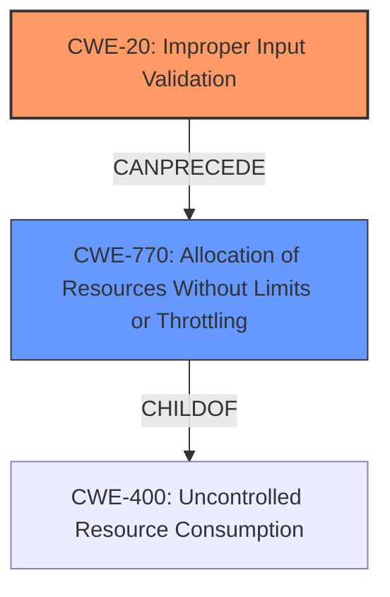

# Raw Analyzer Response for CVE-2021-41585

# Summary
| CWE ID | CWE Name | Confidence | CWE Abstraction Level | CWE Vulnerability Mapping Label | CWE-Vulnerability Mapping Notes |
|---|---|---|---|---|---|
| CWE-20 | Improper Input Validation | 0.75 | Class | Primary | Discouraged |
| CWE-770 | Allocation of Resources Without Limits or Throttling | 0.5 | Base | Secondary | Allowed |

## Evidence and Confidence

*   **Confidence Score:** 0.7
*   **Evidence Strength:** MEDIUM

## Relationship Analysis
The primary CWE is CWE-20, which is a class-level CWE. While CWE-20 is discouraged, there is not enough information to select a more specific CWE. CWE-770 is a child of CWE-400 (Uncontrolled Resource Consumption) and can lead to resource exhaustion, which aligns with the vulnerability's impact.

## Vulnerability Chain
The vulnerability chain starts with **improper input validation** (CWE-20), which leads to the server stopping accepting new connections, potentially due to resource exhaustion (CWE-770).

## Summary of Analysis
The initial assessment identifies **improper input validation** as the root cause. The **improper input validation** leads to a denial-of-service condition where the server stops accepting new connections. The vulnerability description key phrases state "Improper Input Validation" as the **rootcause** and "make the server stop accepting new connections" as the impact.

The analysis relies heavily on the provided evidence, specifically the vulnerability description stating "**Improper Input Validation** vulnerability...allows an attacker to make the server stop accepting new connections."

CWE-20 is a Class-level CWE and is discouraged. However, without more specific details about the type of **improper input validation**, it is difficult to select a more specific Base or Variant level CWE. CWE-770 (Allocation of Resources Without Limits or Throttling) is included as a secondary CWE since the impact of stopping new connections could be caused by resource exhaustion, where the server cannot allocate resources for new connections. This is a plausible scenario given the **improper input validation**.

Relevant CWE Information:

# Enhanced Context (25 CWEs)

## CWE-20: Improper Input Validation
**Abstraction:** Class
**Status:** Stable

### Description
The product receives input or data, but it does
        not validate or incorrectly validates that the input has the
        properties that are required to process the data safely and
        correctly.

### Mapping Guidance
**Usage:** Discouraged
**Rationale:** CWE-20 is commonly misused in low-information vulnerability reports when lower-level CWEs could be used instead, or when more details about the vulnerability are available [REF-1287]. It is not useful for trend analysis. It is also a level-1 Class (i.e., a child of a Pillar).

## CWE-770: Allocation of Resources Without Limits or Throttling
**Abstraction:** Base
**Status:** Incomplete

### Description
The product allocates a reusable resource or group of resources on behalf of an actor without imposing any restrictions on the size or number of resources that can be allocated, in violation of the intended security policy for that actor.

# Technical Explanation for Each Selected CWE

## CWE-20: Improper Input Validation
*   **Match:** The vulnerability description states that the **rootcause** is "**Improper Input Validation**".
*   **Security Implications:** **Improper Input Validation** can lead to various security issues, including denial-of-service, if an attacker can send malformed input that the server does not handle correctly.
*   **Relationships:** CWE-20 is a class-level CWE and can be a precursor to other weaknesses.
*   **Mapping Guidance:** The MITRE mapping guidance discourages using CWE-20 due to its high-level nature. However, in this case, there is no information to select a more specific CWE.
*   **Justification:** The selection of CWE-20 is based on the direct statement of "**Improper Input Validation**" in the vulnerability description.

## CWE-770: Allocation of Resources Without Limits or Throttling
*   **Match:** The vulnerability leads to the server stopping accepting new connections, which can be a result of resource exhaustion.
*   **Security Implications:** Attackers can exploit the lack of resource limits to cause a denial-of-service, preventing legitimate users from accessing the server.
*   **Relationships:** CWE-770 is a base-level CWE and a child of CWE-400 (Uncontrolled Resource Consumption).
*   **Mapping Guidance:** The MITRE mapping guidance allows using CWE-770 when the product allocates resources without proper limits.
*   **Justification:** The selection of CWE-770 is based on the potential impact of stopping new connections, which can be linked to resource exhaustion caused by missing limits on resource allocation.

## Other CWEs Considered But Not Used
*   CWE-400 (Uncontrolled Resource Consumption): This was considered but is a class-level CWE and less specific than CWE-770 if resource exhaustion is the cause.
*   CWE-923 (Improper Restriction of Communication Channel to Intended Endpoints): While this CWE relates to socket connections, the primary issue described is input validation.
*   CWE-444 (Inconsistent Interpretation of HTTP Requests ('HTTP Request/Response Smuggling')): This CWE is specific to HTTP requests and is not applicable to general socket connections.