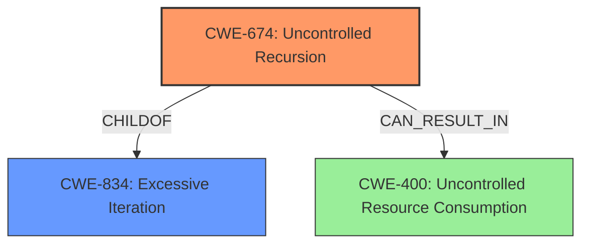

# Analysis for CVE-2021-41752

# Summary
| CWE ID | CWE Name | Confidence | CWE Abstraction Level | CWE Vulnerability Mapping Label | CWE-Vulnerability Mapping Notes |
|---|---|---|---|---|---|
| CWE-674 | Uncontrolled Recursion | 1.0 | Class | Allowed-with-Review | Primary CWE |
| CWE-400 |  Uncontrolled Resource Consumption | 0.7 | Class | Discouraged | Secondary Candidate |

## Evidence and Confidence

*   **Confidence Score:** 0.9
*   **Evidence Strength:** HIGH

## Relationship Analysis
The primary relationship influencing the decision is the hierarchical relationship between CWE-834 (Excessive Iteration) and CWE-674 (Uncontrolled Recursion), where CWE-674 is a child of CWE-834. Although CWE-674 is a class and guidance advises to select the most specific Base or Variant, in this case CWE-674 is a better fit than its parent CWE-834.

## Vulnerability Chain
The vulnerability chain starts with the **unbounded recursive call** (CWE-674) which leads to stack exhaustion and ultimately results in a denial-of-service (DoS). The overflow of the stack can be classified as CWE-400.

## Summary of Analysis
The initial assessment focused on identifying the root cause of the stack overflow. The vulnerability description clearly states the "**unbounded recursive call**" to the `new opt()` function as the core issue. The CVE Reference Links Content Summary reinforces this by highlighting the infinite recursion as the primary weakness.

The choice of CWE-674 (Uncontrolled Recursion) is based on the following evidence:
*   The **Vulnerability Description Key Phrases** identifies "**unbounded recursive call**" as a rootcause.
*   The **CVE Reference Links Content Summary** states "The root cause is an infinite recursion within the JavaScript code due to the line `let obj = new opt();` inside the `opt` function."

CWE-674 accurately captures the nature of the vulnerability, where the lack of control over the recursion depth leads to resource exhaustion. While stack overflow is a symptom, the underlying cause is the uncontrolled recursion.

Although the retriever results suggest CWE-121 (Stack-based Buffer Overflow), it is more of a consequence than a root cause. The **stack overflow** is due to the uncontrolled recursion, not directly due to writing past the end of a buffer, so it is not the most accurate mapping.

The alternative CWEs considered, such as CWE-190 (Integer Overflow or Wraparound) and CWE-835 (Loop with Unreachable Exit Condition), do not align well with the specific vulnerability details.

CWE-400 is a consequence of the unbounded recursion, but it is too general to be the primary mapping.

The final decision is to classify the vulnerability as CWE-674 because it best represents the **root cause** of the **unbounded recursive call**. This is further supported by the structure of the vulnerability chain. The classification focuses on the coding error rather than the resulting impact.

Relevant CWE Information:

# Enhanced Context (25 CWEs)
The following CWEs were identified as potentially relevant to this vulnerability:

## CWE-674: Uncontrolled Recursion
**Abstraction Level**: Class
**Similarity Score**: 0.74
**Source**: dense

**Description**:
The product does not properly control the amount of recursion that takes place,  consuming excessive resources, such as allocated memory or the program stack.

**Mapping Guidance**:
- Usage: Allowed-with-Review
- Rationale: This CWE entry is a Class and might have Base-level children that would be more appropriate

## CWE-400: Uncontrolled Resource Consumption
**Abstraction Level**: Class
**Similarity Score**: N/A

**Description**:
The software does not properly control the consumption of resources, which can lead to a denial of service (DoS), degraded performance, or other negative consequences.

**Mapping Guidance**:
- Usage: Discouraged
- Rationale: This CWE entry is high-level when lower-level children are available.

## CWE-121: Stack-based Buffer Overflow
**Abstraction Level**: Variant
**Similarity Score**: 1.0

**Description**:
A stack-based buffer overflow condition is a condition where the buffer being overwritten is allocated on the stack (i.e., is a local variable or, rarely, a parameter to a function).

**Mapping Guidance**:
- Usage: Allowed
- Rationale: This CWE entry is at the Variant level of abstraction, which is a preferred level of abstraction for mapping to the root causes of vulnerabilities.
-Comments: Carefully read both the name and description to ensure that this mapping is an appropriate fit. Do not try to 'force' a mapping to a lower-level Base/Variant simply to comply with this preferred level of abstraction.