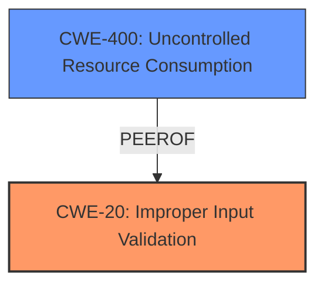

# Analysis Report for CVE-2021-41789

# Vulnerability Analysis Report: CVE-2021-41789

## Description


## Analysis (with Relationship Data)

# Summary
| CWE ID | CWE Name | Confidence | CWE Abstraction Level | CWE Vulnerability Mapping Label | CWE-Vulnerability Mapping Notes |
|---|---|---|---|---|---|
| CWE-20 (Primary) | Improper Input Validation | 0.8 | Class | Allowed-with-Review | The vulnerability stems from a **missing validation check**, which falls under the broader category of **improper input validation**.  |
| CWE-400 | Uncontrolled Resource Consumption | 0.6 | Class | Allowed-with-Review | System crash due to missing validation can be seen as a form of uncontrolled resource consumption since the system resources were not being properly released after an invalid input. |

## Evidence and Confidence

*   **Confidence Score:** 0.8
*   **Evidence Strength:** MEDIUM

## Relationship Analysis
The primary relationship influencing the decision is the parent-child relationship between CWE-20 (Improper Input Validation) and its potential child CWEs. While more specific child CWEs could potentially apply, the provided information focuses on a general **missing validation check**, making CWE-20 the most appropriate initial classification.



## Vulnerability Chain
The chain of events is as follows:

1.  **Root Cause:** **Missing Validation Check** (CWE-20)
2.  **Impact:** System Crash (Denial of Service). (CWE-400)

## Summary of Analysis
The initial assessment focuses on the **missing validation check** within the wifi driver. The provided information explicitly states this as the root cause of the vulnerability. This directly aligns with the description of CWE-20 (Improper Input Validation), which covers cases where input is not validated, leading to exploitable conditions.

The selection of CWE-20 is further supported by the "Vulnerability Description Key Phrases" and "CVE Reference Links Content Summary," both of which highlight the **missing validation** aspect.

While CWE-20 is a Class-level CWE and MITRE guidelines suggest considering more specific Base or Variant-level CWEs, the available evidence doesn't provide enough detail to pinpoint the exact type of input or the specific validation that is **missing**. Therefore, CWE-20 serves as the most appropriate starting point.

CWE-400 (Uncontrolled Resource Consumption) is considered as a secondary weakness because the system crash results from the **missing validation**, which leads to the uncontrolled allocation or consumption of system resources.

Relevant CWE Information:

# Enhanced Context (25 CWEs)

## CWE-862: Missing Authorization
**Abstraction Level**: Class
**Similarity Score**: 0.370

CWE-862 (Missing Authorization) was considered but deemed less relevant because the vulnerability description focuses on a **missing validation check** rather than a **missing authorization** mechanism. Authorization typically involves verifying user permissions, while validation focuses on ensuring the input data is in the correct format and range.

## CWE-1284: Improper Validation of Specified Quantity in Input
**Abstraction Level**: Base
**Similarity Score**: 0.333

CWE-1284 (Improper Validation of Specified Quantity in Input) was also considered but not chosen because the provided information doesn't specify that the **missing validation** is related to a quantity (e.g., size, length). While possible, there's no direct evidence to support this more specific classification.

## CWE-1285: Improper Validation of Specified Index, Position, or Offset in Input
**Abstraction Level**: Base
**Similarity Score**: 0.586

CWE-1285 (Improper Validation of Specified Index, Position, or Offset in Input) was considered, as an index or offset *could* be the kind of input that lacks validation. However, the evidence is insufficient to confirm this, so the more general CWE-20 is preferred.

## CWE-120: Buffer Copy without Checking Size of Input ('Classic Buffer Overflow')
**Abstraction Level**: Base
**Similarity Score**: 0.002

CWE-120 (Buffer Copy without Checking Size of Input ('Classic Buffer Overflow')) was considered but not chosen because the vulnerability description does not mention any buffer copy operations or potential buffer overflows. This CWE is too specific and lacks supporting evidence.

## CWE-770: Allocation of Resources Without Limits or Throttling
**Abstraction Level**: Base
**Similarity Score**: 0.315

CWE-770 (Allocation of Resources Without Limits or Throttling) was considered because the **missing validation** *could* lead to excessive resource allocation. However, this is an indirect consequence, and the root cause is still the **lack of validation**.

## CWE-400: Uncontrolled Resource Consumption
**Abstraction Level**: Class
**Similarity Score**: N/A

CWE-400 (Uncontrolled Resource Consumption) was considered as a secondary weakness, as the **system crash** indicates a failure to manage resources effectively.


## CWE Relationship Analysis

Current CWEs represent these abstraction levels: .


### Vulnerability Chain Analysis

**Chain starting from CWE-862:**
- 862 (Missing Authorization) - ROOT


**Chain starting from CWE-400:**
- 400 (Uncontrolled Resource Consumption) - ROOT


### CWE Relationship Diagram

```mermaid
graph TD
    classDef primary fill:#f96,stroke:#333,stroke-width:2px
    classDef secondary fill:#69f,stroke:#333
    classDef tertiary fill:#9e9,stroke:#333
```


*Report generated on 2025-03-31 01:19:07*
