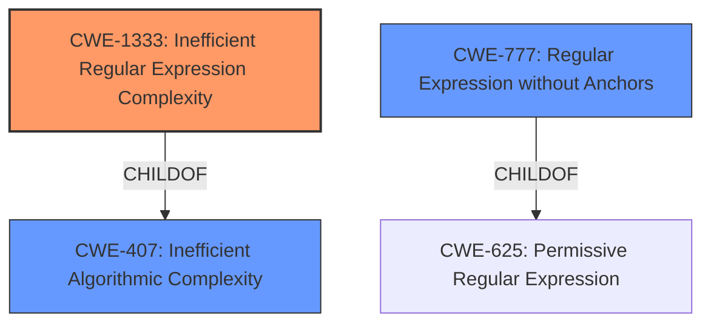

# Analysis Report for CVE-2021-41817

# Vulnerability Analysis Report: CVE-2021-41817

## Description


## Analysis (with Relationship Data)

# Summary
| CWE ID | CWE Name | Confidence | CWE Abstraction Level | CWE Vulnerability Mapping Label | CWE-Vulnerability Mapping Notes |
|---|---|---|---|---|---|
| CWE-1333 | Inefficient Regular Expression Complexity | 1.0 | Base | Allowed | Primary CWE |
| CWE-407 | Inefficient Algorithmic Complexity | 0.7 | Class | Allowed-with-Review | Secondary Candidate |
| CWE-777 | Regular Expression without Anchors | 0.6 | Variant | Allowed | Secondary Candidate |

## Evidence and Confidence

*   **Confidence Score:** 0.9
*   **Evidence Strength:** HIGH

## Relationship Analysis
The primary relationship that influenced the decision was the ChildOf relationship between CWE-1333 and CWE-407. CWE-1333 is a more specific case of CWE-407, where the inefficient algorithmic complexity stems specifically from regular expressions. While CWE-407 is relevant, CWE-1333 provides a more precise characterization of the vulnerability. CWE-777 is also a child of CWE-625 which is relevant due to regular expressions being used in an improper way.



## Vulnerability Chain
The vulnerability chain starts with the use of regular expressions and culminates in a denial-of-service condition.

1.  **Root Cause:** Use of regular expressions without sufficient attention to their complexity (**CWE-1333**).
2.  **Weakness:** Inefficient algorithmic complexity due to the regular expressions (**CWE-407**).
3.  **Impact:** Denial of Service (DoS) due to excessive CPU consumption.

## Summary of Analysis
The initial analysis focused on identifying the root cause of the vulnerability, which is the use of regular expressions that can lead to denial-of-service.

The **Vulnerability Description** mentions "**regular expression denial of service**" in the date gem, which strongly suggests **CWE-1333 (Inefficient Regular Expression Complexity)**.

The **CVE Reference Links Content Summary** provides additional evidence, stating that "The vulnerability stems from the use of regular expressions (Regexps) within the `Date` parsing methods" and that "Certain regular expressions used in date parsing are vulnerable to ReDoS, which can cause excessive processing time".

Based on this evidence, **CWE-1333** is the most appropriate primary CWE. It is a **Base** level CWE, aligning with the goal of identifying the root cause. The MITRE mapping guidance for **CWE-1333** recommends it for ReDoS vulnerabilities, stating "Carefully read both the name and description to ensure that this mapping is an appropriate fit."

**CWE-407 (Inefficient Algorithmic Complexity)** was considered because **CWE-1333** is a child of it, and the vulnerability results in inefficient CPU consumption. However, **CWE-1333** is more specific and thus a better fit.

**CWE-777 (Regular Expression without Anchors)** was considered because the description mentions malformed data slipping through, which is relevant in some cases. However, this vulnerability is focused on the inefficiency of the expression itself, not the lack of anchors.

The selection of **CWE-1333** as the primary CWE is justified by the explicit mention of ReDoS and the supporting details about the use of vulnerable regular expressions within the date parsing methods.


## CWE Relationship Analysis

Current CWEs represent these abstraction levels: .


### Vulnerability Chain Analysis

**Chain starting from CWE-1333:**
- 1333 (Inefficient Regular Expression Complexity) - ROOT


**Chain starting from CWE-625:**
- 625 (Permissive Regular Expression) - ROOT


### CWE Relationship Diagram

```mermaid
graph TD
    classDef primary fill:#f96,stroke:#333,stroke-width:2px
    classDef secondary fill:#69f,stroke:#333
    classDef tertiary fill:#9e9,stroke:#333
```


*Report generated on 2025-03-30 15:06:34*
