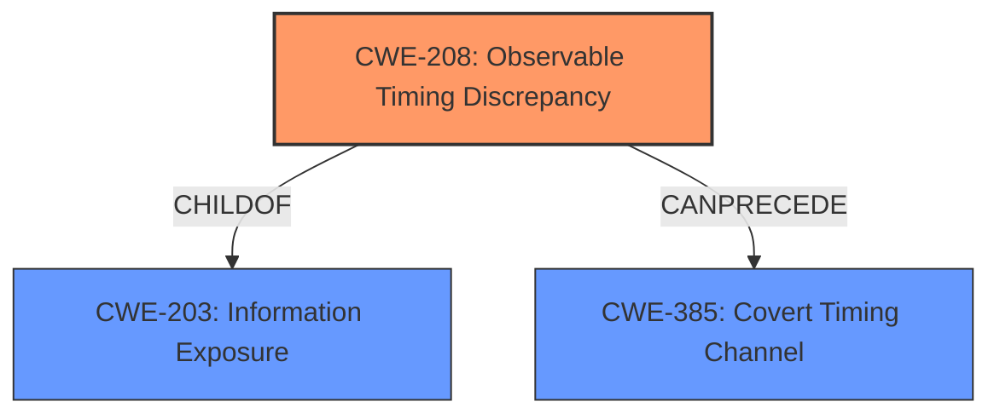

# Analysis Report for CVE-2021-42016

# Vulnerability Analysis Report: CVE-2021-42016

## Description


## Analysis (with Relationship Data)

# Summary
| CWE ID | CWE Name | Confidence | CWE Abstraction Level | CWE Vulnerability Mapping Label | CWE-Vulnerability Mapping Notes |
|---|---|---|---|---|---|
| CWE-208 | Observable Timing Discrepancy | 1 | Base | Primary | Allowed |

## Evidence and Confidence

*   **Confidence Score:** 1
*   **Evidence Strength:** HIGH

## Relationship Analysis
The primary CWE, CWE-208, is a Base level CWE. It is a child of CWE-203 (Information Exposure), indicating that timing discrepancies lead to information exposure. It can precede CWE-385 (Covert Timing Channel), suggesting that the timing discrepancy could be exploited to create a covert channel for information leakage. There is no child of CWE-208 that is more applicable.



## Vulnerability Chain
The vulnerability chain starts with the **timing attack** (**observable timing discrepancy**), which leads to the potential retrieval of the private key, compromising data integrity and security.

## Summary of Analysis
The primary weakness is CWE-208 (Observable Timing Discrepancy), which aligns directly with the vulnerability description. The **timing attack** mentioned in the description directly corresponds to an observable timing discrepancy that could be exploited to retrieve the private key.

The "CVE Reference Links Content Summary" explicitly states: "The vulnerability is due to a timing discrepancy that can be observed, potentially allowing an attacker to deduce information about the private key" and " **CWE-208: Observable Timing Discrepancy**: The vulnerability is due to a timing discrepancy that can be observed, potentially allowing an attacker to deduce information about the private key."

CWE-208 is the most specific and accurate representation of the vulnerability based on the provided evidence and descriptions. The retriever results also support CWE-208 as the top candidate with the highest similarity score. Other CWEs like CWE-326 (Inadequate Encryption Strength) and CWE-94 (Improper Control of Generation of Code ('Code Injection')) were considered but ultimately deemed less relevant as they describe higher-level consequences or different types of vulnerabilities. The chosen CWE is at the optimal level of specificity (Base) according to the provided information.


## CWE Relationship Analysis

Current CWEs represent these abstraction levels: .


### Vulnerability Chain Analysis

**Chain starting from CWE-208:**
- 208 (Observable Timing Discrepancy) - ROOT


**Chain starting from CWE-203:**
- 203 (Observable Discrepancy) - ROOT


### CWE Relationship Diagram

```mermaid
graph TD
    classDef primary fill:#f96,stroke:#333,stroke-width:2px
    classDef secondary fill:#69f,stroke:#333
    classDef tertiary fill:#9e9,stroke:#333
```


*Report generated on 2025-03-31 03:01:17*
