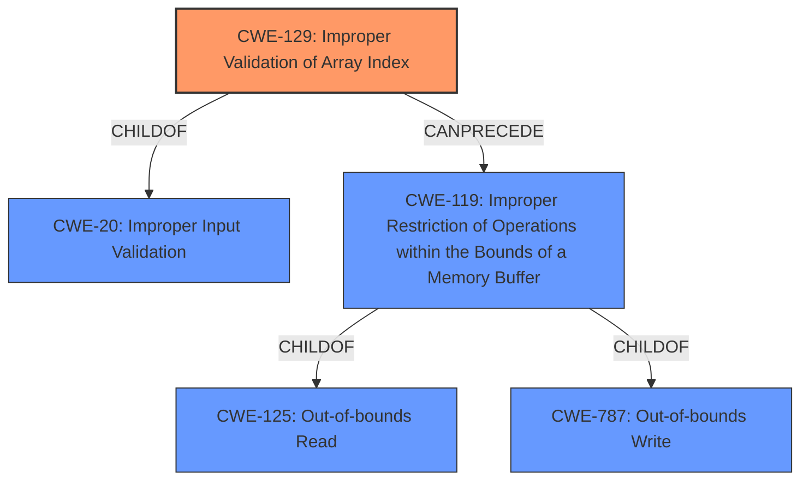

# Analysis Report for CVE-2021-4204

# Vulnerability Analysis Report: CVE-2021-4204

## Description


## Analysis (with Relationship Data)

# Summary
| CWE ID | CWE Name | Confidence | CWE Abstraction Level | CWE Vulnerability Mapping Label | CWE-Vulnerability Mapping Notes |
|---|---|---|---|---|---|
| CWE-129 | Improper Validation of Array Index | 0.8 | Variant | Primary | Allowed |
| CWE-125 | Out-of-bounds Read | 0.6 | Base | Secondary | Allowed |

## Evidence and Confidence

*   **Confidence Score:** 0.7
*   **Evidence Strength:** HIGH

## Relationship Analysis
The primary CWE is CWE-129 which is a child of CWE-20 (Improper Input Validation). CWE-129 can lead to CWE-119 (Improper Restriction of Operations within the Bounds of a Memory Buffer), which in turn has children like CWE-125 (Out-of-bounds Read) and CWE-787 (Out-of-bounds Write). The relationship analysis influenced the decision to prioritize the root cause (improper validation) while also acknowledging the resulting out-of-bounds access.



## Vulnerability Chain
The vulnerability chain starts with **Improper Input Validation** (CWE-20), leading to an **Improper Validation of Array Index** (CWE-129), which results in an **Out-of-bounds Read** (CWE-125) or potentially an **Out-of-bounds Write** (CWE-787), ultimately causing a system crash or information leak.

## Summary of Analysis
Initially, the description pointed to **out-of-bounds (OOB) memory access** due to an **Improper Input Validation**. The CVE reference summary highlighted that the `bpf_ringbuf_submit` and `bpf_ringbuf_discard` helper functions **do not properly validate the size of memory being passed**, which leads to out-of-bounds memory access.

The primary CWE selected is CWE-129 (Improper Validation of Array Index) because the **root cause** lies in the **improper validation** of the array index, leading to out-of-bounds access. This is supported by the "Vulnerability Description Key Phrases" which mention "**Improper Input Validation**" as the root cause. CWE-129 is a variant-level CWE, making it more specific than its parent, CWE-20.

CWE-125 (Out-of-bounds Read) is a secondary CWE because it represents the immediate consequence of the **improper input validation**. While the description mentions the possibility of a system crash (potentially caused by an out-of-bounds write), the primary effect described is an out-of-bounds read leading to information leakage.

Other CWEs were considered but not selected:
*   CWE-119 (Improper Restriction of Operations within the Bounds of a Memory Buffer): While relevant, it's a class-level CWE and less specific than CWE-129 and CWE-125. The mapping guidance discourages its use when lower-level CWEs are available.
*   CWE-787 (Out-of-bounds Write): While a possible consequence, the primary described impact is an information leak (read).
*   CWE-190 (Integer Overflow or Wraparound): Not directly supported by the vulnerability description.
*   CWE-193 (Off-by-one Error): Not directly supported by the vulnerability description.
*   CWE-823 (Use of Out-of-range Pointer Offset): While related to memory access, the root cause is the lack of validation, not specifically a pointer offset issue.

The chosen CWEs are at the optimal level of specificity because they directly address the root cause (**improper input validation** leading to array index issues) and the immediate consequence (**out-of-bounds read**).

Relevant CWE Information:

# Enhanced Context (25 CWEs)

## CWE-823: Use of Out-of-range Pointer Offset
**Abstraction Level**: Base
**Similarity Score**: 0.79
**Source**: dense

**Description**:
The product performs pointer arithmetic on a valid pointer, but it uses an offset that can point outside of the intended range of valid memory locations for the resulting pointer.

**Mapping Guidance**:
- Usage: Allowed
- Rationale: This CWE entry is at the Base level of abstraction, which is a preferred level of abstraction for mapping to the root causes of vulnerabilities.

## CWE-191: Integer Underflow (Wrap or Wraparound)
**Abstraction Level**: Base
**Similarity Score**: 0.79
**Source**: dense

**Description**:
The product subtracts one value from another, such that the result is less than the minimum allowable integer value, which produces a value that is not equal to the correct result.

**Mapping Guidance**:
- Usage: Allowed
- Rationale: This CWE entry is at the Base level of abstraction, which is a preferred level of abstraction for mapping to the root causes of vulnerabilities.

## CWE-131: Incorrect Calculation of Buffer Size
**Abstraction Level**: Base
**Similarity Score**: 0.79
**Source**: dense

**Description**:
The product does not correctly calculate the size to be used when allocating a buffer, which could lead to a buffer overflow.

**Mapping Guidance**:
- Usage: Allowed
- Rationale: This CWE entry is at the Base level of abstraction, which is a preferred level of abstraction for mapping to the root causes of vulnerabilities.

## CWE-125: Out-of-bounds Read
**Abstraction Level**: Base
**Similarity Score**: 0.78
**Source**: dense

**Description**:
The product reads data past the end, or before the beginning, of the intended buffer.

**Mapping Guidance**:
- Usage: Allowed
- Rationale: This CWE entry is at the Base level of abstraction, which is a preferred level of abstraction for mapping to the root causes of vulnerabilities.

## CWE-197: Numeric Truncation Error
**Abstraction Level**: Base
**Similarity Score**: 0.78
**Source**: dense

**Description**:
Truncation errors occur when a primitive is cast to a primitive of a smaller size and data is lost in the conversion.

**Mapping Guidance**:
- Usage: Allowed
- Rationale: This CWE entry is at the Base level of abstraction, which is a preferred level of abstraction for mapping to the root causes of vulnerabilities.

## CWE-193: Off-by-one Error
**Abstraction Level**: Base
**Similarity Score**: 0.77
**Source**: dense

**Description**:
A product calculates or uses an incorrect maximum or minimum value that is 1 more, or 1 less, than the correct value.

**Mapping Guidance**:
- Usage: Allowed
- Rationale: This CWE entry is at the Base level of abstraction, which is a preferred level of abstraction for mapping to the root causes of vulnerabilities.

## CWE-129: Improper Validation of Array Index
**Abstraction Level**: Variant
**Similarity Score**: 0.77
**Source**: dense

**Description**:
The product uses untrusted input when calculating or using an array index, but the product does not validate or incorrectly validates the index to ensure the index references a valid position within the array.

**Mapping Guidance**:
- Usage: Allowed
- Rationale: This CWE entry is at the Variant level of abstraction, which is a preferred level of abstraction for mapping to the root causes of vulnerabilities.

## CWE-824: Access of Uninitialized Pointer
**Abstraction Level**: Base
**Similarity Score**: 0.77
**Source**: dense

**Description**:
The product accesses or uses a pointer that has not been initialized.

**Mapping Guidance**:
- Usage: Allowed
- Rationale: This CWE entry is at the Base level of abstraction, which is a preferred level of abstraction for mapping to the root causes of vulnerabilities.

## CWE-667: Improper Locking
**Abstraction Level**: Class
**Similarity Score**: 0.77
**Source**: dense

**Description**:
The product does not properly acquire or release a lock on a resource, leading to unexpected resource state changes and behaviors.

**Mapping Guidance**:
- Usage


## CWE Relationship Analysis

Current CWEs represent these abstraction levels: .


### Vulnerability Chain Analysis

**Chain starting from CWE-190:**
- 190 (Integer Overflow or Wraparound) - ROOT


**Chain starting from CWE-131:**
- 131 (Incorrect Calculation of Buffer Size) - ROOT


### CWE Relationship Diagram

```mermaid
graph TD
    classDef primary fill:#f96,stroke:#333,stroke-width:2px
    classDef secondary fill:#69f,stroke:#333
    classDef tertiary fill:#9e9,stroke:#333
```


*Report generated on 2025-03-31 09:35:14*
