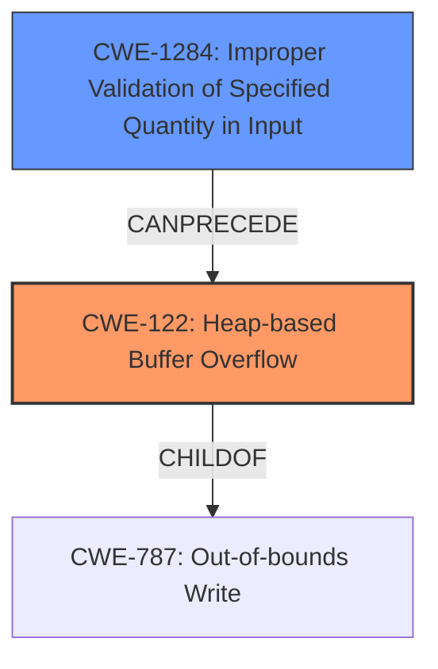

# Raw Analyzer Response for CVE-2021-4207

# Summary
| CWE ID | CWE Name | Confidence | CWE Abstraction Level | CWE Vulnerability Mapping Label | CWE-Vulnerability Mapping Notes |
|---|---|---|---|---|---|
| CWE-122 | Heap-based Buffer Overflow | 1.0 | Variant | Allowed | Primary CWE |
| CWE-1284 | Improper Validation of Specified Quantity in Input | 0.7 | Base | Allowed | Secondary Candidate |

## Evidence and Confidence

*   **Confidence Score:** 0.85
*   **Evidence Strength:** HIGH

## Relationship Analysis
The primary CWE is CWE-122, a **Variant** of CWE-787 (Out-of-bounds Write) and CWE-788. The vulnerability description clearly states a "heap-based buffer overflow," making CWE-122 the most specific and accurate choice. CWE-1284 can precede CWE-789 which could have been the root cause of the allocation of a small cursor object followed by a subsequent heap-based buffer overflow. CWE-119 is a more general class that is not appropriate, since the evidence suggests a heap-based overflow.

## Vulnerability Chain
The chain of events is as follows:
1.  **Double fetch of guest-controlled values** (`cursor->header.width` and `cursor->header.height`) leading to
2.  Allocation of a small cursor object
3.  Subsequent **heap-based buffer overflow**
4.  Crash of the QEMU process or arbitrary code execution

The **double fetch** and **improper validation** are root causes, while the **heap-based buffer overflow** is the weakness that leads to the final impact.

## Summary of Analysis
The primary weakness is clearly a **heap-based buffer overflow** (CWE-122), directly stated in the vulnerability description and CVE summary. The root cause involves a **double fetch of guest-controlled values**. This double fetch likely leads to **improper validation of the specified quantity in input** (CWE-1284), which then causes the heap-based buffer overflow.

The analysis is heavily based on the provided evidence, specifically:
*   "A **double fetch of guest controlled values** `cursor->header.width` and `cursor->header.height` can lead to the allocation of a small cursor object followed by a subsequent **heap-based buffer overflow**."
*   "Weakness: **heap-based buffer overflow**"
*   "Root cause: Double fetch of guest-controlled values `cursor->header.width` and `cursor->header.height` in the `qxl_cursor` function."

CWE-122 is at the optimal level of specificity because the description explicitly mentions a "heap-based buffer overflow." While CWE-119 (Improper Restriction of Operations within the Bounds of a Memory Buffer) is a parent class, it's too general. While a race condition is mentioned in the CVE summary, the root cause is the double fetch which leads to a buffer overflow.

Relevant CWE Information:

# Enhanced Context (25 CWEs)
The following CWEs were identified as potentially relevant to this vulnerability:

## CWE-404: Improper Resource Shutdown or Release
**Abstraction Level**: Class
**Similarity Score**: 0.78
**Source**: dense

**Description**:
The product does not release or incorrectly releases a resource before it is made available for re-use.

**Mapping Guidance**:
- Usage: Allowed-with-Review
- Rationale: This CWE entry is a Class and might have Base-level children that would be more appropriate

*Not Selected*: This CWE is not related to the root cause or weakness described in the vulnerability.

## CWE-667: Improper Locking
**Abstraction Level**: Class
**Similarity Score**: 0.78
**Source**: dense

**Description**:
The product does not properly acquire or release a lock on a resource, leading to unexpected resource state changes and behaviors.

**Mapping Guidance**:
- Usage: Allowed-with-Review
- Rationale: This CWE entry is a Class and might have Base-level children that would be more appropriate

*Not Selected*: While a race condition is mentioned in the CVE summary, improper locking is not the root cause of the issue.

## CWE-226: Sensitive Information in Resource Not Removed Before Reuse
**Abstraction Level**: Base
**Similarity Score**: 0.77
**Source**: dense

**Description**:
The product releases a resource such as memory or a file so that it can be made available for reuse, but it does not clear or "zeroize" the information contained in the resource before the product performs a critical state transition or makes the resource available for reuse by other entities.

**Mapping Guidance**:
- Usage: Allowed
- Rationale: This CWE entry is at the Base level of abstraction, which is a preferred level of abstraction for mapping to the root causes of vulnerabilities.

*Not Selected*: This CWE is not related to the root cause or weakness described in the vulnerability.

## CWE-662: Improper Synchronization
**Abstraction Level**: Class
**Similarity Score**: 0.77
**Source**: dense

**Description**:
The product utilizes multiple threads or processes to allow temporary access to a shared resource that can only be exclusive to one process at a time, but it does not properly synchronize these actions, which might cause simultaneous accesses of this resource by multiple threads or processes.

**Mapping Guidance**:
- Usage: Discouraged
- Rationale: This CWE entry is a level-1 Class (i.e., a child of a Pillar). It might have lower-level children that would be more appropriate

*Not Selected*: While a race condition is mentioned in the CVE summary, improper synchronization is not the root cause of the issue, the root cause is the double fetch which leads to a buffer overflow.

## CWE-131: Incorrect Calculation of Buffer Size
**Abstraction Level**: Base
**Similarity Score**: 0.77
**Source**: dense

**Description**:
The product does not correctly calculate the size to be used when allocating a buffer, which could lead to a buffer overflow.

**Mapping Guidance**:
- Usage: Allowed
- Rationale: This CWE entry is at the Base level of abstraction, which is a preferred level of abstraction for mapping to the root causes of vulnerabilities.

*Not Selected*: This is closely related to the vulnerability, however, since CWE-1284 (Improper Validation of Specified Quantity in Input) is listed, it is preferred.

## CWE-909: Missing Initialization of Resource
**Abstraction Level**: Class
**Similarity Score**: 0.76
**Source**: dense

**Description**:
The product does not initialize a critical resource.

**Mapping Guidance**:
- Usage: Allowed-with-Review
- Rationale: This CWE entry is a Class and might have Base-level children that would be more appropriate

*Not Selected*: This CWE is not related to the root cause or weakness described in the vulnerability.

## CWE-789: Memory Allocation with Excessive Size Value
**Abstraction Level**: Variant
**Similarity Score**: 0.76
**Source**: dense

**Description**:
The product allocates memory based on an untrusted, large size value, but it does not ensure that the size is within expected limits, allowing arbitrary amounts of memory to be allocated.

**Mapping Guidance**:
- Usage: Allowed
- Rationale: This CWE entry is at the Variant level of abstraction, which is a preferred level of abstraction for mapping to the root causes of vulnerabilities.

*Not Selected*: This could have been selected if the double fetch had resulted in a large allocation value, but it resulted in a small allocation value.

## CWE-754: Improper Check for Unusual or Exceptional Conditions
**Abstraction Level**: Class
**Similarity Score**: 0.76
**Source**: dense

**Description**:
The product does not check or incorrectly checks for unusual or exceptional conditions that are not expected to occur frequently during day to day operation of the product.

**Mapping Guidance**:
- Usage: Allowed-with-Review
- Rationale: This CWE entry is a Class and might have Base-level children that would be more appropriate

*Not Selected*: This CWE is too generic and doesn't fit the specific vulnerability.

## CWE-191: Integer Underflow (Wrap or Wraparound)
**Abstraction Level**: Base
**Similarity Score**: 0.76
**Source**: dense

**Description**:
The product subtracts one value from another, such that the result is less than the minimum allowable integer value, which produces a value that is not equal to the correct