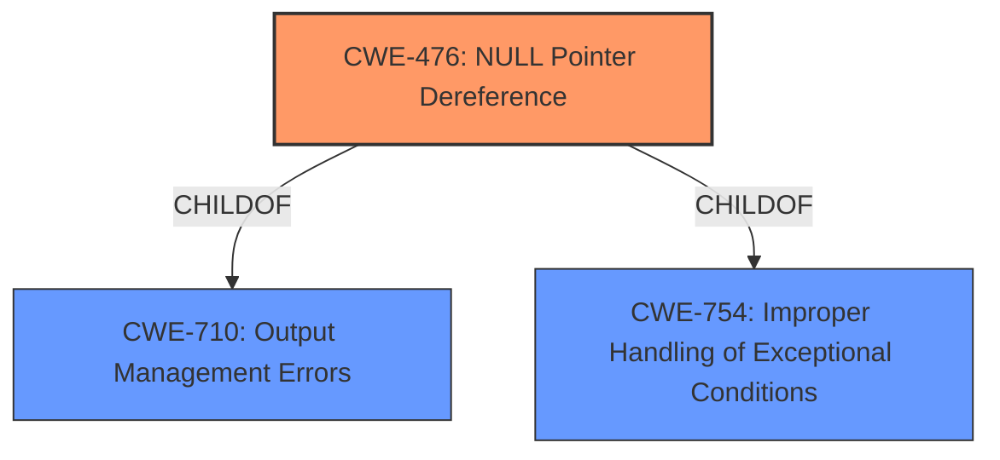

# Analysis for CVE-2021-4209

# Summary
| CWE ID | CWE Name | Confidence | CWE Abstraction Level | CWE Vulnerability Mapping Label | CWE-Vulnerability Mapping Notes |
|---|---|---|---|---|---|
| CWE-476 | NULL Pointer Dereference | 1.0 | Base | Allowed | Primary CWE |

## Evidence and Confidence

*   **Confidence Score:** 1.0
*   **Evidence Strength:** HIGH

## Relationship Analysis
The primary relationship considered was the ChildOf relationship for CWE-476, linking it to higher-level classes such as CWE-710 and CWE-754, but these were less specific than CWE-476. No chain relationships influenced the selection, as the vulnerability is directly caused by the **NULL pointer dereference**.

## Vulnerability Chain
The vulnerability chain consists of the following:
1.  The Nettle hash update functions are called with zero-length input.
2.  Internally, `memcpy` is called with a null pointer as the source argument.
3.  This leads to a **NULL pointer dereference**.
4.  The result is a denial of service.

The root cause is the **NULL pointer dereference** due to the improper handling of zero-length input and the subsequent call to `memcpy` with a null pointer. The impact is a denial of service.

## Summary of Analysis
The analysis is based on the vulnerability description and CVE Reference Links Content Summary provided. The vulnerability is a **NULL pointer dereference** that occurs when Nettle's hash update functions are called with zero-length input, leading to a call to `memcpy` with a null pointer. This results in a denial of service.

The evidence from the CVE Reference Links Content Summary is: "The vulnerability stems from how GnuTLS handles hash updates when Nettle's hash update functions (specifically `memcpy`) are called with zero-length input. This zero-length input can cause a null pointer dereference leading to a crash."

CWE-476 (NULL Pointer Dereference) is the most appropriate CWE because it directly describes the vulnerability. The CWE description states: "The product dereferences a pointer that it expects to be valid but is NULL." This aligns perfectly with the vulnerability description.

Other CWEs were considered but not selected:

*   CWE-824 (Access of Uninitialized Pointer): This CWE was considered because it relates to pointer issues. However, the pointer is not uninitialized; it is explicitly NULL.
*   CWE-252 (Unchecked Return Value): This CWE was considered because a missing check could lead to the NULL pointer. However, the primary issue is the **NULL pointer dereference** itself, not the missing check.
*   CWE-690 (Unchecked Return Value to NULL Pointer Dereference): While this is related, it's a compound CWE and less specific than CWE-476. The immediate cause is the **NULL pointer dereference**, making CWE-476 more appropriate.
*   CWE-170 (Improper Null Termination): This is not related to the vulnerability description.
*   CWE-125 (Out-of-bounds Read): This is not related to the vulnerability description.

The selection of CWE-476 is at the optimal level of specificity (Base). It accurately represents the weakness described in the vulnerability.

# Enhanced Query for CVE-2021-4209

## Vulnerability Description
A **NULL pointer dereference** flaw was found in GnuTLS. As Nettles hash update functions internally call memcpy, providing zero-length input may cause undefined behavior. This flaw leads to a denial of service after authentication in rare circumstances.

### Vulnerability Description Key Phrases
- **rootcause:** **NULL pointer dereference**
- **impact:** denial of service
- **product:** GnuTLS

## CVE Reference Links Content Summary
Based on the provided content, here's an analysis of the vulnerability described in CVE-2021-4209:

**Root Cause of Vulnerability:**
The vulnerability stems from how GnuTLS handles hash updates when Nettle's hash update functions (specifically `memcpy`) are called with zero-length input. This zero-length input can cause a null pointer dereference leading to a crash.

**Weaknesses/Vulnerabilities Present:**
- **Null Pointer Dereference:** The core issue is that when using GnuTLS with Guile disabled, a null pointer might be passed as the source argument to `memcpy` within Nettle's hash update functions, leading to a null pointer dereference.
- **Lack of Input Validation:** The code doesn't properly validate the input length before passing it to the `memcpy` function, especially during the computation of the PSK binder.

**Impact of Exploitation:**
- **Denial of Service (DoS):** Successful exploitation of this vulnerability results in a crash of the GnuTLS application, effectively causing a denial of service. The program terminates abruptly due to the null pointer dereference, interrupting the TLS handshake process.

**Attack Vectors:**
- **TLS Handshake with PSK:** The vulnerability is triggered during a TLS handshake when using Pre-Shared Keys (PSK) specifically, while sending client parameters, and when GnuTLS is compiled with Guile disabled.
- **Specific TLS Configuration:** The attack requires a specific TLS configuration that utilizes PSK ciphersuites and can be triggered when the client sends hello extensions.

**Required Attacker Capabilities/Position:**
- **Network Access:** An attacker needs to be able to initiate a TLS handshake with a vulnerable GnuTLS server or client application.
- **Knowledge of PSK:** The attacker needs to be aware that the server or client is configured with PSK and needs to use it during the handshake.
- **Specific TLS Ciphersuite:** The attacker must use a ciphersuite that triggers the vulnerable code path (e.g., `NORMAL:-KX-ALL:+ECDHE-PSK:+DHE-PSK:+PSK` in the provided example).
- **Guile Disabled:** The targeted GnuTLS must be compiled with the Guile support disabled to be vulnerable.

**Additional Notes:**
- The issue occurs when the function `_gnutls_hash_fast` within GnuTLS is called which eventually calls `nettle_sha256_update` with a `length` of 0 and a `data` pointer equal to NULL.
- The vulnerability is triggered by a zero-length memcpy when computing the PSK binder key for the client hello extensions.
- Patches were made in GnuTLS version 3.7.3 to prevent the null pointer dereference.
- The vulnerability was present in Nettle library's hash update functions, specifically `memcpy`.

## Retriever Results

### Top Combined Results

| Rank | CWE ID | Name | Abstraction | Usage  | Retrievers | Individual Scores |
|------|--------|------|-------------|-------|------------|-------------------|
| 1 | 476 | NULL Pointer Dereference | Base | Allowed | sparse | 0.362 |
| 2 | 824 | Access of Uninitialized Pointer | Base | Allowed | sparse | 0.273 |
| 3 | 252 | Unchecked Return Value | Base | Allowed | sparse | 0.248 |
| 4 | 822 | Untrusted Pointer Dereference | Base | Allowed | sparse | 0.231 |
| 5 | 690 | Unchecked Return Value to NULL Pointer Dereference | Compound | Discouraged | sparse | 0.227 |
| 6 | 626 | Null Byte Interaction Error (Poison Null Byte) | Variant | Allowed | dense | 0.593 |
| 7 | 170 | Improper Null Termination | Base | Allowed | graph | 0.003 |
| 8 | 688 | Function Call With Incorrect Variable or Reference as Argument | Variant | Allowed | sparse | 0.227 |
| 9 | 665 | Improper Initialization | Class | Discouraged | sparse | 0.226 |
| 10 | 125 | Out-of-bounds Read | Base | Allowed | sparse | 0.226 |

# Complete CWE Specifications

## CWE-476: NULL Pointer Dereference
**Abstraction:** Base
**Status:** Stable

### Description
The product dereferences a pointer that it expects to be valid but is NULL.

### Extended Description
Not provided

### Alternative Terms
NPD: Common abbreviation for Null Pointer Dereference
null deref: Common abbreviation for Null Pointer Dereference
NPE: Common abbreviation for Null Pointer Exception
nil pointer dereference: used for access of nil in Go programs

### Relationships
ChildOf -> CWE-710
ChildOf -> CWE-754
ChildOf -> CWE-754

### Mapping Guidance
**Usage:** Allowed
**Rationale:** This CWE entry is at the Base level of abstraction, which is a preferred level of abstraction for mapping to the root causes of vulnerabilities.
**Comments:** Carefully read both the name and description to ensure that this mapping is an appropriate fit. Do not try to 'force' a mapping to a lower-level Base/Variant simply to comply with this preferred level of abstraction.
**Reasons:**
- Acceptable-Use

### Observed Examples
- **CVE-2005-3274:** race condition causes a table to be corrupted if a timer activates while it is being modified, leading to resultant NULL dereference; also involves locking.
- **CVE-2002-1912:** large number of packets leads to NULL dereference
- **CVE-2005-0772:** packet with invalid error status value triggers NULL dereference

## CWE-824: Access of Uninitialized Pointer
**Abstraction:** Base
**Status:** Incomplete

### Description
The product accesses or uses a pointer that has not been initialized.

### Extended Description

If the pointer contains an uninitialized value, then the value might not point to a valid memory location. This could cause the product to read from or write to unexpected memory locations, leading to a denial of service. If the uninitialized pointer is used as a function call, then arbitrary functions could be invoked. If an attacker can influence the portion of uninitialized memory that is contained in the pointer, this weakness could be leveraged to execute code or perform other attacks.

Depending on memory layout, associated memory management behaviors, and product operation, the attacker might be able to influence the contents of the uninitialized pointer, thus gaining more fine-grained control of the memory location to be accessed.

### Alternative Terms
None

### Relationships
ChildOf -> CWE-119
ChildOf -> CWE-119
ChildOf -> CWE-119
ChildOf -> CWE-119
CanPrecede -> CWE-125
CanPrecede -> CWE-787

### Mapping Guidance
**Usage:** Allowed
**Rationale:** This CWE entry is at the Base level of abstraction, which is a preferred level of abstraction for mapping to the root causes of vulnerabilities.
**Comments:** Carefully read both the name and description to ensure that this mapping is an appropriate fit. Do not try to 'force' a mapping to a lower-level Base/Variant simply to comply with this preferred level of abstraction.
**Reasons:**
- Acceptable-Use

### Additional Notes
**[Maintenance]** There are close relationships between incorrect pointer dereferences and other weaknesses related to buffer operations. There may not be sufficient community agreement regarding these relationships. Further study is needed to determine when these relationships are chains, composites, perspective/layering, or other types of relationships. As of September 2010, most of the relationships are being captured as chains.

**[Terminology]** Many weaknesses related to pointer dereferences fall under the general term of "memory corruption" or "memory safety." As of September 2010, there is no commonly-used terminology that covers the lower-level variants.

### Observed Examples
- **CVE-2024-32878:** LLM product has a free of an uninitialized pointer
- **CVE-2010-0211:** chain: unchecked return value (CWE-252) leads to free of invalid, uninitialized pointer (CWE-824).
- **CVE-2009-2768:** Pointer in structure is not initialized, leading to NULL pointer dereference (CWE-476) and system crash.

## CWE-252: Unchecked Return Value
**Abstraction:** Base
**Status:** Draft

### Description
The product does not check the return value from a method or function, which can prevent it from detecting unexpected states and conditions.

### Extended Description
Two common programmer assumptions are "this function call can never fail" and "it doesn't matter if this function call fails". If an attacker can force the function to fail or otherwise return a value that is not expected, then the subsequent program logic could lead to a vulnerability, because the product is not in a state that the programmer assumes. For example, if the program calls a function to drop privileges but does not check the return code to ensure that privileges were successfully dropped, then the program will continue to operate with the higher privileges.

### Alternative Terms
None

### Relationships
ChildOf -> CWE-754
ChildOf -> CWE-754
CanPrecede -> CWE-476

### Mapping Guidance
**Usage:** Allowed
**Rationale:** This CWE entry is at the Base level of abstraction, which is a preferred level of abstraction for mapping to the root causes of vulnerabilities.
**Comments:** Carefully read both the name and description to ensure that this mapping is an appropriate fit. Do not try to 'force' a mapping to a lower-level Base/Variant simply to comply with this preferred level of abstraction.
**Reasons:**
- Acceptable-Use

### Observed Examples
- **CVE-2020-17533:** Chain: unchecked return value (CWE-252) of some functions for policy enforcement leads to authorization bypass (CWE-862)
- **CVE-2020-6078:** Chain: The return value of a function returning a pointer is not checked for success (CWE-252) resulting in the later use of an uninitialized variable (CWE-456) and a null pointer dereference (CWE-476)
- **CVE-2019-15900:** Chain: sscanf() call is used to check if a username and group exists, but the return value of sscanf() call is not checked (CWE-252), causing an uninitialized variable to be checked (CWE-457), returning success to allow authorization bypass for executing a privileged (CWE-863).

## CWE-822: Untrusted Pointer Dereference
**Abstraction:** Base
**Status:** Incomplete

### Description
The product obtains a value from an untrusted source, converts this value to a pointer, and dereferences the resulting pointer.

### Extended Description

An attacker can supply a pointer for memory locations that the product is not expecting. If the pointer is dereferenced for a write operation, the attack might allow modification of critical state variables, cause a crash, or execute code. If the dereferencing operation is for a read, then the attack might allow reading of sensitive data, cause a crash, or set a variable to an unexpected value (since the value will be read from an unexpected memory location).

There are several variants of this weakness, including but not necessarily limited to:

  - The untrusted value is directly invoked as a function call.

  - In OS kernels or drivers where there is a boundary between "userland" and privileged memory spaces, an untrusted pointer might enter through an API or system call (see CWE-781 for one such example).

  - Inadvertently accepting the value from an untrusted control sphere when it did not have to be accepted as input at all. This might occur when the code was originally developed to be run by a single user in a non-networked environment, and the code is then ported to or otherwise exposed to a networked environment.

### Alternative Terms
None

### Relationships
ChildOf -> CWE-119
ChildOf -> CWE-119
ChildOf -> CWE-119
CanPrecede -> CWE-125
CanPrecede -> CWE-787

### Mapping Guidance
**Usage:** Allowed
**Rationale:** This CWE entry is at the Base level of abstraction, which is a preferred level of abstraction for mapping to the root causes of vulnerabilities.
**Comments:** Carefully read both the name and description to ensure that this mapping is an appropriate fit. Do not try to 'force' a mapping to a lower-level Base/Variant simply to comply with this preferred level of abstraction.
**Reasons:**
- Acceptable-Use

### Additional Notes
**[Maintenance]** There are close relationships between incorrect pointer dereferences and other weaknesses related to buffer operations. There may not be sufficient community agreement regarding these relationships. Further study is needed to determine when these relationships are chains, composites, perspective/layering, or other types of relationships. As of September 2010, most of the relationships are being captured as chains.

**[Terminology]** Many weaknesses related to pointer dereferences fall under the general term of "memory corruption" or "memory safety." As of September 2010, there is no commonly-used terminology that covers the lower-level variants.

### Observed Examples
- **CVE-2007-5655:** message-passing framework interprets values in packets as pointers, causing a crash.
- **CVE-2010-2299:** labeled as a "type confusion" issue, also referred to as a "stale pointer." However, the bug ID says "contents are simply interpreted as a pointer... renderer ordinarily doesn't supply this pointer directly". The "handle" in the untrusted area is replaced in one function, but not another - thus also, effectively, exposure to wrong sphere (CWE-668).
- **CVE-2009-1719:** Untrusted dereference using undocumented constructor.

## CWE-690: Unchecked Return Value to NULL Pointer Dereference
**Abstraction:** Compound
**Status:** Draft

### Description
The product does not check for an error after calling a function that can return with a NULL pointer if the function fails, which leads to a resultant NULL pointer dereference.

### Extended Description
While unchecked return value weaknesses are not limited to returns of NULL pointers (see the examples in CWE-252), functions often return NULL to indicate an error status. When this error condition is not checked, a NULL pointer dereference can occur.

### Alternative Terms
None

### Relationships
StartsWith -> CWE-252
ChildOf -> CWE-252

### Mapping Guidance
**Usage:** Discouraged
**Rationale:** This CWE entry is a named chain, which combines multiple weaknesses.
**Comments:** Mapping to each separate weakness in the chain would be more precise.
**Reasons:**
- Other

### Observed Examples
- **CVE-2008-1052:** Large Content-Length value leads to NULL pointer dereference when malloc fails.
- **CVE-2006-6227:** Large message length field leads to NULL pointer dereference when malloc fails.
- **CVE-2006-2555:** Parsing routine encounters NULL dereference when input is missing a colon separator.

## CWE-626: Null Byte Interaction Error (Poison Null Byte)
**Abstraction:** Variant
**Status:** Draft

### Description
The product does not properly handle null bytes or NUL characters when passing data between different representations or components.

### Extended Description

A null byte (NUL character) can have different meanings across representations or languages. For example, it is a string terminator in standard C libraries, but Perl and PHP strings do not treat it as a terminator. When two representations are crossed - such as when Perl or PHP invokes underlying C functionality - this can produce an interaction error with unexpected results. Similar issues have been reported for ASP. Other interpreters written in C might also be affected.

The poison null byte is frequently useful in path traversal attacks by terminating hard-coded extensions that are added to a filename. It can play a role in regular expression processing in PHP.

### Alternative Terms
None

### Relationships
ChildOf -> CWE-147
ChildOf -> CWE-436

### Mapping Guidance
**Usage:** Allowed
**Rationale:** This CWE entry is at the Variant level of abstraction, which is a preferred level of abstraction for mapping to the root causes of vulnerabilities.
**Comments:** Carefully read both the name and description to ensure that this mapping is an appropriate fit. Do not try to 'force' a mapping to a lower-level Base/Variant simply to comply with this preferred level of abstraction.
**Reasons:**
- Acceptable-Use

### Additional Notes
**[Terminology]** Current usage of "poison null byte" is typically related to this C/Perl/PHP interaction error, but the original term in 1998 was applied to an off-by-one buffer overflow involving a null byte.

**[Research Gap]** There are not many CVE examples, because the poison NULL byte is a design limitation, which typically is not included in CVE by itself. It is typically used as a facilitator manipulation to widen the scope of potential attacks against other vulnerabilities.

### Observed Examples
- **CVE-2005-4155:** NUL byte bypasses PHP regular expression check
- **CVE-2005-3153:** inserting SQL after a NUL byte bypasses allowlist regexp, enabling SQL injection

## CWE-170: Improper Null Termination
**Abstraction:** Base
**Status:** Incomplete

### Description
The product does not terminate or incorrectly terminates a string or array with a null character or equivalent terminator.

### Extended Description
Null termination errors frequently occur in two different ways. An off-by-one error could cause a null to be written out of bounds, leading to an overflow. Or, a program could use a strncpy() function call incorrectly, which prevents a null terminator from being added at all. Other scenarios are possible.

### Alternative Terms
None

### Relationships
ChildOf -> CWE-707
CanPrecede -> CWE-120
CanPrecede -> CWE-126
CanAlsoBe -> CWE-147
PeerOf -> CWE-464
PeerOf -> CWE-463
ChildOf -> CWE-20

### Mapping Guidance
**Usage:** Allowed
**Rationale:** This CWE entry is at the Base level of abstraction, which is a preferred level of abstraction for mapping to the root causes of vulnerabilities.
**Comments:** Carefully read both the name and description to ensure that this mapping is an appropriate fit. Do not try to 'force' a mapping to a lower-level Base/Variant simply to comply with this preferred level of abstraction.
**Reasons:**
- Acceptable-Use

### Additional Notes
**[Relationship]** Factors: this is usually resultant from other weaknesses such as off-by-one errors, but it can be primary to boundary condition violations such as buffer overflows. In buffer overflows, it can act as an expander for assumed-immutable data.

**[Relationship]** Overlaps missing input terminator.

**[Applicable Platform]** 

Conceptually, this does not just apply to the C language; any language or representation that involves a terminator could have this type of problem.

**[Maintenance]** As currently described, this entry is more like a category than a weakness.

### Observed Examples
- **CVE-2000-0312:** Attacker does not null-terminate argv[] when invoking another program.
- **CVE-2003-0777:** Interrupted step causes resultant lack of null termination.
- **CVE-2004-1072:** Fault causes resultant lack of null termination, leading to buffer expansion.

## CWE-688: Function Call With Incorrect Variable or Reference as Argument
**Abstraction:** Variant
**Status:** Draft

### Description
The product calls a function, procedure, or routine, but the caller specifies the wrong variable or reference as one of the arguments, which may lead to undefined behavior and resultant weaknesses.

### Extended Description
Not provided

### Alternative Terms
None

### Relationships
ChildOf -> CWE-628

### Mapping Guidance
**Usage:** Allowed
**Rationale:** This CWE entry is at the Variant level of abstraction, which is a preferred level of abstraction for mapping to the root causes of vulnerabilities.
**Comments:** Carefully read both the name and description to ensure that this mapping is an appropriate fit. Do not try to 'force' a mapping to a lower-level Base/Variant simply to comply with this preferred level of abstraction.
**Reasons:**
- Acceptable-Use

### Observed Examples
- **CVE-2005-2548:** Kernel code specifies the wrong variable in first argument, leading to resultant NULL pointer dereference.

## CWE-665: Improper Initialization
**Abstraction:** Class
**Status:** Draft

### Description
The product does not initialize or incorrectly initializes a resource, which might leave the resource in an unexpected state when it is accessed or used.

### Extended Description
This can have security implications when the associated resource is expected to have certain properties or values, such as a variable that determines whether a user has been authenticated or not.

### Alternative Terms
None

### Relationships
ChildOf -> CWE-664

### Mapping Guidance
**Usage:** Discouraged
**Rationale:** This CWE entry is a level-1 Class (i.e., a child of a Pillar). It might have lower-level children that would be more appropriate
**Comments:** Examine children of this entry to see if there is a better fit
**Reasons:**
- Abstraction

### Observed Examples
- **CVE-2001-1471:** chain: an invalid value prevents a library file from being included, skipping initialization of key variables, leading to resultant eval injection.
- **CVE-2008-3637:** Improper error checking in protection mechanism produces an uninitialized variable, allowing security bypass and code execution.
- **CVE-2008-4197:** Use of uninitialized memory may allow code execution.

## CWE-125: Out-of-bounds Read
**Abstraction:** Base
**Status:** Draft

### Description
The product reads data past the end, or before the beginning, of the intended buffer.

### Extended Description
Not provided

### Alternative Terms
OOB read: Shorthand for "Out of bounds" read

### Relationships
ChildOf -> CWE-119
ChildOf -> CWE-119
ChildOf -> CWE-119
ChildOf -> CWE-119

### Mapping Guidance
**Usage:** Allowed
**Rationale:** This CWE entry is at the Base level of abstraction, which is a preferred level of abstraction for mapping to the root causes of vulnerabilities.
**Comments:** Carefully read both the name and description to ensure that this mapping is an appropriate fit. Do not try to 'force' a mapping to a lower-level Base/Variant simply to comply with this preferred level of abstraction.
**Reasons:**
- Acceptable-Use

### Observed Examples
- **CVE-2023-1018:** The reference implementation code for a Trusted Platform Module does not implement length checks on data, allowing for an attacker to read 2 bytes past the end of a buffer.
- **CVE-2020-11899:** Out-of-bounds read in IP stack used in embedded systems, as exploited in the wild per CISA KEV.
- **CVE-2014-0160:** Chain: "Heartbleed" bug receives an inconsistent length parameter (CWE-130) enabling an out-of-bounds read (CWE-126), returning memory that could include private cryptographic keys and other sensitive data.

