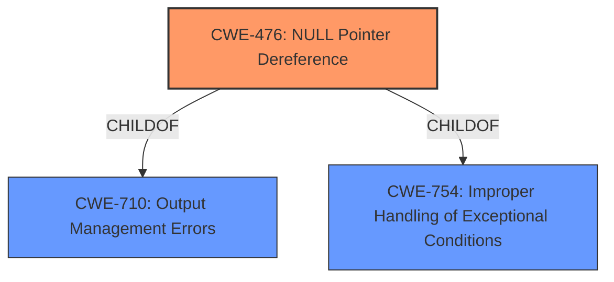

# Analysis Report for CVE-2021-4209

# Vulnerability Analysis Report: CVE-2021-4209

## Description


## Analysis (with Relationship Data)

# Summary
| CWE ID | CWE Name | Confidence | CWE Abstraction Level | CWE Vulnerability Mapping Label | CWE-Vulnerability Mapping Notes |
|---|---|---|---|---|---|
| CWE-476 | NULL Pointer Dereference | 1.0 | Base | Allowed | Primary CWE |

## Evidence and Confidence

*   **Confidence Score:** 1.0
*   **Evidence Strength:** HIGH

## Relationship Analysis
The primary relationship considered was the ChildOf relationship for CWE-476, linking it to higher-level classes such as CWE-710 and CWE-754, but these were less specific than CWE-476. No chain relationships influenced the selection, as the vulnerability is directly caused by the **NULL pointer dereference**.



## Vulnerability Chain
The vulnerability chain consists of the following:
1.  The Nettle hash update functions are called with zero-length input.
2.  Internally, `memcpy` is called with a null pointer as the source argument.
3.  This leads to a **NULL pointer dereference**.
4.  The result is a denial of service.

The root cause is the **NULL pointer dereference** due to the improper handling of zero-length input and the subsequent call to `memcpy` with a null pointer. The impact is a denial of service.

## Summary of Analysis
The analysis is based on the vulnerability description and CVE Reference Links Content Summary provided. The vulnerability is a **NULL pointer dereference** that occurs when Nettle's hash update functions are called with zero-length input, leading to a call to `memcpy` with a null pointer. This results in a denial of service.

The evidence from the CVE Reference Links Content Summary is: "The vulnerability stems from how GnuTLS handles hash updates when Nettle's hash update functions (specifically `memcpy`) are called with zero-length input. This zero-length input can cause a null pointer dereference leading to a crash."

CWE-476 (NULL Pointer Dereference) is the most appropriate CWE because it directly describes the vulnerability. The CWE description states: "The product dereferences a pointer that it expects to be valid but is NULL." This aligns perfectly with the vulnerability description.

Other CWEs were considered but not selected:

*   CWE-824 (Access of Uninitialized Pointer): This CWE was considered because it relates to pointer issues. However, the pointer is not uninitialized; it is explicitly NULL.
*   CWE-252 (Unchecked Return Value): This CWE was considered because a missing check could lead to the NULL pointer. However, the primary issue is the **NULL pointer dereference** itself, not the missing check.
*   CWE-690 (Unchecked Return Value to NULL Pointer Dereference): While this is related, it's a compound CWE and less specific than CWE-476. The immediate cause is the **NULL pointer dereference**, making CWE-476 more appropriate.
*   CWE-170 (Improper Null Termination): This is not related to the vulnerability description.
*   CWE-125 (Out-of-bounds Read): This is not related to the vulnerability description.

The selection of CWE-476 is at the optimal level of specificity (Base). It accurately represents the weakness described in the vulnerability.


## CWE Relationship Analysis

Current CWEs represent these abstraction levels: .


### Vulnerability Chain Analysis

**Chain starting from CWE-476:**
- 476 (NULL Pointer Dereference) - ROOT


**Chain starting from CWE-710:**
- 710 (Improper Adherence to Coding Standards) - ROOT


### CWE Relationship Diagram

```mermaid
graph TD
    classDef primary fill:#f96,stroke:#333,stroke-width:2px
    classDef secondary fill:#69f,stroke:#333
    classDef tertiary fill:#9e9,stroke:#333
```


*Report generated on 2025-03-30 18:23:50*
