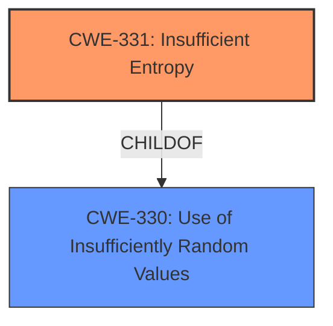

# Raw Analyzer Response for CVE-2021-42138

# Summary
| CWE ID  | CWE Name                                                                     | Confidence | CWE Abstraction Level | CWE Vulnerability Mapping Label | CWE-Vulnerability Mapping Notes |
| :-------- | :--------------------------------------------------------------------------- | :--------- | :---------------------- | :------------------------------ | :------------------------------ |
| CWE-331   | Insufficient Entropy                                                         | 0.9        | Base                    | Primary                         | Allowed                       |

## Evidence and Confidence

*   **Confidence Score:** 0.9
*   **Evidence Strength:** HIGH

## Relationship Analysis
The primary relationship influencing the CWE selection is the direct match between the vulnerability description's **weak entropy** and CWE-331's description of algorithms producing insufficient entropy. CWE-331 is a Base level CWE, making it a suitable choice. It is also a child of CWE-330, but CWE-331 is more specific and better represents the vulnerability.

## Vulnerability Chain
The vulnerability chain consists of a **root cause** of **weak entropy** (CWE-331) leading to the **impact** of accessing encrypted credentials.

## Summary of Analysis
The analysis strongly supports the selection of CWE-331 as the primary CWE. The vulnerability description explicitly mentions **weak entropy**, which directly aligns with the description of CWE-331: "The product uses an algorithm or scheme that produces insufficient entropy, leaving patterns or clusters of values that are more likely to occur than others." The high retriever score for CWE-331 further supports this choice. The analysis is primarily based on the evidence provided in the vulnerability description key phrases, specifically the **rootcause: weak entropy**.

The other CWEs considered, such as CWE-338 (Use of Cryptographically Weak Pseudo-Random Number Generator (PRNG)), CWE-1391 (Use of Weak Credentials), and CWE-330 (Use of Insufficiently Random Values), were not as directly relevant. While a weak PRNG could lead to insufficient entropy, the description does not explicitly mention a PRNG, making CWE-331 a more accurate fit. CWE-1391 and CWE-330 are Class level CWEs and less specific.

The selected CWE, CWE-331, is at the optimal level of specificity (Base) as it directly addresses the **root cause** of the vulnerability. The MITRE mapping guidance allows for the use of Base level CWEs.

Relevant CWE Information:

## Vulnerability Description
A user of a machine protected by SafeNet Agent for Windows Logon may leverage **weak entropy** to access the encrypted credentials of any or all the users on that machine.

### Vulnerability Description Key Phrases
- **rootcause:** **weak entropy**
- **impact:** access encrypted credentials of other users
- **attacker:** user of machine protected by SafeNet Agent for Windows
- **product:** SafeNet Agent for Windows