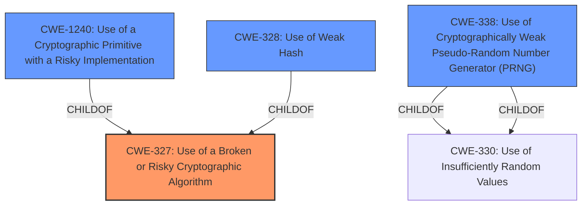

# Analysis Report for CVE-2021-42216

# Vulnerability Analysis Report: CVE-2021-42216

## Description


## Analysis (with Relationship Data)

# Summary
| CWE ID | CWE Name | Confidence | CWE Abstraction Level | CWE Vulnerability Mapping Label | CWE-Vulnerability Mapping Notes |
|---|---|---|---|---|---|
| CWE-327 | Use of a Broken or Risky Cryptographic Algorithm | 0.9 | Class | Primary | Allowed-with-Review |
| CWE-1240 | Use of a Cryptographic Primitive with a Risky Implementation | 0.7 | Base | Secondary | Allowed |
| CWE-328 | Use of Weak Hash | 0.6 | Base | Secondary | Allowed |
| CWE-338 | Use of Cryptographically Weak Pseudo-Random Number Generator (PRNG) | 0.5 | Base | Secondary | Allowed |

## Evidence and Confidence

*   **Confidence Score:** 0.8
*   **Evidence Strength:** MEDIUM

## Relationship Analysis
The primary CWE selected is CWE-327 (Use of a Broken or Risky Cryptographic Algorithm), which is a Class-level CWE. The retriever results suggest more specific Base-level CWEs like CWE-1240 (Use of a Cryptographic Primitive with a Risky Implementation), CWE-328 (Use of Weak Hash), and CWE-338 (Use of Cryptographically Weak Pseudo-Random Number Generator (PRNG)). These are all related to the use of broken or weak cryptographic components. CWE-327 is a parent of CWE-1240 and CWE-328. The final selection includes the parent CWE-327 and other related CWEs to cover the specifics of the vulnerability.



## Vulnerability Chain
The vulnerability chain starts with the **use of a broken or risky cryptographic algorithm** (CWE-327). This can lead to vulnerabilities related to weak hashes (CWE-328) or weak random number generators (CWE-338), ultimately resulting in a compromise of data confidentiality, integrity, or availability.

## Summary of Analysis
The initial assessment based on the **Vulnerability Description Key Phrases** points towards CWE-327 (Use of a Broken or Risky Cryptographic Algorithm). The **Vulnerability Description** mentions a **"Broken or Risky Cryptographic Algorithm"**. The retriever results confirm this, with CWE-327 being a high-scoring candidate.

The evidence supports the selection of CWE-327 as the primary CWE, as it directly reflects the **root cause** described in the vulnerability. The selection of related CWEs like CWE-1240, CWE-328, and CWE-338 provides a more detailed understanding of the cryptographic weaknesses. These are at the base level of abstraction, providing further specifics on the type of broken cryptography.

The final selection aims to provide a comprehensive classification of the vulnerability, covering both the general class of cryptographic weaknesses and the specific types of weaknesses involved.

Relevant CWE Information:

# Enhanced Context (25 CWEs)

## CWE-1240: Use of a Cryptographic Primitive with a Risky Implementation
**Abstraction Level**: Base
**Similarity Score**: 0.82
**Source**: dense

**Description**:
To fulfill the need for a cryptographic primitive, the product implements a cryptographic algorithm using a non-standard, unproven, or disallowed/non-compliant cryptographic implementation.

**Mapping Guidance**:
- Usage: Allowed
- Rationale: This CWE entry is at the Base level of abstraction, which is a preferred level of abstraction for mapping to the root causes of vulnerabilities.

## CWE-327: Use of a Broken or Risky Cryptographic Algorithm
**Abstraction Level**: Class
**Similarity Score**: 8069.86
**Source**: sparse

**Description**:
The product uses a broken or risky cryptographic algorithm or protocol.

**Mapping Guidance**:
- Usage: Allowed-with-Review
- Rationale: This CWE entry is a Class and might have Base-level children that would be more appropriate

## CWE-328: Use of Weak Hash
**Abstraction Level**: Base
**Similarity Score**: 7915.55
**Source**: sparse

**Description**:
The product uses an algorithm that produces a digest (output value) that does not meet security expectations for a hash function that allows an adversary to reasonably determine the original input (preimage attack), find another input that can produce the same hash (2nd preimage attack), or find multiple inputs that evaluate to the same hash (birthday attack).

**Mapping Guidance**:
- Usage: Allowed
- Rationale: This CWE entry is at the Base level of abstraction, which is a preferred level of abstraction for mapping to the root causes of vulnerabilities.

## CWE-338: Use of Cryptographically Weak Pseudo-Random Number Generator (PRNG)
**Abstraction Level**: Base
**Similarity Score**: 7916.67
**Source**: sparse

**Description**:
The product uses a Pseudo-Random Number Generator (PRNG) in a security context, but the PRNG's algorithm is not cryptographically strong.

**Mapping Guidance**:
- Usage: Allowed
- Rationale: This CWE entry is at the Base level of abstraction, which is a preferred level of abstraction for mapping to the root causes of vulnerabilities.


## CWE Relationship Analysis

Current CWEs represent these abstraction levels: .


### Vulnerability Chain Analysis

**Chain starting from CWE-327:**
- 327 (Use of a Broken or Risky Cryptographic Algorithm) - ROOT


**Chain starting from CWE-330:**
- 330 (Use of Insufficiently Random Values) - ROOT


### CWE Relationship Diagram

```mermaid
graph TD
    classDef primary fill:#f96,stroke:#333,stroke-width:2px
    classDef secondary fill:#69f,stroke:#333
    classDef tertiary fill:#9e9,stroke:#333
```


*Report generated on 2025-03-31 09:12:02*
