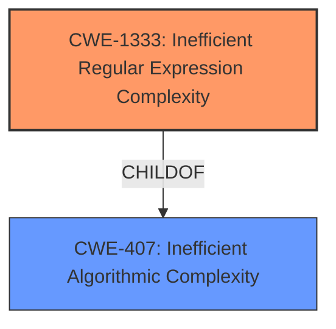

# Analysis Report for CVE-2021-42248

# Vulnerability Analysis Report: CVE-2021-42248

## Description


## Analysis (with Relationship Data)

# Summary
| CWE ID | CWE Name | Confidence | CWE Abstraction Level | CWE Vulnerability Mapping Label | CWE-Vulnerability Mapping Notes |
|---|---|---|---|---|---|
| CWE-1333 | Inefficient Regular Expression Complexity | 1.0 | Base | Allowed | Primary CWE |

## Evidence and Confidence

*   **Confidence Score:** 1.0
*   **Evidence Strength:** HIGH

## Relationship Analysis
The primary relationship influencing the decision is that CWE-1333, "Inefficient Regular Expression Complexity," is a child of CWE-407, "Inefficient Algorithmic Complexity." While CWE-407 was also considered, CWE-1333 provides a more specific classification for vulnerabilities related to regular expressions, aligning perfectly with the provided description.



## Vulnerability Chain
The vulnerability chain starts with a crafted JSON input that exploits an inefficient regular expression, leading to excessive CPU consumption and a denial-of-service condition.

## Summary of Analysis
The analysis is primarily based on the vulnerability description, which explicitly mentions a **"regular expression denial of service"** vulnerability in GJSON <= 1.9.2 due to crafted JSON input. The Retriever Results also strongly suggest CWE-1333, "Inefficient Regular Expression Complexity," as the top candidate.

The evidence is strong: "GJSON <= 1.9.2 allows attackers to cause a redos via crafted JSON input."

The graph relationships influenced the final selection by confirming that CWE-1333 is a more specific instance of the broader CWE-407.

CWE-1333 is selected as it is the optimal level of specificity, directly addressing the **weakness** of **inefficient regular expression** usage leading to a denial-of-service.

Relevant CWE Information:

# Enhanced Context (25 CWEs)

## CWE-1333: Inefficient Regular Expression Complexity
**Abstraction:** Base
**Similarity Score**: 1.000

The product uses a regular expression with an inefficient, possibly exponential worst-case computational complexity that consumes excessive CPU cycles.

This is the best match based on the **Vulnerability Description Key Phrases** and **Retriever Results**.

CWEs Considered but Not Used:

*   CWE-674: Uncontrolled Recursion - While recursion can lead to denial of service, the description specifically mentions regular expressions, making CWE-1333 a more precise fit.
*   CWE-617: Reachable Assertion - This CWE relates to assertion failures, which is not the primary issue described in the vulnerability.
*   CWE-1287: Improper Validation of Specified Type of Input - While input validation is important, the core issue is the inefficiency of the regular expression, not the lack of type validation.
*   CWE-407: Inefficient Algorithmic Complexity - This is a broader category, and CWE-1333 is a more specific child that better describes the **weakness**.
*   CWE-1286: Improper Validation of Syntactic Correctness of Input - This relates to syntax validation, not the efficiency of regular expressions.
*   CWE-843: Access of Resource Using Incompatible Type ('Type Confusion') - This is not related to regular expression inefficiencies.
*   CWE-185: Incorrect Regular Expression - While related, CWE-1333 focuses on the *inefficiency* and complexity, which is the core problem. An incorrect regex could simply fail to match, not necessarily cause a DoS.
*   CWE-1321: Improperly Controlled Modification of Object Prototype Attributes ('Prototype Pollution') - This is a completely different type of vulnerability.
*   CWE-405: Asymmetric Resource Consumption (Amplification) - This is a broader category, and CWE-1333 provides a more specific description of the root cause.


## CWE Relationship Analysis

Current CWEs represent these abstraction levels: .


### Vulnerability Chain Analysis

**Chain starting from CWE-405:**
- 405 (Asymmetric Resource Consumption (Amplification)) - ROOT


**Chain starting from CWE-1321:**
- 1321 (Improperly Controlled Modification of Object Prototype Attributes ('Prototype Pollution')) - ROOT


### CWE Relationship Diagram

```mermaid
graph TD
    classDef primary fill:#f96,stroke:#333,stroke-width:2px
    classDef secondary fill:#69f,stroke:#333
    classDef tertiary fill:#9e9,stroke:#333
```


*Report generated on 2025-03-31 11:11:11*
