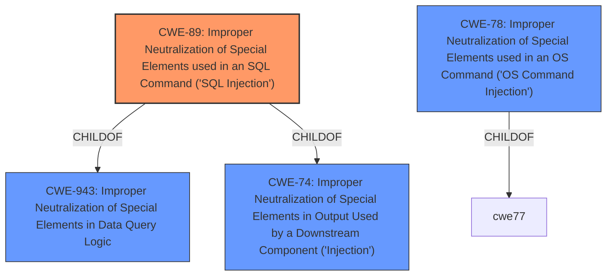

# Raw Analyzer Response for CVE-2021-42258

# Summary
| CWE ID | CWE Name | Confidence | CWE Abstraction Level | CWE Vulnerability Mapping Label | CWE-Vulnerability Mapping Notes |
|---|---|---|---|---|---|
| CWE-89 | Improper Neutralization of Special Elements used in an SQL Command ('SQL Injection') | 1.0 | Base | Primary | Allowed |
| CWE-78 | Improper Neutralization of Special Elements used in an OS Command ('OS Command Injection') | 0.7 | Base | Secondary | Allowed |

## Evidence and Confidence

*   **Confidence Score:** 0.9
*   **Evidence Strength:** HIGH

## Relationship Analysis
The primary CWE is CWE-89 **[CWE-89: Improper Neutralization of Special Elements used in an SQL Command ('SQL Injection')]**, which is a Base level CWE. It is related to CWE-943 **[CWE-943: Improper Neutralization of Special Elements in Data Query Logic]** (Class) as a ChildOf. CWE-78 **[CWE-78: Improper Neutralization of Special Elements used in an OS Command ('OS Command Injection')]** is considered a secondary CWE since the successful exploitation of the SQL injection vulnerability allows attackers to execute arbitrary code on the underlying Windows server via xp_cmdshell, an OS command.

## Vulnerability Chain
The vulnerability chain starts with **improper neutralization of special elements used in an SQL command (CWE-89)**, which leads to the ability to execute arbitrary code on the MSSQLSERVER$ via xp_cmdshell (**OS Command Injection - CWE-78**).

## Summary of Analysis
The initial analysis identified CWE-89 **[CWE-89: Improper Neutralization of Special Elements used in an SQL Command ('SQL Injection')]** as the primary weakness due to the **SQL injection** vulnerability. The vulnerability description states, "BQE BillQuick Web Suite 2018 through 2021 before 22.0.9.1 allows **SQL injection** for unauthenticated remote code execution, as exploited in the wild in October 2021 for ransomware installation. **SQL injection** can, for example, use the txtID (aka username) parameter. Successful exploitation can include the ability to execute arbitrary code as MSSQLSERVER$ via xp_cmdshell."

The CVE Reference Links Content Summary confirms this, stating, "The vulnerability is a SQL injection flaw found in the login form of BillQuick Web Suite. The application constructs SQL queries by concatenating strings, which allows an attacker to inject malicious SQL code."

CWE-78 **[CWE-78: Improper Neutralization of Special Elements used in an OS Command ('OS Command Injection')]** is included as a secondary weakness because the **SQL injection** vulnerability allows for remote code execution through `xp_cmdshell`, which is an OS command.

The CWEs are at the optimal level of specificity. CWE-89 **[CWE-89: Improper Neutralization of Special Elements used in an SQL Command ('SQL Injection')]** directly addresses the root cause, and CWE-78 **[CWE-78: Improper Neutralization of Special Elements used in an OS Command ('OS Command Injection')]** identifies the impact.

Relevant CWE Information:

# Enhanced Context (25 CWEs)
The following CWEs were identified as potentially relevant to this vulnerability:

## CWE-74: Improper Neutralization of Special Elements in Output Used by a Downstream Component ('Injection')
**Abstraction Level**: Class
**Similarity Score**: 0.79
**Source**: dense

**Description**:
The product constructs all or part of a command, data structure, or record using externally-influenced input from an upstream component, but it does not neutralize or incorrectly neutralizes special elements that could modify how it is parsed or interpreted when it is sent to a downstream component.

**Mapping Guidance**:
- Usage: Discouraged
- Rationale: CWE-74 is high-level and often misused when lower-level weaknesses are more appropriate.

## CWE-89: Improper Neutralization of Special Elements used in an SQL Command ('SQL Injection')
**Abstraction:** Base
**Status:** Stable

### Description
The product constructs all or part of an SQL command using externally-influenced input from an upstream component, but it does not neutralize or incorrectly neutralizes special elements that could modify the intended SQL command when it is sent to a downstream component. Without sufficient removal or quoting of SQL syntax in user-controllable inputs, the generated SQL query can cause those inputs to be interpreted as SQL instead of ordinary user data.

### Extended Description
Not provided

### Alternative Terms
SQL injection: a common attack-oriented phrase
SQLi: a common abbreviation for "SQL injection"

### Relationships
ChildOf -> CWE-943
ChildOf -> CWE-74

### Mapping Guidance
**Usage:** Allowed
**Rationale:** This CWE entry is at the Base level of abstraction, which is a preferred level of abstraction for mapping to the root causes of vulnerabilities.
**Comments:** Carefully read both the name and description to ensure that this mapping is an appropriate fit. Do not try to 'force' a mapping to a lower-level Base/Variant simply to comply with this preferred level of abstraction.
**Reasons:**
- Acceptable-Use

### Additional Notes
**[Relationship]** SQL injection can be resultant from special character mismanagement, MAID, or denylist/allowlist problems. It can be primary to authentication errors.

### Observed Examples
- **CVE-2023-32530:** SQL injection in security product dashboard using crafted certificate fields
- **CVE-2021-42258:** SQL injection in time and billing software, as exploited in the wild per CISA KEV.
- **CVE-2021-27101:** SQL injection in file-transfer system via a crafted Host header, as exploited in the wild per CISA KEV.

## CWE-78: Improper Neutralization of Special Elements used in an OS Command ('OS Command Injection')
**Abstraction:** Base
**Status:** Stable

### Description
The product constructs all or part of an OS command using externally-influenced input from an upstream component, but it does not neutralize or incorrectly neutralizes special elements that could modify the intended OS command when it is sent to a downstream component.

### Extended Description
This weakness can lead to a vulnerability in environments in which the attacker does not have direct access to the operating system, such as in web applications. Alternately, if the weakness occurs in a privileged program, it could allow the attacker to specify commands that normally would not be accessible, or to call alternate commands with privileges that the attacker does not have. The problem is exacerbated if the compromised process does not follow the principle of least privilege, because the attacker-controlled commands may run with special system privileges that increases the amount of damage.

There are at least two subtypes of OS command injection:

  - The application intends to execute a single, fixed program that is under its own control. It intends to use externally-supplied inputs as arguments to that program. For example, the program might use system("nslookup [HOSTNAME]") to run nslookup and allow the user to supply a HOSTNAME, which is used as an argument. Attackers cannot prevent nslookup from executing. However, if the program does not remove command separators from the HOSTNAME argument, attackers could place the separators into the arguments, which allows them to execute their own program after nslookup has finished executing.

  - The application accepts an input that it uses to fully select which program to run, as well as which commands to use. The application simply redirects this entire command to the operating system. For example, the program might use "exec([COMMAND])" to execute the [COMMAND] that was supplied by the user. If the COMMAND is under attacker control, then the attacker can execute arbitrary commands or programs. If the command is being executed using functions like exec() and CreateProcess(), the attacker might not be able to combine multiple commands together in the same line.

From a weakness standpoint, these variants represent distinct programmer errors. In the first variant, the programmer clearly intends that input from untrusted parties will be part of the arguments in the command to be executed. In the second variant, the programmer does not intend for the command to be accessible to any untrusted party, but the programmer probably has not accounted for alternate ways in which malicious attackers can provide input.

### Alternative Terms