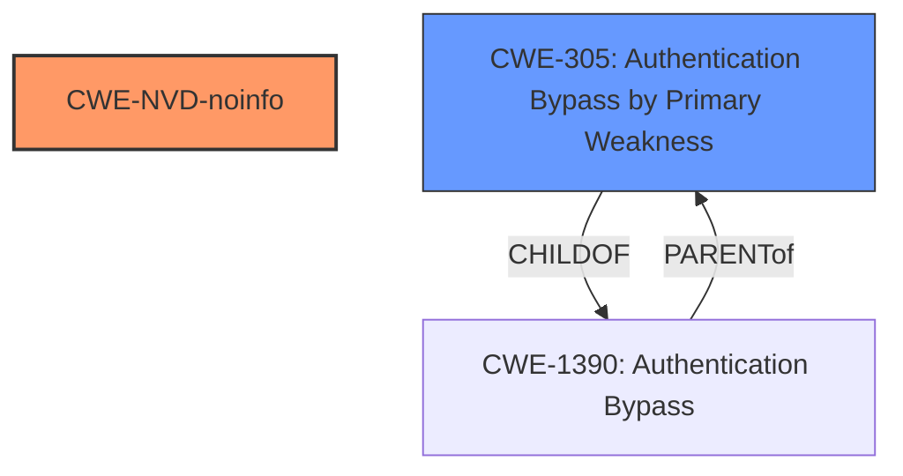

# Analysis Report for CVE-2021-42292

# Vulnerability Analysis Report: CVE-2021-42292

## Description


## Analysis (with Relationship Data)

# Summary
| CWE ID    | CWE Name                                                                     | Confidence | CWE Abstraction Level | CWE Vulnerability Mapping Label | CWE-Vulnerability Mapping Notes |
| :-------- | :--------------------------------------------------------------------------- | :--------- | :-------------------- | :------------------------------ | :------------------------------ |
| CWE-NVD-noinfo | NVD Request for Information (Missing Details)                                        | 0.7       |   N/A                   | N/A                             | N/A                            |
| CWE-305     | Authentication Bypass by Primary Weakness                                                | 0.4        | Base                      | Allowed                       |                                |

## Evidence and Confidence

*   **Confidence Score:** 0.7
*   **Evidence Strength:** LOW

## Relationship Analysis
The primary match from similar CVE descriptions is CWE-NVD-noinfo, indicating a lack of specific information. Among the other CWEs suggested by the retriever, CWE-305 stands out as potentially relevant, as it addresses authentication bypass due to a primary weakness. However, without further details, it's challenging to determine if the **security feature bypass** leads to an authentication bypass scenario. The weakness is treated as primary since that is what the vulnerability description key phrases states. Other CWEs are too specific to this general weakness.



## Vulnerability Chain
The chain of events is not clear from the vulnerability description. It only mentions a **Security Feature Bypass** in Microsoft Excel, without specifying what is bypassed, or what the impact is.

## Summary of Analysis
The initial assessment heavily relies on the limited information provided in the vulnerability description. The primary evidence is the phrase "**Security Feature Bypass**" and the product being "Microsoft Excel."

Given the lack of specific details, assigning a precise CWE is difficult. The selection of CWE-NVD-noinfo is based on the recommendation for similar CVE descriptions, which suggests insufficient information is available. The alternate suggestion of CWE-305 is based on the chance the security feature bypass is an authentication bypass; however, this is speculative. The lack of details prevents selecting a lower-level CWE.

Relevant CWE Information:
# Enhanced Context (25 CWEs)
The following CWEs were identified as potentially relevant to this vulnerability:

## CWE-305: Authentication Bypass by Primary Weakness
**Abstraction:** Base
**Status:** Draft

### Description
The authentication algorithm is sound, but the implemented mechanism can be bypassed as the result of a separate weakness that is primary to the authentication error.

### Extended Description
Not provided

### Alternative Terms
None

### Relationships
ChildOf -> CWE-1390

### Mapping Guidance
**Usage:** Allowed
**Rationale:** This CWE entry is at the Base level of abstraction, which is a preferred level of abstraction for mapping to the root causes of vulnerabilities.
**Comments:** Carefully read both the name and description to ensure that this mapping is an appropriate fit. Do not try to 'force' a mapping to a lower-level Base/Variant simply to comply with this preferred level of abstraction.
**Reasons:**
- Acceptable-Use

### Additional Notes
**[Relationship]** Most "authentication bypass" errors are resultant, not primary.

### Observed Examples
- **CVE-2002-1374:** The provided password is only compared against the first character of the real password.
- **CVE-2000-0979:** The password is not properly checked, which allows remote attackers to bypass access controls by sending a 1-byte password that matches the first character of the real password.
- **CVE-2001-0088:** Chain: Forum software does not properly initialize an array, which inadvertently sets the password to a single character, allowing remote attackers to easily guess the password and gain administrative privileges.

CWE-NVD-noinfo is selected as the primary CWE due to the lack of information about the vulnerability. CWE-305 is considered as a possible secondary CWE because the vulnerability description mentions a "**Security Feature Bypass**", which could potentially lead to authentication bypass. However, this is speculative and there is no clear evidence to support this.

Other CWEs considered and rejected:

*   CWE-357: Insufficient UI Warning of Dangerous Operations - The description doesn't mention any UI warnings or user interaction.
*   CWE-447: Unimplemented or Unsupported Feature in UI - The description doesn't mention unimplemented features in the UI.
*   CWE-1236: Improper Neutralization of Formula Elements in a CSV File - This is specific to CSV files, and there's no indication that the vulnerability involves CSV files.
*   CWE-274: Improper Handling of Insufficient Privileges - The description doesn't mention privileges or permissions.
*   CWE-302: Authentication Bypass by Assumed-Immutable Data - There's no mention of immutable data being modified.
*   CWE-290: Authentication Bypass by Spoofing - There's no mention of spoofing.
*   CWE-356: Product UI does not Warn User of Unsafe Actions - Similar to CWE-357, there's no mention of UI warnings.
*   CWE-183: Permissive List of Allowed Inputs - There's no mention of allowlists or input validation.
*   CWE-88: Improper Neutralization of Argument Delimiters in a Command ('Argument Injection') - There's no mention of command injection.


## CWE Relationship Analysis

Current CWEs represent these abstraction levels: .


### Vulnerability Chain Analysis

**Chain starting from CWE-290:**
- 290 (Authentication Bypass by Spoofing) - ROOT


**Chain starting from CWE-356:**
- 356 (Product UI does not Warn User of Unsafe Actions) - ROOT


### CWE Relationship Diagram

```mermaid
graph TD
    classDef primary fill:#f96,stroke:#333,stroke-width:2px
    classDef secondary fill:#69f,stroke:#333
    classDef tertiary fill:#9e9,stroke:#333
```


*Report generated on 2025-03-30 22:44:31*
