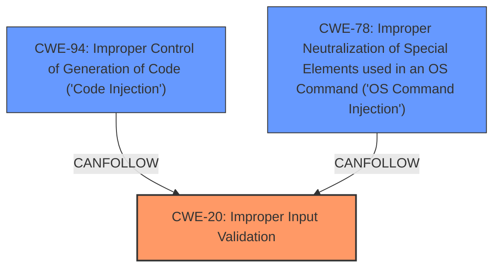

# Analysis for CVE-2021-42321

# Summary
| CWE ID | CWE Name | Confidence | CWE Abstraction Level | CWE Vulnerability Mapping Label | CWE-Vulnerability Mapping Notes |
|---|---|---|---|---|---|
| CWE-20 | Improper Input Validation | 0.75 | Base | Primary | Allowed |
| CWE-94 | Improper Control of Generation of Code ('Code Injection') | 0.60 | Base | Secondary | Allowed-with-Review |
| CWE-78 | Improper Neutralization of Special Elements used in an OS Command ('OS Command Injection') | 0.50 | Base | Secondary | Allowed |

## Evidence and Confidence

*   **Confidence Score:** 0.70
*   **Evidence Strength:** MEDIUM

## Relationship Analysis
The primary CWE is CWE-20 Improper Input Validation, which is a base class. CWE-94 Improper Control of Generation of Code ('Code Injection') and CWE-78 Improper Neutralization of Special Elements used in an OS Command ('OS Command Injection') are secondary considerations because the vulnerability description mentions "remote code execution" and **"improper input handling"**, but the description doesn't explicitly specify code injection or OS command injection. The relationship between CWE-20 and other CWEs such as CWE-78 and CWE-94 is that **improper input handling** (CWE-20) can often lead to injection vulnerabilities like code injection (CWE-94) or OS command injection (CWE-78) if the input is used to construct code or OS commands without proper sanitization.

## Vulnerability Chain
The vulnerability chain starts with **improper input handling** (CWE-20), which leads to a remote code execution vulnerability. The exact mechanism is not specified, but depending on how the **improperly handled** input is used, it could potentially lead to code injection (CWE-94) or OS command injection (CWE-78).

## Summary of Analysis
The analysis is based on the provided vulnerability description, which highlights **improper input handling** as the root cause and remote code execution as the impact.

The provided evidence states:
- **Vulnerability Description Key Phrases**
  - **rootcause:** **improper input handling**
  - **impact:** remote code execution
  - **product:** Microsoft Exchange Server

CWE-20 is selected as the primary CWE because it directly addresses the **improper input handling** mentioned in the description. CWE-94 and CWE-78 are considered as secondary possibilities because remote code execution can often be a result of code injection or OS command injection. However, without more detailed information about the specific mechanism, these are only speculative. The mapping is at the base level because CWE-20 is a base level CWE and best describes the **rootcause** as being an **improper input validation**.

Relevant CWE Information:
# Enhanced Context (25 CWEs)
## CWE-74: Improper Neutralization of Special Elements in Output Used by a Downstream Component ('Injection')
**Abstraction Level**: Class
**Similarity Score**: 0.78
**Source**: dense
## CWE-1289: Improper Validation of Unsafe Equivalence in Input
**Abstraction Level**: Base
**Similarity Score**: 0.77
**Source**: dense
## CWE-134: Use of Externally-Controlled Format String
**Abstraction Level**: Base
**Similarity Score**: 0.77
**Source**: dense
## CWE-80: Improper Neutralization of Script-Related HTML Tags in a Web Page (Basic XSS)
**Abstraction Level**: Variant
**Similarity Score**: 0.77
**Source**: dense
## CWE-176: Improper Handling of Unicode Encoding
**Abstraction Level**: Variant
**Similarity Score**: 0.77
**Source**: dense
## CWE-138: Improper Neutralization of Special Elements
**Abstraction Level**: Class
**Similarity Score**: 0.77
**Source**: dense
## CWE-41: Improper Resolution of Path Equivalence
**Abstraction Level**: Base
**Similarity Score**: 0.77
**Source**: dense
## CWE-184: Incomplete List of Disallowed Inputs
**Abstraction Level**: Base
**Similarity Score**: 0.77
**Source**: dense
## CWE-73: External Control of File Name or Path
**Abstraction Level**: Base
**Similarity Score**: 0.77
**Source**: dense
## CWE-799: Improper Control of Interaction Frequency
**Abstraction Level**: Class
**Similarity Score**: 0.76
**Source**: dense
## CWE-88: Improper Neutralization of Argument Delimiters in a Command ('Argument Injection')
**Abstraction Level**: Base
**Similarity Score**: 5826.61
**Source**: sparse
## CWE-95: Improper Neutralization of Directives in Dynamically Evaluated Code ('Eval Injection')
**Abstraction Level**: Variant
**Similarity Score**: 5429.71
**Source**: sparse
## CWE-116: Improper Encoding or Escaping of Output
**Abstraction Level**: Class
**Similarity Score**: 5413.71
**Source**: sparse
## CWE-502: Deserialization of Untrusted Data
**Abstraction Level**: Base
**Similarity Score**: 5403.03
**Source**: sparse
## CWE-22: Improper Limitation of a Pathname to a Restricted Directory ('Path Traversal')
**Abstraction Level**: Base
**Similarity Score**: 5378.13
**Source**: sparse
## CWE-78: Improper Neutralization of Special Elements used in an OS Command ('OS Command Injection')
**Abstraction Level**: base
**Similarity Score**: 4.59
**Source**: graph
## CWE-22: Improper Limitation of a Pathname to a Restricted Directory ('Path Traversal')
**Abstraction Level**: base
**Similarity Score**: 4.33
**Source**: graph
## CWE-502: Deserialization of Untrusted Data
**Abstraction Level**: base
**Similarity Score**: 3.64
**Source**: graph
## CWE-915: Improperly Controlled Modification of Dynamically-Determined Object Attributes
**Abstraction Level**: base
**Similarity Score**: 3.64
**Source**: graph
## CWE-88: Improper Neutralization of Argument Delimiters in a Command ('Argument Injection')
**Abstraction Level**: base
**Similarity Score**: 3.64
**Source**: graph
## CWE-611: Improper Restriction of XML External Entity Reference
**Abstraction Level**: base
**Similarity Score**: 3.64
**Source**: graph
## CWE-79: Improper Neutralization of Input During Web Page Generation ('Cross-site Scripting')
**Abstraction Level**: base
**Similarity Score**: 3.61
**Source**: graph
## CWE-787: Out-of-bounds Write
**Abstraction Level**: base
**Similarity Score**: 3.49
**Source**: graph
## CWE-94: Improper Control of Generation of Code ('Code Injection')
**Abstraction Level**: base
**Similarity Score**: 3.49
**Source**: graph
## CWE-183: Permissive List of Allowed Inputs
**Abstraction Level**: base
**Similarity Score**: 3.42
**Source**: graph

CWE-74, CWE-78, CWE-88, and CWE-94 were considered because of the "remote code execution" impact, as these can result in code execution. However, without more information about how the **improperly handled** input is used, these are only speculative. CWE-20 provides the best explanation of the **rootcause** as being **improper input validation**.