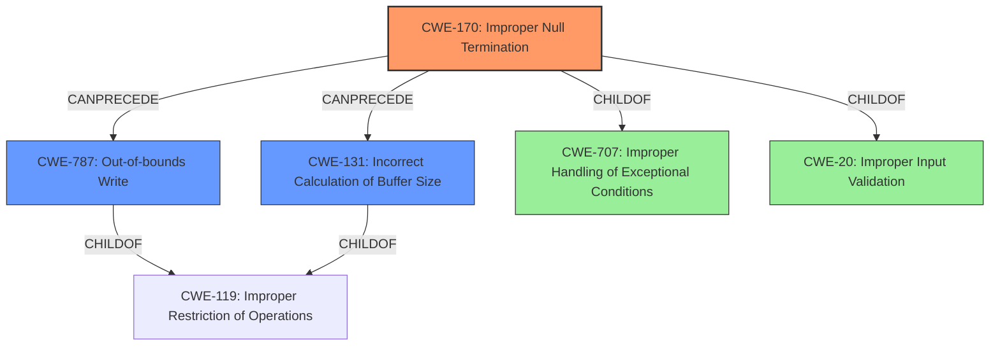

# Analysis Report for CVE-2021-42341

# Vulnerability Analysis Report: CVE-2021-42341

## Description


## Analysis (with Relationship Data)

# Summary
| CWE ID | CWE Name | Confidence | CWE Abstraction Level | CWE Vulnerability Mapping Label | CWE-Vulnerability Mapping Notes |
|---|---|---|---|---|---|
| CWE-170 | Improper Null Termination | 1.0 | Base | Allowed | Primary CWE |
| CWE-131 | Incorrect Calculation of Buffer Size | 0.7 | Base | Allowed | Secondary Candidate |
| CWE-787 | Out-of-bounds Write | 0.6 | Base | Allowed | Secondary Candidate |

## Evidence and Confidence

*   **Confidence Score:** 0.9
*   **Evidence Strength:** HIGH

## Relationship Analysis
The primary CWE, CWE-170, is a base level weakness describing the **improper null termination** of a string or array. This can **lead to** other issues such as CWE-787 Out-of-bounds Write and CWE-131 Incorrect Calculation of Buffer Size.
CWE-170 is a child of CWE-707 and CWE-20 which are higher level classes of vulnerabilities.
The **root cause** is the **improper null termination** described in CWE-170.



## Vulnerability Chain
The vulnerability chain starts with the **improper calculation of the buffer size** because the code **uses the direct output of strlen() to allocate strings, which does not account for the \0 byte at the end of the string**. This **leads to memory corruption**.
CWE-170 -> CWE-131 -> CWE-787 -> Memory Corruption.

## Summary of Analysis
The primary weakness is CWE-170 Improper Null Termination.
The vulnerability description states that the **root cause** is that the code **uses the direct output of strlen() to allocate strings, which does not account for the \0 byte at the end of the string**. This maps directly to the description of CWE-170, which states: "The product does not terminate or incorrectly terminates a string or array with a null character or equivalent terminator."
The CVE Reference Links Content Summary confirms this: "The `clean_path` function in `src/rc/checkpath.c` allocates memory for a string using `xmalloc(strlen(path))` which doesn't account for the null terminator, leading to a heap buffer overflow." This confirms that the **root cause** is the **lack of null termination**.
The relationship graph shows that CWE-170 can precede CWE-131 Incorrect Calculation of Buffer Size, which is related because the buffer size is incorrectly calculated due to the lack of null termination.
The relationship graph also shows that CWE-170 can precede CWE-787 Out-of-bounds Write, which is related because the **lack of null termination** can **lead to a heap buffer overflow**.
CWE-170 is at the optimal level of specificity, as it directly describes the **root cause** of the vulnerability.

Other CWEs Considered:

*   CWE-125 Out-of-bounds Read: While an out-of-bounds read could occur as a result of the missing null terminator, the primary issue is the **incorrect memory allocation** and **lack of null termination**, not the read itself.
*   CWE-193 Off-by-one Error: While related, the core issue isn't simply an off-by-one error, but specifically the **failure to account for the null terminator**.
*   CWE-1284 Improper Validation of Specified Quantity in Input: This is too general. The issue isn't just a lack of validation of a quantity, but a specific **failure to account for the null terminator** when allocating memory.
*   CWE-95 Improper Neutralization of Directives in Dynamically Evaluated Code ('Eval Injection'): This is not relevant to the vulnerability.
*   CWE-126 Buffer Over-read: This is a possible consequence, but the **root cause** is the **lack of null termination**.
*   CWE-787 Out-of-bounds Write: This is a possible consequence, but the **root cause** is the **lack of null termination**.
*   CWE-122 Heap-based Buffer Overflow: This is a possible consequence, but the **root cause** is the **lack of null termination**.
*   CWE-335 Incorrect Usage of Seeds in Pseudo-Random Number Generator (PRNG): This is not relevant to the vulnerability.
*   CWE-158 Improper Neutralization of Null Byte or NUL Character: This is not relevant to the vulnerability.


## CWE Relationship Analysis

Current CWEs represent these abstraction levels: .


### Vulnerability Chain Analysis

**Chain starting from CWE-131:**
- 131 (Incorrect Calculation of Buffer Size) - ROOT


**Chain starting from CWE-158:**
- 158 (Improper Neutralization of Null Byte or NUL Character) - ROOT


### CWE Relationship Diagram

```mermaid
graph TD
    classDef primary fill:#f96,stroke:#333,stroke-width:2px
    classDef secondary fill:#69f,stroke:#333
    classDef tertiary fill:#9e9,stroke:#333
```


*Report generated on 2025-03-31 13:18:34*
