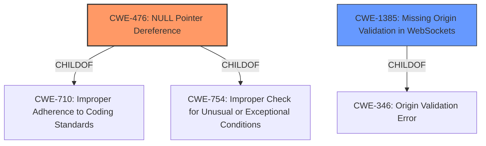

# Analysis Report for CVE-2021-4236

# Vulnerability Analysis Report: CVE-2021-4236

## Description


## Analysis (with Relationship Data)

# Summary
| CWE ID | CWE Name | Confidence | CWE Abstraction Level | CWE Vulnerability Mapping Label | CWE-Vulnerability Mapping Notes |
|---|---|---|---|---|---|
| CWE-476 | NULL Pointer Dereference | 1.0 | Base | Allowed | Primary CWE |
| CWE-1385 | Missing Origin Validation in WebSockets | 0.6 | Variant | Allowed | Secondary Candidate |

## Evidence and Confidence

*   **Confidence Score:** 0.9
*   **Evidence Strength:** HIGH

## Relationship Analysis
The primary CWE is CWE-476 (**NULL Pointer Dereference**), which is a **Base** level CWE. It is related to other CWEs as a ChildOf CWE-710 (**Improper Adherence to Coding Standards**), and ChildOf CWE-754 (**Improper Check for Unusual or Exceptional Conditions**).
CWE-1385 (**Missing Origin Validation in WebSockets**) is a Variant of CWE-346 (**Origin Validation Error**).



## Vulnerability Chain
The vulnerability chain starts with **WebSockets do not execute any AuthenticateMethod methods** leading to a **nil pointer dereference** if the returned UserData pointer is assumed to be non-nil, or authentication bypass.

## Summary of Analysis
The primary weakness is a **nil pointer dereference**.
Based on the provided information, the analysis and resulting conclusion is as follows:
*   The vulnerability description clearly states that the root cause is a **nil pointer dereference**: "Web Sockets do not execute any AuthenticateMethod methods which may be set, leading to a **nil pointer dereference** if the returned UserData pointer is assumed to be non-nil, or authentication bypass."
*   The CVE Reference Links Content Summary also highlights the **Nil Pointer Dereference**: "Nil Pointer Dereference: The code assumes that the UserData returned by the authentication method will not be nil. When authentication isn't performed, the userData variable remains nil and can lead to a nil pointer dereference if the endpoint handler uses it without checking for nil."
*   The retriever results confirm the **NULL Pointer Dereference** as the top match with a score of 1.0.

The other highly ranked results from the retriever results were also considered:
*   CWE-822 (**Untrusted Pointer Dereference**): This is not the primary issue, as the pointer itself isn't necessarily untrusted, but rather the data it points to is unexpectedly nil.
*   CWE-252 (**Unchecked Return Value**): While a missing check could contribute, the direct cause is the dereference of a nil pointer.
*   CWE-665 (**Improper Initialization**): While initialization is related, the core issue is the dereference.
*   CWE-824 (**Access of Uninitialized Pointer**): Similar to CWE-665, this is related, but the direct cause is the nil dereference.
*   CWE-1385 (**Missing Origin Validation in WebSockets**): This is a variant that occurs in WebSockets.

The selection of CWE-476 (**NULL Pointer Dereference**) is at the optimal level of specificity as it directly addresses the vulnerability's root cause.

# Relevant CWE Information:

## CWE-476: NULL Pointer Dereference
**Abstraction:** Base
**Status:** Stable

### Description
The product dereferences a pointer that it expects to be valid but is NULL.

### Extended Description
Not provided

### Alternative Terms
NPD: Common abbreviation for Null Pointer Dereference
null deref: Common abbreviation for Null Pointer Dereference
NPE: Common abbreviation for Null Pointer Exception
nil pointer dereference: used for access of nil in Go programs

### Relationships
ChildOf -> CWE-710
ChildOf -> CWE-754
ChildOf -> CWE-754

### Mapping Guidance
**Usage:** Allowed
**Rationale:** This CWE entry is at the Base level of abstraction, which is a preferred level of abstraction for mapping to the root causes of vulnerabilities.
**Comments:** Carefully read both the name and description to ensure that this mapping is an appropriate fit. Do not try to 'force' a mapping to a lower-level Base/Variant simply to comply with this preferred level of abstraction.
**Reasons:**
- Acceptable-Use

### Observed Examples
- **CVE-2005-3274:** race condition causes a table to be corrupted if a timer activates while it is being modified, leading to resultant NULL dereference; also involves locking.
- **CVE-2002-1912:** large number of packets leads to NULL dereference
- **CVE-2005-0772:** packet with invalid error status value triggers NULL dereference

## CWE-1385: Missing Origin Validation in WebSockets
**Abstraction:** Variant
**Status:** Incomplete

### Description
The product uses a WebSocket, but it does not properly verify that the source of data or communication is valid.

### Extended Description
WebSockets provide a bi-directional low latency communication (near real-time) between a client and a server. WebSockets are different than HTTP in that the connections are long-lived, as the channel will remain open until the client or the server is ready to send the message, whereas in HTTP, once the response occurs (which typically happens immediately), the transaction completes. 

A WebSocket can leverage the existing HTTP protocol over ports 80 and 443, but it is not limited to HTTP. WebSockets can make cross-origin requests that are not restricted by browser-based protection mechanisms such as the Same Origin Policy (SOP) or Cross-Origin Resource Sharing (CORS). Without explicit origin validation, this makes CSRF attacks more powerful.

### Alternative Terms
Cross-Site WebSocket hijacking (CSWSH): this term is used for attacks that exploit this weakness

### Relationships
ChildOf -> CWE-346

### Mapping Guidance
**Usage:** Allowed
**Rationale:** This CWE entry is at the Variant level of abstraction, which is a preferred level of abstraction for mapping to the root causes of vulnerabilities.
**Comments:** Carefully read both the name and description to ensure that this mapping is an appropriate fit. Do not try to 'force' a mapping to a lower-level Base/Variant simply to comply with this preferred level of abstraction.
**Reasons:**
- Acceptable-Use

### Observed Examples
- **CVE-2020-25095:** web console for SIEM product does not check Origin header, allowing Cross Site WebSocket Hijacking (CSWH)
- **CVE-2018-6651:** Chain: gaming client attempts to validate the Origin header, but only uses a substring, allowing Cross-Site WebSocket hijacking by forcing requests from an origin whose hostname is a substring of the valid origin.
- **CVE-2018-14730:** WebSocket server does not check the origin of requests, allowing attackers to steal developer's code using a ws://127.0.0.1:3123/ connection.


## CWE Relationship Analysis

Current CWEs represent these abstraction levels: .


### Vulnerability Chain Analysis

**Chain starting from CWE-476:**
- 476 (NULL Pointer Dereference) - ROOT


**Chain starting from CWE-1385:**
- 1385 (Missing Origin Validation in WebSockets) - ROOT


### CWE Relationship Diagram

```mermaid
graph TD
    classDef primary fill:#f96,stroke:#333,stroke-width:2px
    classDef secondary fill:#69f,stroke:#333
    classDef tertiary fill:#9e9,stroke:#333
```


*Report generated on 2025-03-31 05:09:19*
