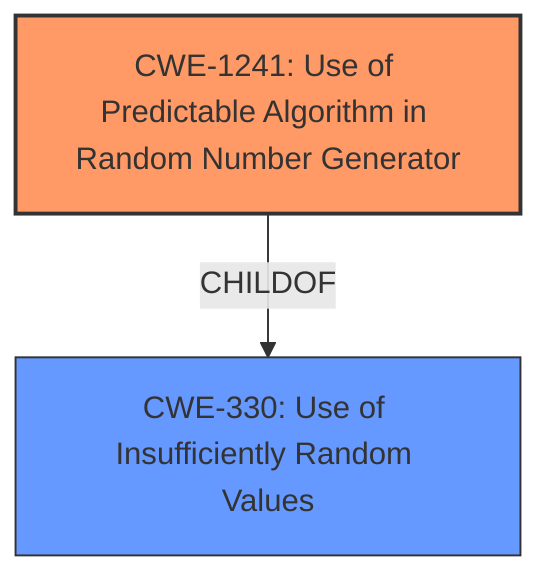

# Raw Analyzer Response for CVE-2021-4241

# Summary
| CWE ID  | CWE Name                                                                  | Confidence | CWE Abstraction Level | CWE Vulnerability Mapping Label | CWE-Vulnerability Mapping Notes |
| ------- | ------------------------------------------------------------------------- | ---------- | --------------------- | ------------------------------- | ------------------------------- |
| CWE-1241 | Use of Predictable Algorithm in Random Number Generator                    | 1          | Base                  | Primary                         | Allowed                        |
| CWE-330  | Use of Insufficiently Random Values                                       | 0.75       | Class                 | Secondary                       | Discouraged                    |

## Evidence and Confidence

*   **Confidence Score:** 0.9
*   **Evidence Strength:** HIGH

## Relationship Analysis
The primary CWE selected is CWE-1241, a **Base** level CWE, which is a child of CWE-330, a **Class** level CWE. CWE-1241 is more specific and accurately reflects the **root cause** of the vulnerability, which is the use of a predictable algorithm in a random number generator. Therefore, CWE-1241 is preferred over its parent, CWE-330.

## Vulnerability Chain
The vulnerability chain begins with the **root cause**: the use of a predictable algorithm (`mt_rand()`) for generating random tokens. This leads to the weakness: the ability to predict the generated tokens. The impact is that an attacker can forge valid "remember me" cookies, gaining unauthorized access to user accounts.

## Summary of Analysis
The initial assessment identifies CWE-1241 as the primary CWE because the **Vulnerability Description Key Phrases** mentions the "**rootcause**: **use of predictable algorithm in random number generator**". The **CVE Reference Links Content Summary** confirms that `mt_rand()` was used to generate random tokens and that this is a predictable algorithm. The **Retriever Results** also lists CWE-1241 as the top result.

CWE-330 was considered as a secondary CWE because it is a parent of CWE-1241. However, since CWE-1241 is more specific, it is the preferred choice.

The final selection of CWE-1241 is based on direct evidence from the vulnerability description and the supporting CVE reference, as well as the Retriever Results. The MITRE mapping guidance also supports the use of the most specific CWE available.

Relevant CWE Information:

# Enhanced Context (25 CWEs)

## CWE-1241: Use of Predictable Algorithm in Random Number Generator
**Abstraction Level**: Base
**Similarity Score**: 2.47
**Source**: graph

**Description**:
CWE-1241: Use of Predictable Algorithm in Random Number Generator

**Mapping Guidance**:
- Usage: Allowed
- Rationale: This CWE entry is at the Base level of abstraction, which is a preferred level of abstraction for mapping to the root causes of vulnerabilities.

**Relationships**:
- CHILDOF -> CWE-330
- PARENTOF -> CWE-1241

**Technical Explanation for CWE-1241:**
The vulnerability description explicitly states "**use of predictable algorithm in random number generator**". The CVE reference confirms that `mt_rand()` was used and is predictable. This directly matches the CWE-1241 description, which focuses on the use of predictable algorithms for generating pseudo-random numbers. The security implication is that an attacker can predict the generated tokens and forge valid cookies. CWE-1241 is a **Base** level CWE and a child of CWE-330. This makes it a more specific representation of the weakness than its parent, CWE-330. The MITRE mapping guidance allows for the use of this CWE.

**Why other CWEs were not used:**
- CWE-330: Although it is a parent of CWE-1241, it is less specific and therefore not as accurate.
- CWE-341: Predictable from Observable State: This is a more general CWE, and CWE-1241 is a more specific fit.