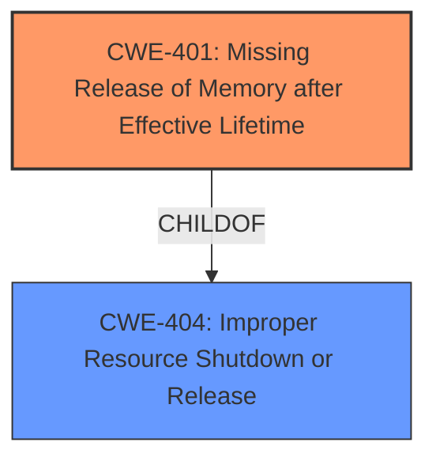

# Raw Analyzer Response for CVE-2021-42522

# Summary
| CWE ID | CWE Name | Confidence | CWE Abstraction Level | CWE Vulnerability Mapping Label | CWE-Vulnerability Mapping Notes |
|---|---|---|---|---|---|
| CWE-401 | Missing Release of Memory after Effective Lifetime | 1.0 | Variant | Primary | Allowed |

## Evidence and Confidence

*   **Confidence Score:** 1.0
*   **Evidence Strength:** HIGH

## Relationship Analysis
The primary CWE selected is CWE-401, which is a Variant of CWE-404 (Improper Resource Shutdown or Release). This indicates a hierarchical relationship where CWE-401 is a more specific instance of the broader resource management issue described by CWE-404. No chain relationships appear relevant in this case.

## Vulnerability Chain
The vulnerability chain is straightforward:
  1. **Root Cause:** **Incorrect use of libxml2 API**, specifically forgetting to call `g_free()` to release memory allocated by `xmlGetProp()`.
  2. **Weakness:** CWE-401 Missing Release of Memory after Effective Lifetime
  3. **Impact:** Memory leak, potentially leading to resource exhaustion.

## Summary of Analysis
The analysis strongly supports CWE-401 as the primary CWE. The **root cause** is the **failure to release allocated memory**, which directly matches the description of CWE-401. The "CVE Reference Links Content Summary" explicitly states "Failure to free the memory allocated by `xmlGetProp` in `anjuta-bookmarks.c:858`", and the "Weaknesses/vulnerabilities present" include "Memory leak due to not freeing the returned string."

The selection of CWE-401 is further supported by the Retriever Results, which list it as the top combined result. The description of CWE-401, "The product does not sufficiently track and release allocated memory after it has been used, which slowly consumes remaining memory," aligns precisely with the vulnerability description. Additionally, the MITRE mapping guidance for CWE-401 designates it as "Allowed" and at the Variant level of abstraction, which is preferred.

CWE-863 (Incorrect Authorization) was considered but rejected because the vulnerability is not related to authorization. Similarly, CWE-125 (Out-of-bounds Read) and CWE-502 (Deserialization of Untrusted Data) were deemed irrelevant because the issue does not involve out-of-bounds reads or deserialization of untrusted data.

The choice of CWE-401 is at the optimal level of specificity, as it directly describes the missing memory release. While CWE-404 (Improper Resource Shutdown or Release) is a parent, CWE-401 provides a more precise characterization of the vulnerability.

Relevant CWE Information:

# Enhanced Context (25 CWEs)

## CWE-401: Missing Release of Memory after Effective Lifetime
**Abstraction Level**: Variant
**Similarity Score**: 0.79
**Source**: dense

**Description**:
The product does not sufficiently track and release allocated memory after it has been used, which slowly consumes remaining memory.

**Mapping Guidance**:
- Usage: Allowed
- Rationale: This CWE entry is at the Variant level of abstraction, which is a preferred level of abstraction for mapping to the root causes of vulnerabilities.