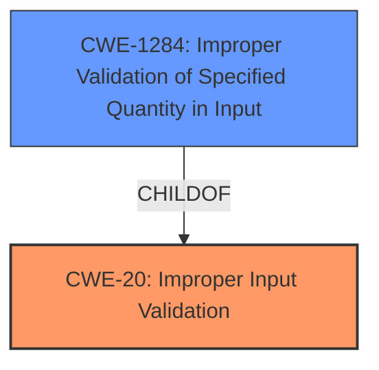

# Enhanced Analysis for CVE-2021-42555

# Summary
| CWE ID  | CWE Name                    | Confidence | CWE Abstraction Level | CWE Vulnerability Mapping Label | CWE-Vulnerability Mapping Notes |
| :------- | :-------------------------- | :--------- | :-------------------- | :------------------------------ | :----------------------------- |
| CWE-20   | Improper Input Validation   | 0.8        | Class                 | Primary                         | Discouraged                    |
| CWE-1284 | Improper Validation of Specified Quantity in Input | 0.7 | Base | Secondary                         | Allowed                    |

## Evidence and Confidence

*   **Confidence Score:** 0.8
*   **Evidence Strength:** MEDIUM

## Relationship Analysis
The primary relationship that influenced the decision was the hierarchical relationship between CWE-20 **Improper Input Validation** and CWE-1284 **Improper Validation of Specified Quantity in Input**, where CWE-1284 is a child of CWE-20. The description mentions **missing call-setup input validation**, which generally falls under CWE-20. However, CWE-1284 offers a more specific categorization by focusing on the validation of "quantity" related inputs, like size or length, which could be applicable in the context of call setup parameters.



## Vulnerability Chain
The vulnerability chain starts with the **missing call-setup input validation** which is the root cause, potentially leading to a temporary remote Denial of Service (abort) which is the impact.

## Summary of Analysis
The initial assessment considered the primary CWE match from similar CVE descriptions, which pointed to CWE-20 **Improper Input Validation**. This aligns with the **rootcause** described as **missing call-setup input validation**.

CWE-20 is a Class-level CWE, and the mapping guidance discourages its use when more specific CWEs are available. The Retriever Results suggested CWE-1284 **Improper Validation of Specified Quantity in Input** as a potential candidate. Given the context of "call-setup," it's plausible that the **missing input validation** relates to specific quantities or parameters needed for call establishment (e.g., call duration, number of participants). While the provided description doesn't explicitly state this, the potential relevance of quantity-related validation justifies including CWE-1284 as a secondary, more specific CWE.

Ultimately, the decision rests on the available evidence. The description explicitly mentions **missing call-setup input validation**, directly supporting CWE-20. The possibility of this validation involving specific quantities leads to the inclusion of CWE-1284 as a secondary CWE.

Relevant CWE Information:

# Enhanced Context (25 CWEs)
The following CWEs were identified as potentially relevant to this vulnerability:

## CWE-1289: Improper Validation of Unsafe Equivalence in Input
**Abstraction Level**: Base
**Similarity Score**: 0.77
**Source**: dense

**Description**:
The product receives an input value that is used as a resource identifier or other type of reference, but it does not validate or incorrectly validates that the input is equivalent to a potentially-unsafe value.

**Mapping Guidance**:
- Usage: Allowed
- Rationale: This CWE entry is at the Base level of abstraction, which is a preferred level of abstraction for mapping to the root causes of vulnerabilities.

*This CWE was considered but rejected because it focuses on equivalence validation, while the vulnerability description indicates a general lack of input validation rather than specifically related to unsafe equivalence.*

## CWE-664: Improper Control of a Resource Through its Lifetime
**Abstraction Level**: Pillar
**Similarity Score**: 0.75
**Source**: dense

**Description**:
The product does not maintain or incorrectly maintains control over a resource throughout its lifetime of creation, use, and release.

**Mapping Guidance**:
- Usage: Discouraged
- Rationale: This CWE entry is high-level when lower-level children are available.

*This CWE was considered but rejected because it is too high-level (Pillar) and doesn't directly relate to the **missing input validation** specified in the vulnerability.*

## CWE-404: Improper Resource Shutdown or Release
**Abstraction Level**: Class
**Similarity Score**: 0.75
**Source**: dense

**Description**:
The product does not release or incorrectly releases a resource before it is made available for re-use.

**Mapping Guidance**:
- Usage: Allowed-with-Review
- Rationale: This CWE entry is a Class and might have Base-level children that would be more appropriate

*This CWE was considered but rejected because it focuses on resource release issues, which is not directly related to the **missing input validation**.*

## CWE-691: Insufficient Control Flow Management
**Abstraction Level**: Pillar
**Similarity Score**: 0.75
**Source**: dense

**Description**:
The code does not sufficiently manage its control flow during execution, creating conditions in which the control flow can be modified in unexpected ways.

**Mapping Guidance**:
- Usage: Discouraged
- Rationale: This CWE entry is extremely high-level, a Pillar. However, classification research is limited for weaknesses of this type, so there can be gaps or organizational difficulties within CWE that force use of this weakness, even at such a high level of abstraction.

*This CWE was considered but rejected because it is too high-level (Pillar) and doesn't directly relate to the **missing input validation**.*

## CWE-807: Reliance on Untrusted Inputs in a Security Decision
**Abstraction Level**: Base
**Similarity Score**: 0.75
**Source**: dense

**Description**:
The product uses a protection mechanism that relies on the existence or values of an input, but the input can be modified by an untrusted actor in a way that bypasses the protection mechanism.

**Mapping Guidance**:
- Usage: Allowed
- Rationale: This CWE entry is at the Base level of abstraction, which is a preferred level of abstraction for mapping to the root causes of vulnerabilities.

*This CWE was considered but rejected because it focuses on security decisions based on untrusted inputs, rather than a general **missing input validation**.*

## CWE-252: Unchecked Return Value
**Abstraction Level**: Base
**Similarity Score**: 0.74
**Source**: dense

**Description**:
The product does not check the return value from a method or function, which can prevent it from detecting unexpected states and conditions.

**Mapping Guidance**:
- Usage: Allowed
- Rationale: This CWE entry is at the Base level of abstraction, which is a preferred level of abstraction for mapping to the root causes of vulnerabilities.

*This CWE was considered but rejected because it focuses on unchecked return values, rather than a general **missing input validation**.*

## CWE-754: Improper Check for Unusual or Exceptional Conditions
**Abstraction Level**: Class
**Similarity Score**: 0.74
**Source**: dense

**Description**:
The product does not check or incorrectly checks for unusual or exceptional conditions that are not expected to occur frequently during day to day operation of the product.

**Mapping Guidance**:
- Usage: Allowed-with-Review
- Rationale: This CWE entry is a Class and might have Base-level children that would be more appropriate

*This CWE was considered but rejected because it focuses on unusual conditions rather than a general **missing input validation**.*

## CWE-606: Unchecked Input for Loop Condition
**Abstraction Level**: Base
**Similarity Score**: 0.74
**Source**: dense

**Description**:
The product does not properly check inputs that are used for loop conditions, potentially leading to a denial of service or other consequences because of excessive looping.

**Mapping Guidance**:
- Usage: Allowed
- Rationale: This CWE entry is at the Base level of abstraction, which is a preferred level of abstraction for mapping to the root causes of vulnerabilities.

*This CWE was considered but rejected because it focuses on loop conditions, rather than a general **missing input validation**.*

## CWE-226: Sensitive Information in Resource Not Removed Before Reuse
**Abstraction Level**: Base
**Similarity Score**: 0.74
**Source**: dense

**Description**:
The product releases a resource such as memory or a file so that it can be made available for reuse, but it does not clear or "zeroize" the information contained in the resource before the product performs a critical state transition or makes the resource available for reuse by other entities.

**Mapping Guidance**:
- Usage: Allowed
- Rationale: This CWE entry is at the Base level of abstraction, which is a preferred level of abstraction for mapping to the root causes of vulnerabilities.

*This CWE was considered but rejected because it focuses on sensitive information in resources, rather than a general **missing input validation**.*

## CWE-703: Improper Check or Handling of Exceptional Conditions
**Abstraction Level**: Pillar
**Similarity Score**: 0.74
**Source**: dense

**Description**:
The product does not properly anticipate


## CWE Relationship Analysis

Current CWEs represent these abstraction levels: .


### Vulnerability Chain Analysis

**Chain starting from CWE-807:**
- 807 (Reliance on Untrusted Inputs in a Security Decision) - ROOT


**Chain starting from CWE-703:**
- 703 (Improper Check or Handling of Exceptional Conditions) - ROOT


### CWE Relationship Diagram

```mermaid
graph TD
    classDef primary fill:#f96,stroke:#333,stroke-width:2px
    classDef secondary fill:#69f,stroke:#333
    classDef tertiary fill:#9e9,stroke:#333
```