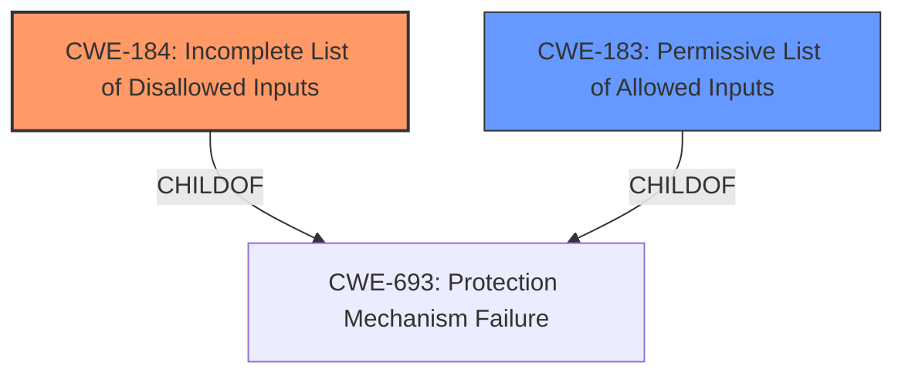

# Analysis for CVE-2021-42576

# Summary
| CWE ID | CWE Name | Confidence | CWE Abstraction Level | CWE Vulnerability Mapping Label | CWE-Vulnerability Mapping Notes |
|---|---|---|---|---|---|
| CWE-184 | Incomplete List of Disallowed Inputs | 0.8 | Base | Primary | Allowed |
| CWE-183 | Permissive List of Allowed Inputs | 0.6 | Base | Secondary | Allowed |

## Evidence and Confidence

*   **Confidence Score:** 0.7
*   **Evidence Strength:** MEDIUM

## Relationship Analysis
The primary relationship influencing the decision is the hierarchical relationship between CWE-693 (Protection Mechanism Failure) and its children, CWE-184 and CWE-183. CWE-184 and CWE-183 represent specific types of protection mechanism failures related to lists of allowed or disallowed inputs. The choice between these two depends on whether the vulnerability stems from an incomplete denylist (CWE-184) or an overly permissive allowlist (CWE-183).

## Vulnerability Chain
The vulnerability chain involves the **improper enforcement of SELECT, STYLE, and OPTION element policies**. This leads to a protection mechanism failure, specifically related to input validation or sanitization, which could result in Cross-Site Scripting (XSS) or other injection-related vulnerabilities. The chain starts with a configuration issue (the **improper enforcement**) leading to a bypassable protection, and potentially to XSS.

## Summary of Analysis
The analysis focuses on the root cause of the vulnerability: the **improper enforcement of SELECT, STYLE, and OPTION element policies** within the bluemonday sanitizer.

The vulnerability description states the "bluemonday sanitizer before 1.0.16 for Go, and before 0.0.8 for Python (in pybluemonday), does not properly enforce policies associated with the SELECT, STYLE, and OPTION elements."

Given this information, the primary candidate is CWE-184 (Incomplete List of Disallowed Inputs), because the sanitizer is failing to properly enforce policies, implying that the list of disallowed inputs related to the specified elements is incomplete.

CWE-183 (Permissive List of Allowed Inputs) is a secondary candidate. It is possible the sanitizer relies on a list of allowed elements, and this list is too permissive, allowing unsafe elements to pass through.

CWE-1286 (Improper Validation of Syntactic Correctness of Input) was considered, but it is less relevant as the core issue is not about incorrect syntax validation, but rather about failing to enforce policies related to specific HTML elements.

CWE-347 (Improper Verification of Cryptographic Signature) and CWE-295 (Improper Certificate Validation) are not applicable since the vulnerability is not related to cryptographic signatures or certificate validation.

CWE-1176 (Inefficient CPU Computation) is also not applicable as the vulnerability is not related to CPU efficiency.

The final selection of CWE-184 as the primary CWE is based on the direct evidence of **improper enforcement** implying an incomplete denylist. The abstraction level is appropriate, as it is a base-level CWE.

Relevant CWE Information:

# Enhanced Context (25 CWEs)
The following CWEs were identified as potentially relevant to this vulnerability:

## CWE-184: Incomplete List of Disallowed Inputs
**Abstraction Level**: Base
**Similarity Score**: 0.81
**Source**: dense

**Description**:
The product implements a protection mechanism that relies on a list of inputs (or properties of inputs) that are not allowed by policy or otherwise require other action to neutralize before additional processing takes place, but the list is incomplete.

**Mapping Guidance**:
- Usage: Allowed
- Rationale: This CWE entry is at the Base level of abstraction, which is a preferred level of abstraction for mapping to the root causes of vulnerabilities.

## CWE-183: Permissive List of Allowed Inputs
**Abstraction Level**: Base
**Similarity Score**: 0.80
**Source**: dense

**Description**:
The product implements a protection mechanism that relies on a list of inputs (or properties of inputs) that are explicitly allowed by policy because the inputs are assumed to be safe, but the list is too permissive - that is, it allows an input that is unsafe, leading to resultant weaknesses.

**Mapping Guidance**:
- Usage: Allowed
- Rationale: This CWE entry is at the Base level of abstraction, which is a preferred level of abstraction for mapping to the root causes of vulnerabilities.