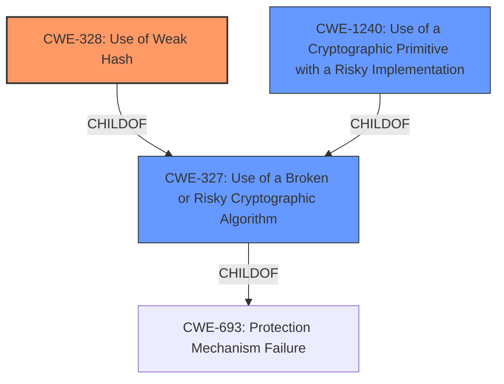

# Analysis Report for CVE-2021-42583

# Vulnerability Analysis Report: CVE-2021-42583

## Description


## Analysis (with Relationship Data)

# Summary
| CWE ID | CWE Name | Confidence | CWE Abstraction Level | CWE Vulnerability Mapping Label | CWE-Vulnerability Mapping Notes |
|---|---|---|---|---|---|
| CWE-328 | Use of Weak Hash | 1.0 | Base | Allowed | Primary CWE |
| CWE-327 | Use of a Broken or Risky Cryptographic Algorithm | 0.7 | Class | Allowed-with-Review | Secondary Candidate |
| CWE-1240 | Use of a Cryptographic Primitive with a Risky Implementation | 0.6 | Base | Allowed | Secondary Candidate |

## Evidence and Confidence

*   **Confidence Score:** 0.9
*   **Evidence Strength:** HIGH

## Relationship Analysis
The primary CWE is CWE-328, Use of Weak Hash, which is a Base level CWE. CWE-328 is a child of CWE-326 and CWE-327, Use of a Broken or Risky Cryptographic Algorithm, which is a Class level CWE. CWE-1240, Use of a Cryptographic Primitive with a Risky Implementation, is also related as it is a child of CWE-327. The choice of CWE-328 is based on the specific weakness of using a weak hash algorithm, making it more specific than its parent classes.



## Vulnerability Chain
The vulnerability chain starts with the **use of a broken or risky cryptographic algorithm** (MD5 in this case) which leads to the **use of a weak hash**. This, in turn, leads to the potential exposure of sensitive information (passwords).

## Summary of Analysis
The initial analysis correctly identified the **rootcause** as a **Broken or Risky Cryptographic Algorithm**. The retriever results also pointed to CWE-327, CWE-328 and CWE-1240 as potential candidates.

The evidence from the CVE reference links clearly indicates that the vulnerability stems from the **use of MD5-based password hashes**. The description notes that MD5 is considered cryptographically broken and vulnerable to collision attacks, making password recovery easier for attackers. This aligns perfectly with the description of CWE-328, "Use of Weak Hash," which specifies the use of an algorithm that does not meet security expectations for a hash function.

While CWE-327, "Use of a Broken or Risky Cryptographic Algorithm," is also relevant, CWE-328 is a more specific and accurate representation of the weakness. CWE-1240, "Use of a Cryptographic Primitive with a Risky Implementation," is also a valid candidate, but CWE-328 is more precise in this context, since MD5's weakness as a hash function is well-documented.

Therefore, CWE-328 is selected as the primary CWE because it is the most specific and accurately reflects the **root cause** of the vulnerability. The evidence supports this decision, and the relationship analysis confirms that it is the appropriate level of abstraction.

Relevant CWE Information:

# Enhanced Context (25 CWEs)

## CWE-328: Use of Weak Hash
**Abstraction Level**: Base
**Similarity Score**: 0.75
**Source**: dense

**Description**:
The product uses an algorithm that produces a digest (output value) that does not meet security expectations for a hash function that allows an adversary to reasonably determine the original input (preimage attack), find another input that can produce the same hash (2nd preimage attack), or find multiple inputs that evaluate to the same hash (birthday attack).

**Mapping Guidance**:
- Usage: Allowed
- Rationale: This CWE entry is at the Base level of abstraction, which is a preferred level of abstraction for mapping to the root causes of vulnerabilities.

## CWE-327: Use of a Broken or Risky Cryptographic Algorithm
**Abstraction Level**: Class
**Similarity Score**: 8160.69
**Source**: sparse

**Description**:
The product uses a broken or risky cryptographic algorithm or protocol.

**Mapping Guidance**:
- Usage: Allowed-with-Review
- Rationale: This CWE entry is a Class and might have Base-level children that would be more appropriate

## CWE-1240: Use of a Cryptographic Primitive with a Risky Implementation
**Abstraction Level**: Base
**Similarity Score**: 9214.46
**Source**: sparse

**Description**:
To fulfill the need for a cryptographic primitive, the product implements a cryptographic algorithm using a non-standard, unproven, or disallowed/non-compliant cryptographic implementation.

**Mapping Guidance**:
- Usage: Allowed
- Rationale: This CWE entry is at the Base level of abstraction, which is a preferred level of abstraction for mapping to the root causes of vulnerabilities.


## CWE Relationship Analysis

Current CWEs represent these abstraction levels: .


### Vulnerability Chain Analysis

**Chain starting from CWE-693:**
- 693 (Protection Mechanism Failure) - ROOT


**Chain starting from CWE-327:**
- 327 (Use of a Broken or Risky Cryptographic Algorithm) - ROOT


### CWE Relationship Diagram

```mermaid
graph TD
    classDef primary fill:#f96,stroke:#333,stroke-width:2px
    classDef secondary fill:#69f,stroke:#333
    classDef tertiary fill:#9e9,stroke:#333
```


*Report generated on 2025-03-31 07:04:40*
