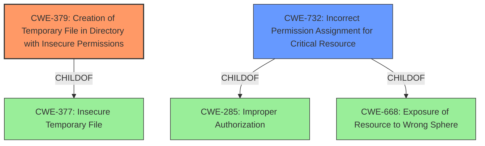

# Raw Analyzer Response for CVE-2021-42713

# Summary
| CWE ID | CWE Name | Confidence | CWE Abstraction Level | CWE Vulnerability Mapping Label | CWE-Vulnerability Mapping Notes |
|---|---|---|---|---|---|
| CWE-379 | Creation of Temporary File in Directory with Insecure Permissions | 1.0 | Base | Allowed | Primary CWE |
| CWE-732 | Incorrect Permission Assignment for Critical Resource | 0.7 | Class | Allowed-with-Review | Secondary Candidate |

## Evidence and Confidence

*   **Confidence Score:** 0.9
*   **Evidence Strength:** HIGH

## Relationship Analysis
The primary CWE selected is CWE-379, which is a Base level CWE, making it a good fit. CWE-379 is a child of CWE-377 (Insecure Temporary File), a Class level CWE. CWE-732 (Incorrect Permission Assignment for Critical Resource) is also a Class level CWE and a child of CWE-285 (Improper Authorization). These relationships helped to contextualize the specific nature of the vulnerability. While CWE-732 could be considered, the core issue is the insecure creation of the temporary file, making CWE-379 more directly relevant.

## Vulnerability Chain
The vulnerability chain starts with the **insecure creation of a temporary file** (CWE-379) in a directory with weak permissions. This allows an attacker to potentially access or manipulate the file. Furthermore, the Windows Installer service executes operations from this directory with SYSTEM privileges, leading to privilege escalation.

## Summary of Analysis
The analysis is based on the provided evidence from the vulnerability description and the CVE Reference Links Content Summary. The most compelling evidence is: "The core issue is the creation of temporary files with insecure permissions within a user-controlled directory (%TEMP%) that are then executed with SYSTEM privileges." This directly supports the selection of CWE-379 (Creation of Temporary File in Directory with Insecure Permissions).

The retriever results also highlight CWE-379 as the top candidate.

Other CWEs considered:

*   **CWE-732 (Incorrect Permission Assignment for Critical Resource):** While permissions are relevant, the primary issue is the creation of the temporary file itself, not the broader assignment of permissions to a critical resource. CWE-732 also has a "Allowed-with-Review" usage designation and the description mentions the CWE is often misused for authorization weaknesses. The core problem is not about assigning permissions to a 'critical resource', but about creating a temporary file in an insecure location, so it is not the best fit.
*   **CWE-59 (Improper Link Resolution Before File Access ('Link Following')) and CWE-1386 (Insecure Operation on Windows Junction / Mount Point):** These CWEs address symlink and junction-related vulnerabilities, which are not explicitly mentioned in the provided vulnerability description. These also require the attacker to create a link or mount point which is not necessary to exploit this vulnerability.
*   **CWE-668 (Exposure of Resource to Wrong Sphere):** This is a high-level class and doesn't accurately represent the vulnerability's specifics.

The chosen CWE, CWE-379, is at the optimal level of specificity because it directly addresses the root cause of the vulnerability: the **creation of a temporary file in a directory with insecure permissions**. This is a base-level CWE, which is the preferred level of abstraction.