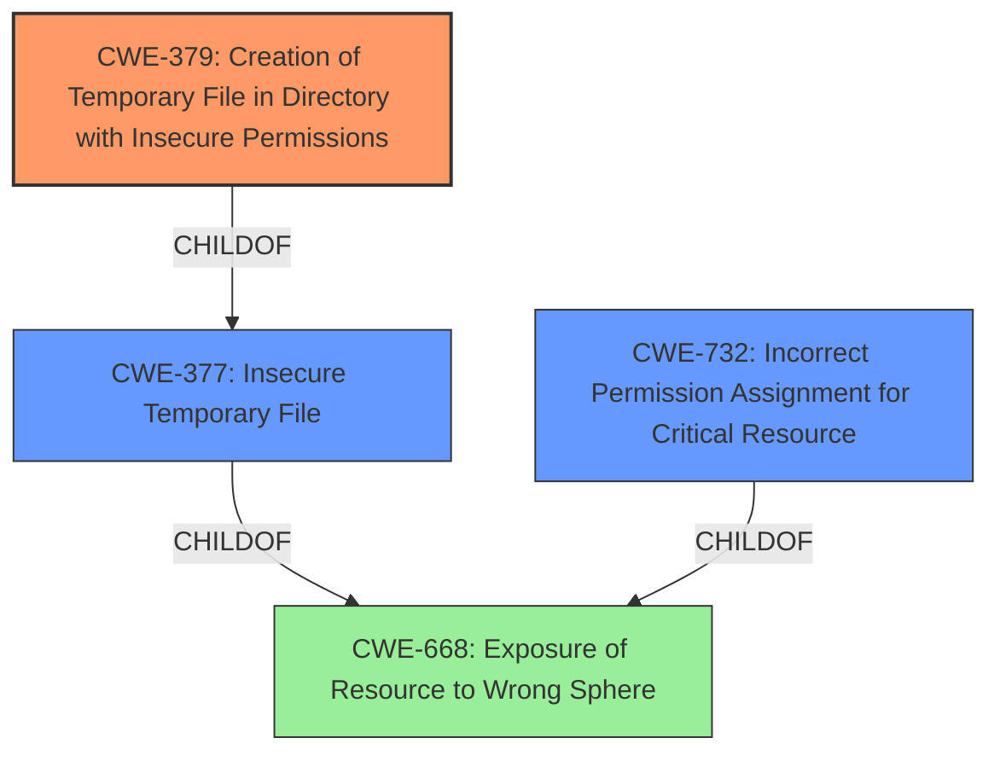

# Enhanced Analysis for CVE-2021-42714

# Summary
| CWE ID  | CWE Name  | Confidence | CWE Abstraction Level | CWE Vulnerability Mapping Label | CWE-Vulnerability Mapping Notes |
|-----------------|------------------------------------------------------------------|-------------------|--------------------------|-------------------------------------|---------------------------------------------------|
| **CWE-379** (Primary) | Creation of Temporary File in Directory with Insecure Permissions | 0.95 | Base | Allowed | This CWE accurately captures the root cause of the vulnerability. |
| CWE-732 | Incorrect Permission Assignment for Critical Resource | 0.75 | Class | Allowed-with-Review | Considered as a broader category, but CWE-379 is more specific. |
| CWE-377 | Insecure Temporary File | 0.65 | Class | Allowed-with-Review | Considered as a broader category, but CWE-379 is more specific. |

## Evidence and Confidence

*   **Confidence Score:** 0.9
*   **Evidence Strength:** HIGH

## Relationship Analysis
The primary CWE is CWE-379, which is a base level CWE and a child of CWE-377 (Class). CWE-732 (Class) is related to incorrect permission assignments, but CWE-379 provides a more specific description of the vulnerability. The hierarchical relationship influenced the selection by favoring the more specific base-level CWE.



## Vulnerability Chain
The vulnerability chain starts with the **creation of a temporary file**, then proceeds to the **assignment of insecure permissions** to the directory containing the temporary file. This ultimately leads to the **potential for unauthorized access and privilege escalation**.
  - Root Cause: Creation of temporary file
  - Weakness: Insecure permissions on the directory containing the file
  - Impact: Potential for unauthorized access and privilege escalation

## Summary of Analysis
The analysis focuses on the root cause of the vulnerability, which is the **creation of a temporary file in a directory with insecure permissions**. This is supported by the vulnerability description and the CVE reference links content summary.

The CVE Reference Links Content Summary states:
-   "The vulnerability stems from insecure permissions related to temporary file creation during the repair process"
-   "The vulnerability arises because the temporary files are created in a directory where an unprivileged user has write access, and these files are then executed with SYSTEM privileges during the repair operation."

This evidence clearly indicates that the **insecure creation of the temporary file** is the primary weakness.

The Retriever Results and Complete CWE Specifications were consulted to find the most appropriate CWE. CWE-379, "Creation of Temporary File in Directory with Insecure Permissions," was selected as the primary CWE because it accurately describes the vulnerability.

CWE-732 was considered, but ultimately rejected as the primary CWE because it is a more general "Incorrect Permission Assignment for Critical Resource." The same logic was applied to CWE-377, "Insecure Temporary File," which is a class level CWE. CWE-379 provides a better level of specificity.

Relevant CWE Information:

# Enhanced Context (25 CWEs)

## CWE-379: Creation of Temporary File in Directory with Insecure Permissions
**Abstraction:** Base
**Status:** Incomplete

### Description
The product creates a temporary file in a directory whose permissions allow unintended actors to determine the file's existence or otherwise access that file.

### Extended Description
On some operating systems, the fact that the temporary file exists may be apparent to any user with sufficient privileges to access that directory. Since the file is visible, the application that is using the temporary file could be known. If one has access to list the processes on the system, the attacker has gained information about what the user is doing at that time. By correlating this with the applications the user is running, an attacker could potentially discover what a user's actions are. From this, higher levels of security could be breached.

### Mapping Guidance
**Usage:** Allowed
**Rationale:** This CWE entry is at the Base level of abstraction, which is a preferred level of abstraction for mapping to the root causes of vulnerabilities.


## CWE Relationship Analysis

Current CWEs represent these abstraction levels: .


### Vulnerability Chain Analysis

**Chain starting from CWE-732:**
- 732 (Incorrect Permission Assignment for Critical Resource) - ROOT


**Chain starting from CWE-377:**
- 377 (Insecure Temporary File) - ROOT


### CWE Relationship Diagram

```mermaid
graph TD
    classDef primary fill:#f96,stroke:#333,stroke-width:2px
    classDef secondary fill:#69f,stroke:#333
    classDef tertiary fill:#9e9,stroke:#333
```