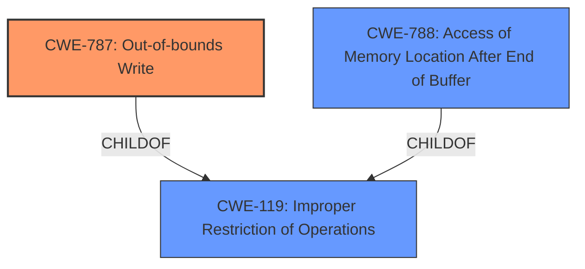

# Enhanced Analysis for CVE-2021-42724

# Summary
| CWE ID | CWE Name | Confidence | CWE Abstraction Level | CWE Vulnerability Mapping Label | CWE-Vulnerability Mapping Notes |
|---|---|---|---|---|---|
| CWE-787 | Out-of-bounds Write | 0.9 | Base | Allowed | Primary CWE |
| CWE-788 | Access of Memory Location After End of Buffer | 0.6 | Base | Discouraged | Secondary Candidate |

## Evidence and Confidence

*   **Confidence Score:** 0.9
*   **Evidence Strength:** HIGH

## Relationship Analysis
The primary relationship influencing the decision is the ChildOf relationship between CWE-787, CWE-788 and CWE-119. CWE-787 is a more specific type of CWE-119. The Retriever Results also show these relationships. I favored CWE-787 as the most specific and accurate representation of the vulnerability.



## Vulnerability Chain
The vulnerability chain starts with **insecure handling** of a malicious file, leading to **memory corruption** which results in arbitrary code execution.

## Summary of Analysis
The initial analysis focused on identifying the root cause and weakness from the vulnerability description and related CVE reference links. The key phrases "**insecure handling**" and "**memory corruption**", along with the reference link's mention of "Access of Memory Location After End of Buffer", pointed towards a memory corruption issue. The Retriever results listed CWE-787 (Out-of-bounds Write) as the top candidate.

The decision to select CWE-787 was based on the high confidence score from the Retriever results and the explicit mention of "Access of Memory Location After End of Buffer" in the CVE Reference Links Content Summary. This aligns with the definition of CWE-787, which describes writing data past the end or before the beginning of the intended buffer. While CWE-119 (Improper Restriction of Operations within the Bounds of a Memory Buffer) was the primary CWE match in the "CWE for similar CVE Descriptions" section, CWE-787 is a more specific child of CWE-119.

CWE-788 was considered as a secondary candidate because the "CVE Reference Links Content Summary" mentions "Access of Memory Location After End of Buffer (CWE-788)". However, CWE-787 was favored as it describes the **write** operation causing the memory corruption, making it a more precise fit.

Relevant CWE Information:

# Enhanced Context (25 CWEs)

## CWE-131: Incorrect Calculation of Buffer Size
**Abstraction Level**: Base
**Similarity Score**: 0.76
**Source**: dense

**Description**:
The product does not correctly calculate the size to be used when allocating a buffer, which could lead to a buffer overflow.
This CWE was considered but not selected because the description does not explicitly mention an incorrect calculation of buffer size, only that there is **insecure handling**.

## CWE-1289: Improper Validation of Unsafe Equivalence in Input
**Abstraction Level**: Base
**Similarity Score**: 0.75
**Source**: dense

**Description**:
The product receives an input value that is used as a resource identifier or other type of reference, but it does not validate or incorrectly validates that the input is equivalent to a potentially-unsafe value.
This CWE was considered but not selected because the description does not explicitly mention an input value being used as a resource identifier.

## CWE-125: Out-of-bounds Read
**Abstraction Level**: Base
**Similarity Score**: 0.75
**Source**: dense

**Description**:
The product reads data past the end, or before the beginning, of the intended buffer.
This CWE was considered but not selected because the vulnerability description explicitly indicates a **memory corruption**, which is caused by writing.

## CWE-788: Access of Memory Location After End of Buffer
**Abstraction Level**: Base
**Similarity Score**: 0.75
**Source**: dense

**Description**:
The product reads or writes to a buffer using an index or pointer that references a memory location after the end of the buffer.
This CWE was considered as a secondary candidate because the "CVE Reference Links Content Summary" mentions "Access of Memory Location After End of Buffer (CWE-788)".

## CWE-1325: Improperly Controlled Sequential Memory Allocation
**Abstraction Level**: Base
**Similarity Score**: 0.75
**Source**: dense

**Description**:
The product manages a group of objects or resources and performs a separate memory allocation for each object, but it does not properly limit the total amount of memory that is consumed by all of the combined objects.
This CWE was considered but not selected because the description does not explicitly mention separate memory allocations for objects.

## CWE-191: Integer Underflow (Wrap or Wraparound)
**Abstraction Level**: Base
**Similarity Score**: 0.74
**Source**: dense

**Description**:
The product subtracts one value from another, such that the result is less than the minimum allowable integer value, which produces a value that is not equal to the correct result.
This CWE was considered but not selected because the description does not explicitly mention an integer underflow.

## CWE-129: Improper Validation of Array Index
**Abstraction Level**: Variant
**Similarity Score**: 0.74
**Source**: dense

**Description**:
The product uses untrusted input when calculating or using an array index, but the product does not validate or incorrectly validates the index to ensure the index references a valid position within the array.
This CWE was considered but not selected because the description does not explicitly mention an array index.

## CWE-193: Off-by-one Error
**Abstraction Level**: Base
**Similarity Score**: 0.74
**Source**: dense

**Description**:
A product calculates or uses an incorrect maximum or minimum value that is 1 more, or 1 less, than the correct value.
This CWE was considered but not selected because the description does not explicitly mention an off-by-one error.

## CWE-805: Buffer Access with Incorrect Length Value
**Abstraction Level**: Base
**Similarity Score**: 0.74
**Source**: dense

**Description**:
The product uses a sequential operation to read or write a buffer, but it uses an incorrect length value that causes it to access memory that is outside of the bounds of the buffer.
This CWE was considered but not selected because the description does not explicitly mention an incorrect length value.

## CWE-124: Buffer Underwrite ('Buffer Underflow')
**Abstraction Level**: Base
**Similarity Score**: 0.74
**Source**: dense

**Description**:
The product writes to a buffer using an index or pointer that references a memory location prior to the beginning of the buffer.
This CWE was considered but not selected because the vulnerability description only speaks of **memory corruption** but not of writing prior to the beginning of a buffer.

## CWE-190: Integer Overflow or Wraparound
**Abstraction Level**: Base
**Similarity Score**: 5995.27
**Source**: sparse

**Description**:
The product performs a calculation that can
         produce an integer overflow or wraparound when the logic
         assumes that the resulting value will always be larger than
         the original value. This occurs when an integer value is
         incremented to a value that is too large to store in the
         associated representation. When this occurs, the value may
         become a very small or negative number.
This CWE was considered but not selected because the vulnerability description only speaks of **memory corruption** without mentioning integer overflow.

## CWE-1284: Improper Validation of Specified Quantity in Input
**Abstraction Level**: Base
**Similarity Score**: 5867.99
**Source**: sparse

**Description**:
The product receives input that is expected to specify a quantity (such as size or length), but it does not validate or incorrectly validates that the quantity has the required properties.
This CWE was considered but not selected because the vulnerability description only speaks of **memory corruption** without mentioning improper validation of specified quantity.

## CWE-252: Unchecked Return Value
**Abstraction Level**: Base
**Similarity Score**: 5784.40
**Source**: sparse

**Description**:
The product does not check the return value from a method or function, which can prevent it from detecting unexpected states and conditions.
This CWE was considered but not selected because the vulnerability description only speaks of **memory corruption** without mentioning unchecked return values.

## CWE-457: Use of Uninitialized


## CWE Relationship Analysis

Current CWEs represent these abstraction levels: .


### Vulnerability Chain Analysis

**Chain starting from CWE-131:**
- 131 (Incorrect Calculation of Buffer Size) - ROOT


**Chain starting from CWE-1325:**
- 1325 (Improperly Controlled Sequential Memory Allocation) - ROOT


### CWE Relationship Diagram

```mermaid
graph TD
    classDef primary fill:#f96,stroke:#333,stroke-width:2px
    classDef secondary fill:#69f,stroke:#333
    classDef tertiary fill:#9e9,stroke:#333
```