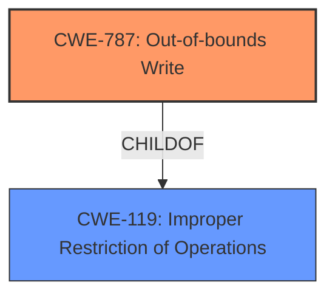

# Analysis for CVE-2021-42730

# Summary
| CWE ID | CWE Name | Confidence | CWE Abstraction Level | CWE Vulnerability Mapping Label | CWE-Vulnerability Mapping Notes |
|---|---|---|---|---|---|
| CWE-787 | Out-of-bounds Write | 0.9 | Base | Primary | Allowed |
| CWE-119 | Improper Restriction of Operations within the Bounds of a Memory Buffer | 0.7 | Class | Secondary | Discouraged |

## Evidence and Confidence

*   **Confidence Score:** 0.9
*   **Evidence Strength:** HIGH

## Relationship Analysis
The primary CWE is CWE-787, which is a base level weakness describing an out-of-bounds write. This is a child of the class-level CWE-119, which describes improper restriction of operations within the bounds of a memory buffer. The vulnerability description mentions **memory corruption** due to **insecure handling** of a malicious PSD file, which aligns with writing data outside the intended buffer. The CVE reference summary mentions out-of-bounds read/write as weaknesses. Choosing CWE-787 provides a more specific description of the weakness than CWE-119.

## Vulnerability Chain
The vulnerability chain starts with the **insecure handling** of a malicious PSD file, which leads to **memory corruption** due to an **out-of-bounds write** (CWE-787), potentially resulting in arbitrary code execution.

## Summary of Analysis
The initial assessment and final conclusion are strongly based on the provided evidence. The vulnerability description explicitly states **memory corruption** due to **insecure handling**. The CVE reference links confirm an "access of Memory Location After End of Buffer" and "Out-of-bounds read/write".

The graph relationships indicate that CWE-787 (Out-of-bounds Write) is a child of CWE-119 (Improper Restriction of Operations within the Bounds of a Memory Buffer). Selecting CWE-787 provides a more specific and accurate representation of the vulnerability compared to the more general CWE-119.

The selected CWEs are at the optimal level of specificity. CWE-787 is a base-level CWE, providing a detailed description of the out-of-bounds write. CWE-119 is a class-level CWE and serves as a broader categorization of the issue.

Relevant CWE Information:

# Enhanced Context (25 CWEs)

## CWE-1289: Improper Validation of Unsafe Equivalence in Input
**Abstraction Level**: Base
**Similarity Score**: 0.78

**Description**:
The product receives an input value that is used as a resource identifier or other type of reference, but it does not validate or incorrectly validates that the input is equivalent to a potentially-unsafe value.
**Not Used:** This CWE is not applicable as the vulnerability is caused by memory corruption due to insecure handling of a PSD file, rather than improper validation of input equivalence.

## CWE-280: Improper Handling of Insufficient Permissions or Privileges
**Abstraction Level**: Base
**Similarity Score**: 0.77
**Description**:
The product does not handle or incorrectly handles when it has insufficient privileges to access resources or functionality as specified by their permissions.
**Not Used:** This CWE is not applicable as the vulnerability is related to memory corruption caused by insecure handling of a file, and not related to privilege handling.

## CWE-404: Improper Resource Shutdown or Release
**Abstraction Level**: Class
**Similarity Score**: 0.77
**Description**:
The product does not release or incorrectly releases a resource before it is made available for re-use.
**Not Used:** This CWE is not applicable because the vulnerability is not related to resource release, but rather to memory corruption during file processing.

## CWE-274: Improper Handling of Insufficient Privileges
**Abstraction Level**: Base
**Similarity Score**: 0.77
**Description**:
The product does not handle or incorrectly handles when it has insufficient privileges to perform an operation, leading to resultant weaknesses.
**Not Used:** This CWE is not applicable as the vulnerability is related to memory corruption caused by insecure handling of a file, and not related to privilege handling.

## CWE-266: Incorrect Privilege Assignment
**Abstraction Level**: Base
**Similarity Score**: 0.77
**Description**:
A product incorrectly assigns a privilege to a particular actor, creating an unintended sphere of control for that actor.
**Not Used:** This CWE is not applicable as the vulnerability is related to memory corruption caused by insecure handling of a file, and not related to privilege assignment.

## CWE-807: Reliance on Untrusted Inputs in a Security Decision
**Abstraction Level**: Base
**Similarity Score**: 0.76
**Description**:
The product uses a protection mechanism that relies on the existence or values of an input, but the input can be modified by an untrusted actor in a way that bypasses the protection mechanism.
**Not Used:** This CWE is not applicable as the vulnerability is related to memory corruption caused by insecure handling of a file, and not related to a protection mechanism being bypassed.

## CWE-667: Improper Locking
**Abstraction Level**: Class
**Similarity Score**: 0.76
**Description**:
The product does not properly acquire or release a lock on a resource, leading to unexpected resource state changes and behaviors.
**Not Used:** This CWE is not applicable as the vulnerability is related to memory corruption caused by insecure handling of a file, and not related to locking mechanisms.

## CWE-668: Exposure of Resource to Wrong Sphere
**Abstraction Level**: Class
**Similarity Score**: 0.76
**Description**:
The product exposes a resource to the wrong control sphere, providing unintended actors with inappropriate access to the resource.
**Not Used:** This CWE is not applicable as the vulnerability is related to memory corruption caused by insecure handling of a file, and not related to resource exposure.

## CWE-267: Privilege Defined With Unsafe Actions
**Abstraction Level**: Base
**Similarity Score**: 0.76
**Description**:
A particular privilege, role, capability, or right can be used to perform unsafe actions that were not intended, even when it is assigned to the correct entity.
**Not Used:** This CWE is not applicable as the vulnerability is related to memory corruption caused by insecure handling of a file, and not related to privilege definitions.

## CWE-183: Permissive List of Allowed Inputs
**Abstraction Level**: Base
**Similarity Score**: 0.76
**Description**:
The product implements a protection mechanism that relies on a list of inputs (or properties of inputs) that are explicitly allowed by policy because the inputs are assumed to be safe, but the list is too permissive - that is, it allows an input that is unsafe, leading to resultant weaknesses.
**Not Used:** This CWE is not applicable as the vulnerability is caused by memory corruption, rather than a permissive list of allowed inputs.

## CWE-190: Integer Overflow or Wraparound
**Abstraction Level**: Base
**Similarity Score**: 6164.30
**Description**:
The product performs a calculation that can produce an integer overflow or wraparound when the logic assumes that the resulting value will always be larger than the original value.
**Not Used:** The vulnerability is not directly related to integer overflows.

## CWE-125: Out-of-bounds Read
**Abstraction Level**: Base
**Similarity Score**: 6114.53
**Description**:
The product reads data past the end, or before the beginning, of the intended buffer.
**Not Used:** While related, the primary issue is an out-of-bounds write which can cause more severe issues such as code execution.

## CWE-1284: Improper Validation of Specified Quantity in Input
**Abstraction Level**: Base
**Similarity Score**: 6016.46
**Description**:
The product receives input that is expected to specify a quantity (such as size or length), but it does not validate or incorrectly validates that the quantity has the required properties.
**Not Used:** While input validation may be a contributing factor, the core issue is the out-of-bounds write.

## CWE-119: Improper Restriction of Operations within the Bounds of a Memory Buffer
**Abstraction Level**: Class
**Similarity Score**: 5868.71
**Description**:
The product performs operations on a memory buffer, but it reads from or writes to a memory location outside the buffer's intended boundary.
**Used as Secondary:** This is a broader category that encompasses out-of-bounds write (CWE-787).

## CWE-252: Unchecked Return Value
**Abstraction Level**: Base
**Similarity Score**: 5859.17
**Description**:
The product does not check the return value from a method or function, which can prevent it from detecting unexpected states and conditions.
**Not Used:**