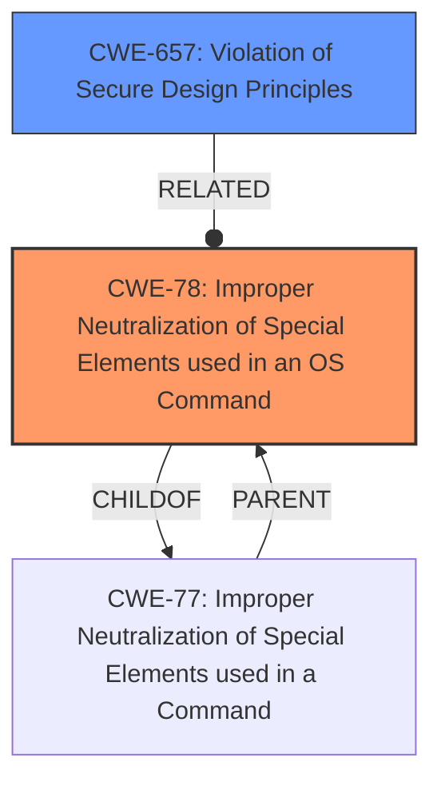

# Analysis for CVE-2021-42759

# Summary
| CWE ID | CWE Name | Confidence | CWE Abstraction Level | CWE Vulnerability Mapping Label | CWE-Vulnerability Mapping Notes |
|---|---|---|---|---|---|
| CWE-78 | Improper Neutralization of Special Elements used in an OS Command ('OS Command Injection') | 1.0 | Base | Allowed | Primary CWE |
| CWE-657 | Violation of Secure Design Principles | 0.7 | Class | Discouraged | Secondary Candidate |

## Evidence and Confidence

*   **Confidence Score:** 0.9
*   **Evidence Strength:** HIGH

## Relationship Analysis
The primary relationship influencing the decision is the parent-child relationship between CWE-77 (Improper Neutralization of Special Elements used in a Command) and CWE-78. Since the specific vulnerability involves OS commands, CWE-78 is a more specific and appropriate choice. CWE-657 is a high-level class that encompasses a broad range of design flaws. While the vulnerability description mentions a **"violation of secure design principles,"** the more specific root cause is the improper handling of OS commands.

## Vulnerability Chain
The vulnerability chain starts with a **violation of secure design principles**, which leads to the **improper sanitization of command elements**, ultimately resulting in OS Command Injection (CWE-78). An authenticated attacker can then exploit this to execute unauthorized code or commands with root privileges.

## Summary of Analysis
The initial analysis considered both CWE-78 and CWE-657. The critical evidence is the "CVE Reference Links Content Summary" which states: "**Root cause of vulnerability:** Improper sanitization of command elements leading to OS Command Injection. **Weaknesses/vulnerabilities present:** OS Command Injection (CWE-78)." This clearly points to CWE-78 as the primary weakness.

CWE-657 (Violation of Secure Design Principles) is a general class and, while applicable at a high level, lacks the specificity needed to accurately represent the vulnerability. The retriever results also indicate CWE-78 as a strong candidate.

The selection of CWE-78 is further supported by its "Base" abstraction level, which is preferred for root cause analysis. The relationship analysis confirms that CWE-78 is a more specific child of CWE-77, making it a better fit than its parent.

The decision is based on the provided evidence and the CWE specifications, resulting in a high confidence level.

Relevant CWE Information:

# Enhanced Context (25 CWEs)

## CWE-653: Improper Isolation or Compartmentalization
**Abstraction Level**: Class
**Similarity Score**: 0.76
**Source**: dense

**Description**:
The product does not properly compartmentalize or isolate functionality, processes, or resources that require different privilege levels, rights, or permissions.
**Did not select**: Though potentially relevant at a high level, this doesn't address the specific weakness of OS command injection.

## CWE-274: Improper Handling of Insufficient Privileges
**Abstraction Level**: Base
**Similarity Score**: 0.76
**Source**: dense

**Description**:
The product does not handle or incorrectly handles when it has insufficient privileges to perform an operation, leading to resultant weaknesses.
**Did not select**: This is about *insufficient* privileges, but the vulnerability involves an attacker gaining *unauthorized* privileges.

## CWE-1220: Insufficient Granularity of Access Control
**Abstraction Level**: Base
**Similarity Score**: 0.75
**Source**: dense

**Description**:
The product implements access controls via a policy or other feature with the intention to disable or restrict accesses (reads and/or writes) to assets in a system from untrusted agents. However, implemented access controls lack required granularity, which renders the control policy too broad because it allows accesses from unauthorized agents to the security-sensitive assets.
**Did not select**: Not directly related to the OS command injection.

## CWE-280: Improper Handling of Insufficient Permissions or Privileges
**Abstraction Level**: Base
**Similarity Score**: 0.75
**Source**: dense

**Description**:
The product does not handle or incorrectly handles when it has insufficient privileges to access resources or functionality as specified by their permissions. This may cause it to follow unexpected code paths that may leave the product in an invalid state.
**Did not select**: Similar to CWE-274, this focuses on *insufficient* privileges, not the execution of commands with elevated privileges via injection.

## CWE-73: External Control of File Name or Path
**Abstraction Level**: Base
**Similarity Score**: 0.75
**Source**: dense

**Description**:
The product allows user input to control or influence paths or file names that are used in filesystem operations.
**Did not select**: While related to command execution in some contexts, the core issue here is the injection of OS commands, not file paths.

## CWE-639: Authorization Bypass Through User-Controlled Key
**Abstraction Level**: Base
**Similarity Score**: 0.74
**Source**: dense

**Description**:
The system's authorization functionality does not prevent one user from gaining access to another user's data or record by modifying the key value identifying the data.
**Did not select**: This is specific to authorization bypass through key modification, which isn't the mechanism in this vulnerability.

## CWE-41: Improper Resolution of Path Equivalence
**Abstraction Level**: Base
**Similarity Score**: 0.74
**Source**: dense

**Description**:
The product is vulnerable to file system contents disclosure through path equivalence. Path equivalence involves the use of special characters in file and directory names. The associated manipulations are intended to generate multiple names for the same object.
**Did not select**: Irrelevant to OS command injection.

## CWE-668: Exposure of Resource to Wrong Sphere
**Abstraction Level**: Class
**Similarity Score**: 0.74
**Source**: dense

**Description**:
The product exposes a resource to the wrong control sphere, providing unintended actors with inappropriate access to the resource.
**Did not select**: Too general; OS command injection is a more specific weakness.

## CWE-23: Relative Path Traversal
**Abstraction Level**: Base
**Similarity Score**: 0.74
**Source**: dense

**Description**:
The product uses external input to construct a pathname that should be within a restricted directory, but it does not properly neutralize sequences such as ".." that can resolve to a location that is outside of that directory.
**Did not select**: Irrelevant to OS command injection.

## CWE-691: Insufficient Control Flow Management
**Abstraction Level**: Pillar
**Similarity Score**: 0.74
**Source**: dense

**Description**:
The code does not sufficiently manage its control flow during execution, creating conditions in which the control flow can be modified in unexpected ways.
**Did not select**: Too general and high-level to be useful for this specific vulnerability.

## CWE-22: Improper Limitation of a Pathname to a Restricted Directory ('Path Traversal')
**Abstraction Level**: Base
**Similarity Score**: 7630.09
**Source**: sparse

**Description**:
The product uses external input to construct a pathname that is intended to identify a file or directory that is located underneath a restricted parent directory, but the product does not properly neutralize special elements within the pathname that can cause the pathname to resolve to a location that is outside of the restricted directory.
**Did not select**: Irrelevant to OS command injection.

## CWE-23: Relative Path Traversal
**Abstraction Level**: Base
**Similarity Score**: 7382.06
**Source**: sparse

**Description**:
The product uses external input to construct a pathname that should be within a restricted directory, but it does not properly neutralize sequences such as ".." that can resolve to a location that is outside of that directory.
**Did not select**: Irrelevant to OS command injection.

## CWE-184: Incomplete List of Disallowed Inputs
**Abstraction Level**: Base
**Similarity Score**: 7109.41
**Source**: sparse

**Description**:
The product implements a protection mechanism that relies on a list of inputs (or properties of inputs) that are not allowed by policy or otherwise require other action to neutralize before additional processing takes place, but the list is incomplete.
**Did not select**: While an incomplete list of disallowed inputs *could* contribute to OS command injection, the primary issue is the lack of proper neutralization.

## CWE-59: Improper Link Resolution Before File Access ('Link Following')
**Abstraction