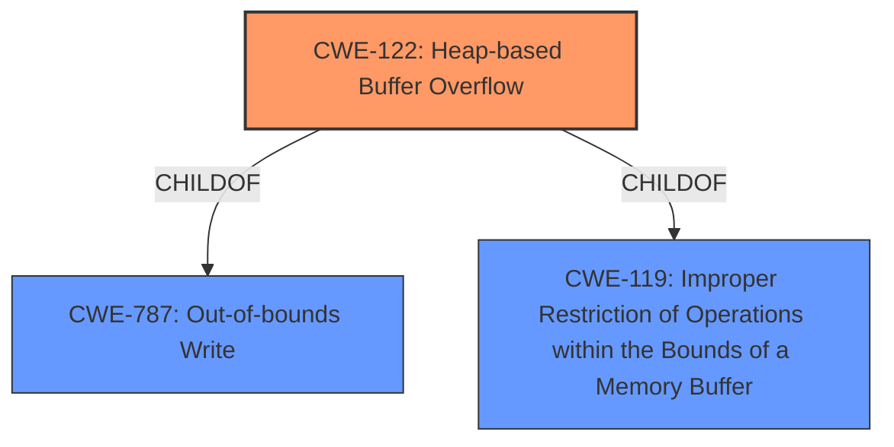

# Raw Analyzer Response for CVE-2021-42781

# Summary
| CWE ID | CWE Name | Confidence | CWE Abstraction Level | CWE Vulnerability Mapping Label | CWE-Vulnerability Mapping Notes |
|---|---|---|---|---|---|
| CWE-122 | Heap-based Buffer Overflow | 0.9 | Variant | Allowed | Primary CWE |
| CWE-119 | Improper Restriction of Operations within the Bounds of a Memory Buffer | 0.6 | Class | Discouraged | Secondary Candidate |

## Evidence and Confidence

*   **Confidence Score:** 0.9
*   **Evidence Strength:** HIGH

## Relationship Analysis
The primary CWE is CWE-122, a Variant of CWE-787 (Out-of-bounds Write) and CWE-119 (Improper Restriction of Operations within the Bounds of a Memory Buffer). CWE-119 is a Class-level CWE and a parent of CWE-122. The analysis focuses on the specific location of the buffer overflow (heap) and the general issue of improper memory boundary handling.

## Vulnerability Chain
The vulnerability chain starts with **insufficient bounds checking**, leading to a **heap buffer overflow**, which can then cause a program crash.

## Summary of Analysis
The initial assessment, based on the vulnerability description indicating a "**buffer overflow**" in "pkcs15-oberthur.c" and the CVE Reference Links Content Summary mentioning "Multiple **heap buffer overflows**" due to "**insufficient bounds checking**", strongly supports classifying this as a **CWE-122 (Heap-based Buffer Overflow)**. The content summary also states that "**the code fails to validate the length of the data read from the card, leading to overflows when copying data into fixed-size buffers**". This confirms the **heap buffer overflow** due to **insufficient bounds checking**.

CWE-119 was considered but not selected as the primary CWE because it is a high-level class and the description specifically indicates a heap buffer overflow. CWE-122 is a variant of CWE-119 and provides a more specific classification. While CWE-119 is listed as "Discouraged" for direct mapping, CWE-122 as a child is "Allowed".

The selection of CWE-122 provides the optimal level of specificity as it directly addresses the root cause (**heap buffer overflow**) and aligns with the provided evidence.

Relevant CWE Information:

# Enhanced Context (25 CWEs)

## CWE-124: Buffer Underwrite ('Buffer Underflow')
Not selected because the vulnerability is a buffer overflow, not a buffer underflow.

## CWE-131: Incorrect Calculation of Buffer Size
Not selected because the root cause is **insufficient bounds checking** and not an incorrect calculation of buffer size.

## CWE-191: Integer Underflow (Wrap or Wraparound)
Not selected because the vulnerability is a buffer overflow, not an integer underflow.

## CWE-805: Buffer Access with Incorrect Length Value
Not selected because the root cause is **insufficient bounds checking**, not necessarily an incorrect length value being used during access.

## CWE-126: Buffer Over-read
Not selected because the vulnerability is a buffer overflow (write), not a buffer over-read.

## CWE-127: Buffer Under-read
Not selected because the vulnerability is a buffer overflow, not a buffer under-read.

## CWE-193: Off-by-one Error
Not selected because the vulnerability is due to **insufficient bounds checking**, which leads to a buffer overflow, and not an off-by-one error.

## CWE-125: Out-of-bounds Read
Not selected because the vulnerability is a buffer overflow (write), not an out-of-bounds read.

## CWE-680: Integer Overflow to Buffer Overflow
Not selected because the root cause is **insufficient bounds checking** and the description does not mention integer overflow.

## CWE-681: Incorrect Conversion between Numeric Types
Not selected because the root cause is **insufficient bounds checking** and the description does not mention incorrect conversion between numeric types.

## CWE-190: Integer Overflow or Wraparound
Not selected because the root cause is **insufficient bounds checking** and the description does not mention integer overflow.

## CWE-1284: Improper Validation of Specified Quantity in Input
Not selected because even though the CVE Reference Links Content Summary mentions "Missing check on length before copying data", the report explicitly mentions **insufficient bounds checking**.

## CWE-128: Wrap-around Error
Not selected because the root cause is **insufficient bounds checking** and the description does not mention wrap-around errors.

## CWE-170: Improper Null Termination
Not selected because the root cause is **insufficient bounds checking** and the description does not mention null termination issues.

## CWE-120: Buffer Copy without Checking Size of Input ('Classic Buffer Overflow')
Not selected because although this is related to buffer overflows, the description specifically mentions that the overflow happens in the heap, so CWE-122 is a better selection.

## CWE-123: Write-what-where Condition
Not selected because the root cause is **insufficient bounds checking**, which leads to a buffer overflow, and not a write-what-where condition.

## CWE-617: Reachable Assertion
Not selected because the root cause is **insufficient bounds checking** and the description does not mention assertions.

## CWE-195: Signed to Unsigned Conversion Error
Not selected because the root cause is **insufficient bounds checking** and the description does not mention signed to unsigned conversion errors.

## CWE-463: Deletion of Data Structure Sentinel
Not selected because the root cause is **insufficient bounds checking** and the description does not mention issues with sentinels.

## CWE-1339: Insufficient Precision or Accuracy of a Real Number
Not selected because the root cause is **insufficient bounds checking** and the description does not mention issues with real number precision.